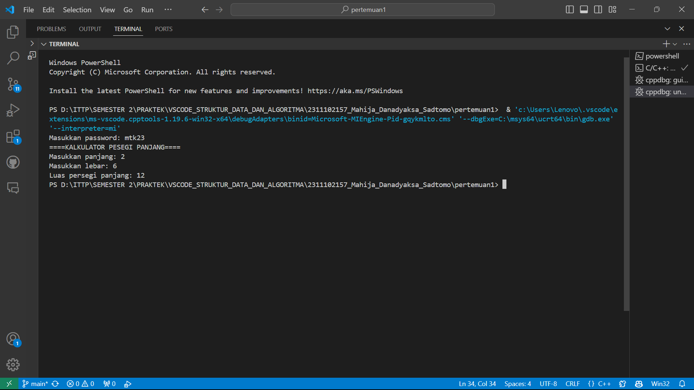
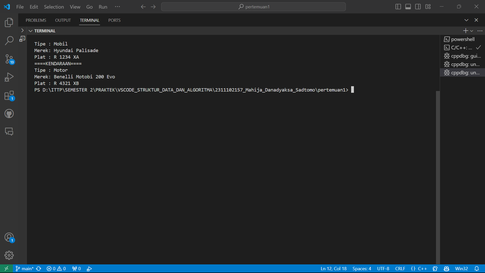
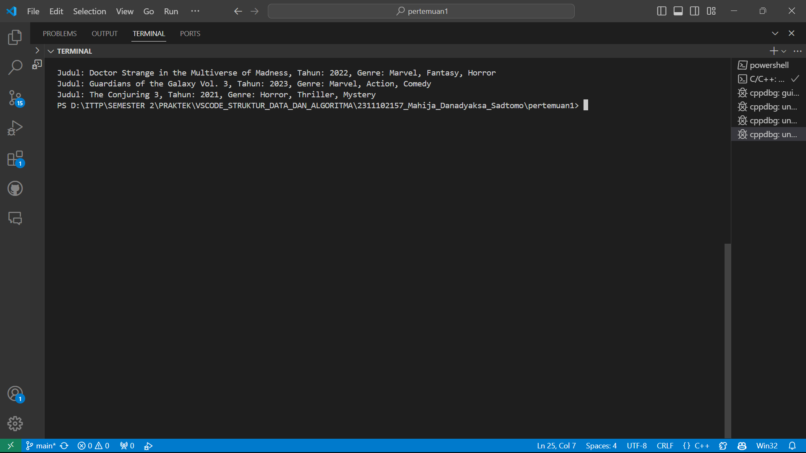

# <h1 align="center">Laporan Praktikum Modul 1 - Tipe Data</h1>
<p align="center">Mahija Danadyaksa Sadtomo_2311102157</p>

## Dasar Teori

Tipe data adalah sebuah pengklasifikasian data berdasarkan data tersebut. Tipe data digunakan untuk menentukan nilai suatu objek yang terdapat dalam sebuah sistem pemograman. Misalnya, tipe data tersebut adalah bilangan bulat (tidak menerima desimal), bilangan desimal (menerima koma), atau karakter/string (tidak menerima angka, hanya menerima huruf), dsb. Tipe data juga digunakan sebagai tempat pemnyimpanan dari sebuah data yang dapat berisi nilai atau tipe tertentu. Tipe data dibagi kedalam tiga kelompok, yaitu:

1. Tipe Data Primitif<br/>
2. Tipe Data Abstrak<br/>
3. Tipe Data Koleksi<br/>

### 1. Tipe Data Primitif <br/>

Tipe data primitif adalah tipe data dasar yang langsung didukung oleh bahasa pemograman dan bisa langsung digunakan oleh programmer untuk deklarasi variabel. tipe data primitif tidak didefinisikan di dalam tipe data yang lain. Misalnya tipe data string, tipe data string tidak termasuk ke dalam tipe data primitif karena mengandung tipe data lain yaitu char. Berikut adalah tipe-tipe data yang termasuk ke dalam tipe data primitif:

1. Tipe Numerik
- Integer
- Floating-point
- Complex
- Decimal

2. Tipe Data Boolean

3. Tipe Data Char

4. Tipe Data Integral
- Byte
- Short
- Int
- Long

5. Tipe Floating Point
- Floating
- Double

### w. Tipe data Abstrak<br/>

ADT (Abstract Data Type atau Tipe Data Abstrak) adalah suatu model matematika, disertai sekumpulan operasi terhadap model itu (Slamet, 1990:14). ADT adalah kumpulan data dan operasi yang dapat digunakan untuk memanipulasi data yang didefinisikan oleh programmer sendiri untuk memudahkan pemograman. Untuk pembuatan ADT dapat dibuat dalam sebuah class. Fitur class adalah fitur OOP pada C++ yang konsepnya mirip seperti struct pada C++, keduanya dapat menampung variabel sebagai anggota.

1. Class<br/>
Class adalah cetak biru atau blueprint dari object. Di dalam class dapat mendefinisikan atribut (data) dan metode (tingkah laku) yang akan dimiliki oleh objek yang dibuat berdasarkan Class tersebut. Class memiliki tipe data defaultnya yaitu privat.

2. Struct <br/>
Struct adalah kumpulan variabel dengan beragam tipe data yang dibungkus dalam satu variabel. Di dalam strut dapat mendefinisikan atribut (data) dan metode (tingkah laku) yang akan dimiliki oleh objek yang dibuat berdasarkan struct tersebut. Struct memiliki tipe data defaultnya yaitu public

### 3. Tipe Data Koleksi <br/>

Tipe data koleksi adalah tipe data yang dapat menyimpan beberapa elemen dalam satu variabel. Terdapat beberapa tipe data koleksi di dalam bahasa pemograman C++ yaitu:

1. Array<br/>
Array adalah tipe data yang digunakan untuk menyimpan beberapa elemen dan nilai dengan tipe data yang sama. Array digunakan untuk menyimpan data sepeti angka, string atau bahkan objek. Array menyimpan banyak elemen atau nilai data yang dapat diambil dengan menggunakan indeks interger mulai dari angka 0,1,2,3, dst.

2. Map <br/>
Map mirip dengan array namun dengan index dapat berupa tipe data selain integer. Map adalah tipe data yang dapat menghubungkan key dengan value. Terdapat 2 jenis struktur data map, yaitu std::map yang menggunakan Self_Balancing Tree, khususnya Red Black Tree dan std::unordered_map yang menggunakan hash table.

3. Vector<br/>
 Vector memiliki bentuk std::vector. Vector mirip dengan array. Ukuran vector dapat berubah secara dinamis yang memungkinkan proses insert dan delete element pada bagian  tengah array. Vector memiliki kemampuan untuk menyimpan data dalam bentuk elemen-elemen yang penempatan memorinya dilakukan secara otomatis bersebelahan.

## Guided 

### 1. Tipe Data Primitif

```C++
#include <iostream>
#include <iomanip>

using namespace std;

int main()
{
    char op; // operator
    float num1, num2; // input angka

    cout << "Enter operator either + or - or * or /: "; 
    cin >> op;  // meminta user untuk memasukkan operator

    cout << "Enter two operands: ";
    cin >> num1 >> num2;    // meminta user untuk memasukkan dua angka  

    switch (op)
    {
    case '+':   // jika operator adalah +
        cout << "result: " << num1 + num2; // mencetak hasil penjumlahan
        break;
    case '-':   // jika operator adalah -   
        cout << "result: " << num1 - num2;  // mencetak hasil pengurangan
        break;
    case '*':   // jika operator adalah *
        cout << "result: " << num1 * num2;  // mencetak hasil perkalian
        break;
    case '/':   // jika operator adalah /
        if (num2 != 0)  // jika angka kedua bukan 0
        {
            cout << "result: " << fixed << setprecision(2) << num1 / num2;  // berhasil mencetak hasil pembagian
        }
        else
        {
            cout << "Division by zero is not possible"; // jika angka kedua adalah 0 maka akan mencetak ini
        }
        break;
    default:
        cout << "Division by zero is not possible"; // jika operator bukan +, -, *, atau / maka akan mencetak ini
    }
    return 0;
}
```
Program tersebut adalah program untuk kalkulator dasar 2 bilangan dengan menggunakan 2 tipe data primitif yaitu char dan float. Di dalam coding itu terdapat variabel op dengan tipe data char sebagai inputan operator oleh user yaitu penujumlahan (+), pengurangan (-), perkalian (*), pembagian (/). Terdapat num1 dan num2 dengan tipe data float yang digunakan untuk inputan bilangan oleh user yang nantinya akan di kalkulasi. Terdapat switch case yang digunakan untuk percabangan kalkulatornya. Jika operator yang diinputkan selain tanda "+, -, *, /", maka program akan menghasilkan output ""Division by zero is not possible".

### 2. Tipe Data Abstrak
```c++
#include <stdio.h>
#include <string.h>

struct Mahasiswa  // struct dengan nama Mahasiswa
{
    char name[50]; // name bertipe data string
    char address[50]; // address bertipe data string
    int age;     // age bertipe data integer
};

int main() 
{
struct Mahasiswa mhs1, mhs2; // membuat objek mhs1 dan mhs2 dengan tipe data struct Mahasiswa

strcpy(mhs1.name, "Dian");
strcpy(mhs1.address, "Mataram");a
mhs1.age = 22;
strcpy(mhs2.name, "Bambang");
strcpy(mhs2.address, "Surabaya");
mhs2.age = 23;

printf("## Mahasiswa 1 ##\n"); // mencetak data mahasiswa 1
printf("Nama: %s\n", mhs1.name);
printf("Alamat: %s\n", mhs1.address);
printf("Umur: %d\n", mhs1.age);
printf("\n");
printf("## Mahasiswa 2 ##\n"); // mencetak data mahasiswa 2
printf("Nama: %s\n", mhs2.name);
printf("Alamat: %s\n", mhs2.address);
printf("Umur: %d\n", mhs2.age);
return 0;
}
```
Program tersebut adalah program biodata mahasiswa dengan menggunakan struct. Struct termasuk ke dalam tipe data abstrak karena didalamnya terdapat kumpulan tipe data primitif yaitu char untuk menyimpan nama mahasiswa, alamat dan integer untuk menyimpan umur mahasiswa.Setelah membuat struct, di dalam main program terdapat 2 mahasiswa dengan isi struct nama dan alamat. Setelah itu mencetak isi struct mahasiswa.

### 3. Tipe Data Kolektif
```c++
#include <iostream>
#include <array>
using namespace std;

// Tipe Data Koleksi

int main() {

    // Deklarasi dan inisialisasi array
    int nilai[5];
    nilai[0] = 23;
    nilai[1] = 50;
    nilai[2] = 34;
    nilai[3] = 78;
    nilai[4] = 90;

    // Mencetak array dengan tab
    cout << "Isi array pertama : " << nilai[0] << endl;
    cout << "Isi array kedua : " << nilai[1] << endl;
    cout << "Isi array ketiga : " << nilai[2] << endl;
    cout << "Isi array keempat : " << nilai[3] << endl;
    cout << "Isi array kelima : " << nilai[4] << endl;

    return 0;
}
```
Program tersebut adalah program yang dibuat dengan array yang termasuk ke dalam tipe data kolektif. Di dalam main program, array menggunakan tipe data integer untuk menyimpan bilangan bulat sebanyak 5. Indeks k-0 diisi angka 23, indeks ke-1 diisi angka 50, indeks ke-2 diisi angka 34, indeks ke-3 diisi angka 78, dan indeks ke-4 diisi angka 90. Selanjutnya cetak array dengan memanggil indeks array tadi.

## Unguided 

### 1. Buatlah program menggunakan tipe data primitif minimal dua fungsi dan bebas. Menampilkan program, jelaskan program tersebut dan ambil kesimpulan dari materi tipe data primitif!

```C++
#include <iostream> // untuk fungsonalitas i/o standar, yaitu cin dan cout 

using namespace std; // agar tidak perlu menulis std:: 

// Fungsi untuk mengecek password dengan tipe data boolean
bool passwordCheck(string password) 
{
    if (password == "mtk23") {
        return true; // jika pass mtk23, maka true
    } else { // jika pass bukan mtk23
        return false; //  maka false
    }
}

// fungsi untuk menghitung luas persegi panjang
int luasPersegiPanjang(int panjang, int lebar) 
{
    return panjang * lebar; // rumus luas persegi panjang
}

// fungsi main program
int main() 
{
    string password; // variabel untuk menyimpan pass
    int pilihan, panjang, lebar; // variabel untuk menyimpan panjang, dan lebar
    cout << "Masukkan password: "; // meminta user untuk memasukkan pass
    cin >> password; // menyimpan pass yang dimasukkan user

    if (passwordCheck(password)) {// memeriksa pass yang dimasukkan user, kalau benar maka masuk sini
            cout << "====KALKULATOR PESEGI PANJANG====" << endl;
            cout << "Masukkan panjang: "; // meminta user untuk memasukkan panjang
            cin >> panjang; // menyimpan panjang yang dimasukkan user
            cout << "Masukkan lebar: "; // meminta user untuk memasukkan lebar
            cin >> lebar; // menyimpan lebar yang dimasukkan user
            cout << "Luas persegi panjang: " << luasPersegiPanjang(panjang, lebar) << endl; // mencetak luas persegi panjang
    } else {
        cout << "Password salah" << endl; // jika pass salah, maka akan mencetak ini
        return 0; // keluar dari program, mengembalikkkan nilai 0
    }
    return 0; // keluar dari program, mengembalikkkan nilai 0
}
```
#### Output:


Program tersebut adalah program menghitung luas persegi panjang dengan memasukkan password terlebih dahulu. Program itu menggunakan tipe data primitif dan 2 fungsi yaitu bool untuk fungsi password dan integer untuk fungsi luas persegi panjang. Di dalam fungsi password terdapat percabangan if yang digunakan sebagai true or false dari password. Di dalam fungsi luas persegi panjang terdapat rumus luas persegi panjang untuk mengkalkulasikan. Kemudian di dalam main program terdapat password, user diminta untuk memasukan password yang benar, jika benar maka user dapar mengakses kalkulator pesegi panjang, jika salah maka muncul output "password salah" dan akan keluar dari program.<rb/>

Kesimpulan tipe data primitif:<br/>
Tipe data primitif adalah tipe data bawaan dari bahasa pemograman itu sendiri, contohnya yaitu int, float, char, bool dan bisa langsung digunakan oleh programmer.

### 2. Jelaskan fungsi dari class dan struct secara detail dan berikan contoh programnya!

```C++
#include <iostream> // untuk fungsonalitas i/o standar, yaitu cin dan cout 

using namespace std; // agar tidak perlu menulis std:: 

// ==========STRUCT===========
// struct digunakan untuk mengelompokkan data dan fungsi 
// struct sifat default accessnya public
// struct tidak dapat digunakan sebagai parent di pewarisan

struct Mobil // struct dengan nama mobil
{
    string tipe; 
    string merek;
    string plat;

//terdapat tiga anggota yaitu tipe, merek, dan plat
//semuanya bertipe data string
};

// ========CLASS=========
// class digunakan untuk mengelompokkan data dan fungsi 
// class sifat default accessnya privat
// class dapat digunakan sebagai parent di pewarisan

class Motor// class dengan nama mobil
{
    public:
    string tipe;
    string merek;
    string plat;

//terdapat tiga anggota yaitu tipe, merek, dan plat
//semuanya bertipe data string
};

int main()
{
    cout<<"2311102157_Mahija Danadyaksa Sadtomo_S1IF-11-D";

    // =======STRUCT========

    Mobil mobil{"Mobil", "Hyundai Palisade", "R 1234 XA"}; // Membuat objek mobil dan inisialisasi nilai awal tiap anggotanya
    cout<<"====KENDARAAN===="<<endl;
    cout<<"Tipe : "<<mobil.tipe<<endl;// mencetak tipe mobil
    cout<<"Merek: "<<mobil.merek<<endl;// mencetak merek mobil
    cout<<"Plat : "<<mobil.plat<<endl;// mencetak plat mobil

    // ========CLASS========

    Motor motor;
    motor.tipe = "Motor";
    motor.merek = "Benelli Motobi 200 Evo";
    motor.plat = "R 4321 XB";
//  Membuat objek mobil dan inisialisasi nilai awal tiap anggotanya

    cout<<"====KENDARAAN===="<<endl;
    cout<<"Tipe : "<<motor.tipe<<endl;// mencetak tipe motor
    cout<<"Merek: "<<motor.merek<<endl;// mencetak merek motor
    cout<<"Plat : "<<motor.plat<<endl;// mencetak plat motor

    return 0; //mengkahiri fungsi main dan mengembalikan nilai 0
}
```
#### Output:


Program tersebut adalah program catatan kendaraan dengan menggunakan struct dan class yang termasuk ke dalam tipe data abstraksi. Di dalam struct dan class terdapat tipe, merek, dan plat dengan tipe data string. Di dalam main program membuat object mobil dari struct dan diisi nilai awal tiap anggotanya setelah itu dicetak. Di dalam class membuat objek dan mengisi nilai awal tiap anggotanya setelah itu dicetak. 

1. Class<br/>
Class adalah cetak biru atau blueprint dari object. Di dalam class dapat mendefinisikan atribut (data) dan metode (tingkah laku) yang akan dimiliki oleh objek yang dibuat berdasarkan Class tersebut. Class memiliki tipe data defaultnya yaitu privat.

2. Struct <br/>
Struct adalah kumpulan variabel dengan beragam tipe data yang dibungkus dalam satu variabel. Di dalam strut dapat mendefinisikan atribut (data) dan metode (tingkah laku) yang akan dimiliki oleh objek yang dibuat berdasarkan struct tersebut. Struct memiliki tipe data defaultnya yaitu public

Perbedaan dari struct dan class terdapat di inheritance, dimana class dapat melakukan inheritance sedangkan struct tidak bisa. Class lebih banyak digunakan untuk objek yang dimana setiap proses di dalamnya saling berhubungan. Sedangkan struct biasa digunakan untuk struktur data atau objek yang sebenarnya, menyimpan data menggunakan variabel dan membuat fungsi.


### 3. Buat dan jelaskan program menggunakan fungsi map dan jelaskan perbedaan dari array dengan map!

```C++
#include <iostream> // untuk fungsonalitas i/o standar, yaitu cin dan cout
#include <map> // untuk menggunakan tipe data map
#include <string> // untuk menggunakan tipe data string

using namespace std; // agar tidak perlu menulis std::

struct movie // struct dengan nama movie
{
    string title; // title tipe data string
    int year; // year tipe data integer
    string genre; // genre tipe data string
};

int main() // fungsi main program
{
    map<string, movie> movies; // membuat objek movies dengan tipe data map

    // menambahkan data ke objek movies
    movies["Doctor Strange in the Multiverse of Madness"] = {"Doctor Strange in the Multiverse of Madness", 2022, "Marvel, Fantasy, Horror"};
    movies["Guardians of the Galaxy Vol. 3"] = {"Guardians of the Galaxy Vol. 3",  2023, "Marvel, Action, Comedy"};
    movies["The Conjuring 3"] = {"The Conjuring 3", 2021, "Horror, Thriller, Mystery"};

    cout<<"Daftar film yang tersedia: "<<endl;
    for (const auto &pair : movies) // perulangan untuk mencetak data dari objek movies
    {
        // mencetak judul, tahun, dan genre film
        cout << "Judul: " << pair.second.title << ", Tahun: " << pair.second.year << ", Genre: " << pair.second.genre << endl; 
    };
}
```
#### Output:


Program di atas adalah program daftar movie dengan menggunakan map. Map termasuk ke dalam tipe data koleksi karena dapat menyimpan beberapa elemen dalam satu variabel. Terdapas struct movie yang di dalamnya terdapat string title, genre dan int year. Di dalam main program terdapat map yang digunakan untuk mengisi nilai dari movie yang nantinya akan dicetak.

Penjelasan array dan map:
1. Array<br/>
Array adalah tipe data yang digunakan untuk menyimpan beberapa elemen dan nilai dengan tipe data yang sama. Array digunakan untuk menyimpan data sepeti angka, string atau bahkan objek. Array menyimpan banyak elemen atau nilai data yang dapat diambil dengan menggunakan indeks interger mulai dari angka 0,1,2,3, dst.

2. Map <br/>
Map mirip dengan array namun dengan index dapat berupa tipe data selain integer. Map adalah tipe data yang dapat menghubungkan key dengan value. Terdapat 2 jenis struktur data map, yaitu std::map yang menggunakan Self_Balancing Tree, khususnya Red Black Tree dan std::unordered_map yang menggunakan hash table.

Perbedaan array dan map:
1. Struktur data:
- array : urut berdasarkan indeks numerik
- map   : key-value tanpa urutan tertentu

2. Memanggil elemen:
- array : berdasarkan indeks numerik
- map   : berdasarkan key

3. ukuran:
- array : tetap
- map   : dinamis

4. Tipe data:
- array : hanya dapat menggunakan tipe data primitif
- map   : bisa tipe data apapun

5. indeks:
- array : hanya bisa bilangan bulat
- map   : bisa berupa nilai apapun

Jadi, array cocok untuk menyimpan elemen dengan tipe data yang sama dan ukuran tetap, sedangkan map cocok untuk menghubungkan kunci dengan nilai dalam struktur data yang lebih fleksibel.

## Kesimpulan
Tipe data adalah kumpulan data dengan nilai atau jenis yang telah ditetapkan. Tipe data memiliki 3 tipe yaitu primitif, abstrak, dan koleksi. Tipe data primitif adalah tipe data bawaan dari bahasa pemograman itu sendiri, contohnya yaitu int, float, char, bool dan bisa langsung digunakan oleh programmer. Tipe data abstrak adalah tipe data buatan programmer itu sendiri contohnya yaiitu class dan struct. Tipe data koleksi adalah tipe data yang didalamnya dapat memuat berbagai elemen dalam satu variabel contohnya yaitu array, map, dan vector. Setiap kelompok tipe data memiliki peran dan fungsi masing-masing dalam pengembangan program, sesuai dengan kebutuhan dan kompleksitas dari masalah yang akan dipecahkan.

## Referensi
[1] Istiqomah, Nalar. (2023). Transformasi Digital. Sukoharjo: Tahta Media.<br/>
[2] Putri, Meidyan P., et al. (2022). "Algoritma dan Struktur Data. Bandung: Widina Bhakti Persada Bandung. <br/>
[3] Khoirudin. (2019). Algoritma & Struktur Data dengan Python 3. Semarang: Universitas Semarang Press.<br/>
[4] Astuti, Indah Kusuma. (2019). Struktur data tipe data real. <br/>