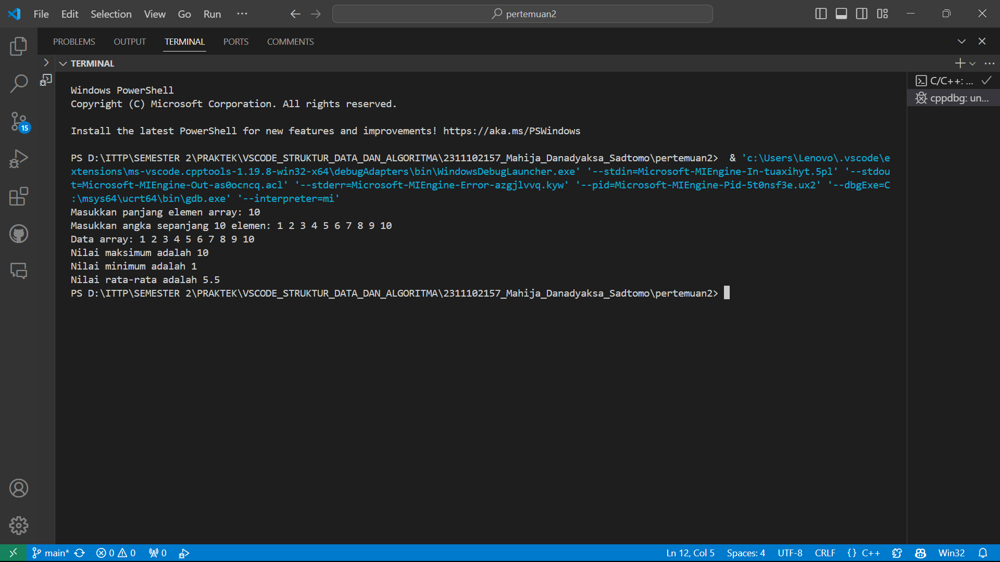

# <h1 align="center">Laporan Praktikum Modul 2 - Array </h1>
<p align="center">Mahija Danadyaksa Sadtomo_2311102157</p>

## Dasar Teori

Tipe data array adalah tipe data terstruktur yang merujuk kepada sebuah atau sekumpulan elemen yang mempunyai tipe data yang sama melalui indeks. Nilai-nilai data di suatu array disebut dengan elemen-elemen array. Letak urutan dari elemen-elemen array ditunjukkan oleh suatu subscript atau indeks yang dimulai dari 0. Array banyak digunakan pada operasi yg melibatkan indeks seperti pada statistik. Adapun array dibedakan menjadi tiga macam, yaitu:
1. array berdimensi satu<br/> 
2. array berdimensi dua<br/>
3. array berdimensi banyak atau multidimensi<br/>

### 1. Array Satu Dimensi

Array satu dimensi adalah array yang disusun dalam satu baris atau satu dimensi. Elemen-elemen dalam array tersebut memiliki indeks tunggal yang berfungsi sebaga urutan array dan digunakan untuk mengakses elemen tersebut. Indeks dalam array dimulai dari angka 0,1,2,3, dan seterusnya. Artinya indeks 0 merujuk pada elemen ke-1 dalam array, indeks 1 merujuk pada elemen ke-2 dalam array, dan seterusnya. Sintaks penulisan array satu dimensi yaitu:<br/>
tipe_data nama_variabel [n] = {elemen};<br/>

Contoh:<br/>
int Arr[5]={5,4,3,2,1};

### 2. Array Dua Dimensi
Array dua dimensi adalah array yang disusun dalam dua baris atau dua dimensi. Bentuk array semacam ini menggunakan 2 (dua) buah kelompok indeks yang masing-masing direpresentasikan sebagai indeks baris dan kolom. Jika ingin memasukkan atau membaca sebuah nilai pada matriks maka, harus diketahui terlebih dahulu indeks baris dan kolomnya. Sintaks penulisan array dua dimensi yaitu:<br/>
tipe_data nama_variabel [jumlah_baris_array] [jumlah_kolom_array] ={{elemen},{elemen}};<br/>
Contoh:<br/>
int Arr [2] [3] = {{1, 2, 3}, {4, 5, 6}};

### 3. Array Berdimensi Banyak atau Multidimensi 
 Array Multidimensi merupakan array yang serupa dengan array satu dimensi maupun array dua dimensi namun array multidimensi dapat memiliki memori yang lebih besar. Sebutan array ini dipakai untuk dimensi lebih dari dua atau array yang mempunyai lebih dari dua subskrip. Sintaks penulisan array tiga dimensi yaitu:<br/>
 Tipe_data nama_variabel [index1] [ndex2] [index3] [ndex4].....; = {{elemen},{elemen},...};<br/>
Contoh:
int arr[2] [2] [3] = {{{2, 8, 7}, {6, 5, 1}}, {{8, 5, 2}, {9, 2 ,7}}};

## Guided 

### 1. Array 3 Dimensi

```C++
#include <iostream>
using namespace std;

// Program input array 3 dimensi
int main()
{
    // Deklarasi array
    int arr[2][3][3];

    // Input elemen
    for (int x = 0; x < 2; x++)
    {
        for (int y = 0; y < 3; y++)
        {
            for (int z = 0; z < 3; z++)
            {
                cout << "Input Array[" << x << "][" << y << "][" << z << "] = ";
                cin >> arr[x][y][z];
            }
        }
        cout << endl;
    }

    // Output Array
    for (int x = 0; x < 2; x++)
    {
        for (int y = 0; y < 3; y++)
        {
            for (int z = 0; z < 3; z++)
            {
                cout << "Data Array[" << x << "][" << y << "][" << z << "] = " << arr[x][y][z] << endl;
            }
        }
    }
    cout << endl;

    // Tampilan array
    for (int x = 0; x < 2; x++)
    {
        for (int y = 0; y < 3; y++)
        {
            for (int z = 0; z < 3; z++)
            {
                cout << arr[x][y][z] << ends;
            }
            cout << endl;
        }
        cout << endl;
    }
}
```
program di atas adalah program input array 3 dimensi. pertama deklarasikan array 3 dimensi dengan tipe data int dan nama variabel arr[2][3][3] yang artinya 2 blok dengan tiap blok memiliki 3 baris dan 3 kolom. kemudian, inputkan elemen array dengan menggunakan perulangan for. setelah itu output elemen array dengan menggunakan perulangan for. terakhir program akan menampilkan elemen array dengan menggunakan perulangan for.

### 2. Array Mencari Nilai Maksimum
```c++
#include <iostream>

using namespace std;
int main ()
{

    int maks, a, i = 1, lokasi; //deklarasi variabel
    cout << "Masukkan panjang array: "; 
    cin >> a;
    int array[a]; //deklarasi array
    cout << "Masukkan " << a << " angka: " << endl; //input array
    for (int i = 0; i < a; i++) //perulangan untuk input array
    {
        cout << "Array ke-" << i << ": ";
        cin >> array[i];
    }
    maks = array[0];
    for (int i = 0; i < a; i++) //perulangan untuk mencari nilai maksimum
    {
        if (array[i] > maks)
        {
            maks = array[i];
            lokasi = i;
        }
    }
    cout << "Nilai maksimum adalah " << maks << " yang terdapat pada array ke-" << lokasi << endl;
}
```
Program di atas adalah program mencari nilai maksimum dari array. pertama user menginputkan panjang array dengan menggunakan cin >> a. kemudian,  deklarasikan array dengan nama array[a]; kemudian inputkan elemen array dengan menggunakan perulangan for. setelah itu program akan mencari nilai maksimum dari array dengan menggunakan perulangan for. terakhir program akan menampilkan nilai maksimum dari array.

## Unguided 

### 1. Buatlah program untuk menampilkan Output seperti berikut dengan data yang diinputkan oleh user!

```C++
#include <iostream> // Include library iostream untuk menggunakan fungsi input output

using namespace std; // Menggunakan namespace std untuk mempersingkat penulisan kode    

int main() 
{
    // Deklarasi variabel maks untuk menyimpan panjang array
    int maks; 
    cout << "Masukkan panjang elemen array: "; 
    cin >> maks; 
    int angka [maks];  // Deklarasi array dengan panjang maks
    
    // Meminta pengguna untuk memasukkan data array
    cout << "Masukkan angka sepanjang " << maks << " elemen: ";
    for (int i = 0; i < maks; ++i) 
    {
        cin >> angka[i];
    }
    
    // Menampilkan data array
    cout << "Data array: ";
    for (int i = 0; i < maks; ++i) 
    {
        cout << angka[i] << " ";
    }
    cout << endl;
    
    // Menampilkan nomor genap
    cout << "Nomor Genap: ";
    for (int i = 0; i < maks; ++i) 
    {
        if (angka[i] % 2 == 0) 
        {
            cout << angka[i] << ", ";
        }
    }
    cout << endl;
    
    // Menampilkan nomor ganjil
    cout << "Nomor Ganjil: ";
    for (int i = 0; i < maks; ++i) 
    {
        if (angka[i] % 2 != 0) 
        {
            cout << angka[i] << ", ";
        }
    }
    cout << endl;

    return 0;
}
```
#### Output:


 program di atas adalah program untuk menampilkan angka genap dan ganjil dari array yang diinputkan oleh user. pertama, program akan meminta user untuk memasukkan panjang array yang disimpan di variabel int maks, kemudian program akan meminta user untuk memasukkan angka sepanjang panjang array yang diinputkan. setelah itu program akan menampilkan angka genap dan ganjil dari array yang diinputkan oleh user.

### 2. Buatlah program Input array tiga dimensi (seperti pada guided) tetapi jumlah atau ukuran elemennya diinputkan oleh user!

```C++
#include <iostream>
using namespace std;

int main() {
    // Deklarasi array
    int xSize, ySize, zSize;
    int arr[xSize][ySize][zSize];
    
    // Input ukuran array 3 dimensi
    cout << "Input ukuran array 3 dimensi:" << endl;
    cout << "Ukuran x: ";
    cin >> xSize;
    cout << "Ukuran y: ";
    cin >> ySize;
    cout << "Ukuran z: ";
    cin >> zSize;

    // Input elemen array
    for (int x = 0; x < xSize; x++) {
        for (int y = 0; y < ySize; y++) {
            for (int z = 0; z < zSize; z++) {
                cout << "Input Array[" << x << "][" << y << "][" << z << "] = ";
                cin >> arr[x][y][z];
            }
        }
        cout << endl;
    }

    // Menampilkan array
    cout << "Array yang dimasukkan:" << endl;
    for (int x = 0; x < xSize; x++) {
        for (int y = 0; y < ySize; y++) {
            for (int z = 0; z < zSize; z++) {
                cout << arr[x][y][z] << " ";
            }
            cout << endl;
        }
        cout << endl;
    }

    return 0;
}
```
#### Output:


program di atas adalah progam array multidimensi yaitu berdimensi 3. pertama, program akan meminta input ukuran array 3 dimensi yang disimpan di variabel int xSize, ySize, zSize. kemudian program akan meminta input elemen array 3 dimensi di dalam pengulangan fot input elemen array. setelah itu program akan menampilkan array 3 dimensi yang dimasukkan.

### 3. Buatlah program menu untuk mencari nilai Maksimum, Minimum dan Nilai rata – rata dari suatu array dengan input yang dimasukan oleh user!

```C++
#include <iostream> // Include library iostream untuk menggunakan fungsi input output
using namespace std; // Menggunakan namespace std untuk mempersingkat penulisan kode    

int main() 
{

    int jml, maks, min, sum;    // Deklarasi variabel jml, maks, min, sum
    float avg; // Deklarasi variabel avg
    cout << "Masukkan panjang elemen array: "; 
    cin >> jml; 
    int angka [jml];  // Deklarasi array dengan panjang jml
    
    // Meminta pengguna untuk memasukkan data array
    cout << "Masukkan angka sepanjang " << jml << " elemen: ";
    for (int i = 0; i < jml; ++i) 
    {
        cin >> angka[i];
    }
    
    // Menampilkan data array
    cout << "Data array: ";
    for (int i = 0; i < jml; ++i) 
    {
        cout << angka[i] << " ";
    }
    cout << endl;
    
    // menampilkan nilai maksimum
    maks = angka[0];
    for (int i = 0; i < jml; i++) 
    {
        if (angka[i] > maks) 
        {
            maks = angka[i];
        }
    }
    cout << "Nilai maksimum adalah " << maks << endl;

    // menampilkan nilai minimum
    min = angka[0];
    for (int i = 0; i < jml; i++) 
    {
        if (angka[i] < min) 
        {
            min = angka[i];
        }
    }
    cout << "Nilai minimum adalah " << min << endl;

    // menampilkan nilai rata-rata
    sum = 0;
    for (int i = 0; i < jml; i++) 
    {
        sum += angka[i];
    }
    avg = (float) sum / jml;
    cout << "Nilai rata-rata adalah " << avg << endl;

    return 0;
}
```
#### Output:


program di atas adalah program mencari nilai maksimum, minimum, dan rata-rata dari array yang dimasukkan. pertama, program akan meminta input panjang array yang disimpan di variabel jml. kemudian program akan meminta input elemen array. Setelah itu program akan menampilkan array yang dimasukkan. Kemudian program akan menampilkan nilai maksimum, minimum, dan rata-rata dari array yang dimasukkan.

## Kesimpulan
Array adalah tipe data terstruktur yang memuat elemen-elemen dengan tipe data yang sama, diatur melalui indeks, dan dapat diakses menggunakan indeks tersebut. Indeks dalam array dimulai dari indeks 0 yang merujuk pada elemen ke-1 dalam array, indeks 1 merujuk pada elemen ke-2 array, dan seterusnya. Ada tiga jenis array:

1. array berdimensi satu, contoh: int Arr[5]={5,4,3,2,1}; <br/> 
2. array berdimensi dua, contoh: int Arr [2] [3] = {{1, 2, 3}, {4, 5, 6}}; <br/>
3. array berdimensi banyak atau multidimensi, contoh: int Arr[2] [2] [3] = {{{2, 8, 7}, {6, 5, 1}}, {{8, 5, 2}, {9, 2 ,7}}}; <br/>

Jumlah dimensi pada array ditetapkan oleh jumlah tanda "[ ]" yang menunjukkan jumlah elemen dalam array tersebut. Jika terdapat dua tanda "[ ]", array tersebut adalah dua dimensi, sedangkan jika ada tiga tanda "[ ]", array tersebut adalah tiga dimensi.

## Referensi
[1] Suryana, T. (2022). Array Dalam C++. <br/>
[2] Pratama, M. A. (2020). STRUKTUR DATA ARRAY DUA DIMENSI PADA PEMROGRAMAN C++. <br/>
[3] Faradiba, F. (2019). PENGGUNAAN APLIKASI VISUAL C++ UNTUK PEMROGRAMAN KOMPUTER. <br/>
[4] Efendi, Y. (2022). Buku Ajar Pendidikan Algoritma dan Struktur Data. <br/>