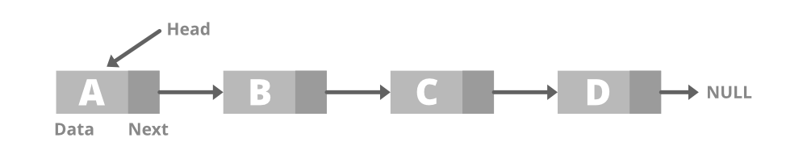
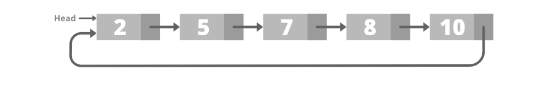
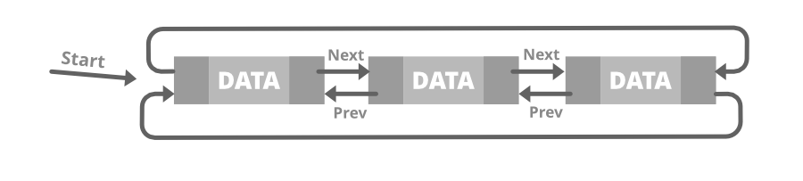
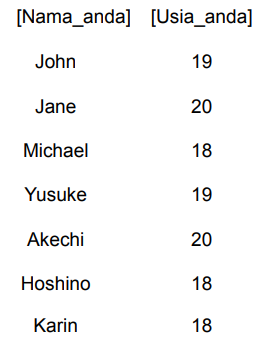

# <h1 align="center">Laporan Praktikum Modul 3 - Linked List </h1>
<p align="center">Mahija Danadyaksa Sadtomo_2311102157</p>

## Dasar Teori
<p>Linked list adalah struktur data yang berisi kumpulan elemen data dimana (node) tiap elemen saling berkaitan atau dihubungkan dengan elemen lain melalui suatu pointer. Pointer adalah alamat elemen data yang tersimpan di mermori.</p> <br/>
<p>Ada dua jenis pointer yaitu head dan tail. Head adalah simpul pertama yang digunakan sebagai awal akses ke seluruh data dalam linked list. Tail adalah simpul terakhir yang digunakan sebagai penanda akhir urutan simpul. Apabila linked list berisi elemen kosong, maka pointer dari head akan menunjuk ke NULL, begitu juga untuk pointer berikutnya dari tail.</p> <br/>
<p> Berbeda dengan array, linked list memiliki ukuran elemen yang dapat berubah secara dinamis dan mudah dalam menyisipkan dan menghapus elemen. Selain itu, pada linked list penyimpanan memorinya tidak harus berurutan dan berdekatan. </p> <br/>

Tedapat beberapa jenis linked list, yaitu:
1. Single linked list
2. Double linked list
3. Single Circular linked list
4. Double Circular linked list

### Single Linked List
Single linked list adalah jenis linked list yang hanya memiliki 1 pointer saja. Pointer digunakan untuk menunjuk node selanjutnya (next), kecuali pada node tail atau node terakhir yang pointernya menunjuk ke NULL.


### Double Linked List
Double Linked List adalah jenis linked list yang memiliki 2 pointer. 1 pointer menunjuk ke node selanjutnya (next) dan 1 lagi menunjuk ke node sebelumnya (prev). Pada node head, pointer prev akan bernilai NULL karena node Head adalah node pertama. Pada node Tail, pointer next akan menunjuk ke NULL.


### Single Circluar Linked List
Single Circular Linked List adalah linked list yang pointer next-nya menunjuk ke dirinya sendiri, jadi node tail (node terakhir) akan menunjuk ke node head (node pertama).



### Double Circular Linked List
Double Circular Linked List adalah linked list yang pointer next dan pointer prev-nya menunjuk ke dirinya sendiri secara circular.



## Guided 

### 1. Latihan Single Linked List

```C++
// Latihan Single Linked List

#include <iostream>
using namespace std;

///PROGRAM SINGLE LINKED LIST NON-CIRCULAR
//Deklarasi Struct Node
struct Node {
    int data;
    Node* next;
};

Node* head;
Node* tail;

//Inisialisasi Node
void init() {
    head = NULL;
    tail = NULL;
}

// Pengecekan
bool isEmpty() {
    if (head == NULL)
        return true;
    else
        return false;
}

//Tambah Depan
void insertDepan(int nilai) {
    //Buat Node baru
    Node* baru = new Node;
    baru->data = nilai;
    baru->next = NULL;

    if (isEmpty() == true) {
        head = tail = baru;
        tail->next = NULL;
    }
    else {
        baru->next = head;
        head = baru;
    }
}

//Tambah Belakang
void insertBelakang(int nilai) {
    //Buat Node baru
    Node* baru = new Node;
    baru->data = nilai;
    baru->next = NULL;

    if (isEmpty() == true) {
        head = tail = baru;
        tail->next = NULL;
    }
    else {
        tail->next = baru;
        tail = baru;
    }
}

//Hitung Jumlah List
int hitungList() {
    Node* hitung;
    hitung = head;
    int jumlah = 0;

    while (hitung != NULL) {
        jumlah++;
        hitung = hitung->next;
    }

    return jumlah;
}

//Tambah Tengah
void insertTengah(int data, int posisi) {
    if (posisi < 1 || posisi > hitungList()) {
        cout << "Posisi diluar jangkauan" << endl;
    }
    else if (posisi == 1) {
        cout << "Posisi bukan posisi tengah" << endl;
    }
    else {
        Node* baru, * bantu;
        baru = new Node();
        baru->data = data;

        // tranversing
        bantu = head;
        int nomor = 1;

        while (nomor < posisi - 1) {
            bantu = bantu->next;
            nomor++;
        }

        baru->next = bantu->next;
        bantu->next = baru;
    }
}

//Hapus Depan
void hapusDepan() {
    Node* hapus;

    if (isEmpty() == false) {
        if (head->next != NULL) {
            hapus = head;
            head = head->next;
            delete hapus;
        }
        else {
            head = tail = NULL;
        }
    }
    else {
        cout << "List kosong!" << endl;
    }
}

//Hapus Belakang
void hapusBelakang() {
    Node* hapus;
    Node* bantu;

    if (isEmpty() == false) {
        if (head != tail) {
            hapus = tail;
            bantu = head;

            while (bantu->next != tail) {
                bantu = bantu->next;
            }

            tail = bantu;
            tail->next = NULL;
            delete hapus;
        }
        else {
            head = tail = NULL;
        }
    }
    else {
        cout << "List kosong!" << endl;
    }
}

//Hapus Tengah
void hapusTengah(int posisi) {
    Node* hapus, * bantu, * bantu2;

    if (posisi < 1 || posisi > hitungList()) {
        cout << "Posisi di luar jangkauan" << endl;
    }
    else if (posisi == 1) {
        cout << "Posisi bukan posisi tengah" << endl;
    }
    else {
        int nomor = 1;
        bantu = head;

        while (nomor <= posisi) {
            if (nomor == posisi - 1) {
                bantu2 = bantu;
            }

            if (nomor == posisi) {
                hapus = bantu;
            }

            bantu = bantu->next;
            nomor++;
        }

        bantu2->next = bantu;
        delete hapus;
    }
}

//Ubah Depan
void ubahDepan(int data) {
    if (isEmpty() == false) {
        head->data = data;
    }
    else {
        cout << "List masih kosong!" << endl;
    }
}

//Ubah Tengah
void ubahTengah(int data, int posisi) {
    Node* bantu;

    if (isEmpty() == false) {
        if (posisi < 1 || posisi > hitungList()) {
            cout << "Posisi di luar jangkauan" << endl;
        }
        else if (posisi == 1) {
            cout << "Posisi bukan posisi tengah" << endl;
        }
        else {
            bantu = head;
            int nomor = 1;

            while (nomor < posisi) {
                bantu = bantu->next;
                nomor++;
            }

            bantu->data = data;
        }
    }
    else {
        cout << "List masih kosong!" << endl;
    }
}

//Ubah Belakang
void ubahBelakang(int data) {
    if (isEmpty() == false) {
        tail->data = data;
    }
    else {
        cout << "List masih kosong!" << endl;
    }
}

//Hapus List
void clearList() {
    Node* bantu, * hapus;
    bantu = head;

    while (bantu != NULL) {
        hapus = bantu;
        bantu = bantu->next;
        delete hapus;
    }

    head = tail = NULL;
    cout << "List berhasil terhapus!" << endl;
}

//Tampilkan List
void tampil() {
    Node* bantu;
    bantu = head;

    if (isEmpty() == false) {
        while (bantu != NULL) {
            cout << bantu->data << ends;
            bantu = bantu->next;
        }

        cout << endl;
    }
    else {
        cout << "List masih kosong!" << endl;
    }
}

int main() {
    init();
    insertDepan(3);
    tampil();
    insertBelakang(5);
    tampil();
    insertDepan(2);
    tampil();
    insertDepan(1);
    tampil();
    hapusDepan();
    tampil();
    hapusBelakang();
    tampil();
    insertTengah(7, 2);
    tampil();
    hapusTengah(2);
    tampil();
    ubahDepan(1);
    tampil();
    ubahBelakang(8);
    tampil();
    ubahTengah(11, 2);
    tampil();

    return 0;
}
```
 Program di atas adalah program single linked list non-circular yang menggunakan bahasa C++. Pertama kita deklarasikan struct Node yang berisi data dan pointer next. Kemudian kita inisialisasi head dan tail dengan NULL. Kemudian kita membuat fungsi-fungsi untuk menambahkan data di depan, belakang, dan tengah. Kemudian kita membuat fungsi untuk menghitung jumlah list, menghapus data di depan, belakang, dan tengah, mengubah data di depan, belakang, dan tengah, menghapus semua data, dan menampilkan data. Kemudian kita panggil fungsi-fungsi tersebut di dalam fungsi main. Hasilnya adalah sebagai berikut: 3 5 2 3 5 7 3 8 11

### 2. Latihan Double Linked List
```c++
#include <iostream>
using namespace std;

class Node {
public:
    int data;
    Node* prev;
    Node* next;
};

class DoublyLinkedList {
public:
    Node* head;
    Node* tail;

    DoublyLinkedList() {
        head = nullptr;
        tail = nullptr;
    }

    void push(int data) {
        Node* newNode = new Node;
        newNode->data = data;
        newNode->prev = nullptr;
        newNode->next = head;
        if (head != nullptr) {
            head->prev = newNode;
        }
        else {
            tail = newNode;
        }
        head = newNode;
    }

    void pop() {
        if (head == nullptr) {
            return;
        }
        Node* temp = head;
        head = head->next;
        if (head != nullptr) {
            head->prev = nullptr;
        }
        else {
            tail = nullptr;
        }
        delete temp;
    }

    bool update(int oldData, int newData) {
        Node* current = head;
        while (current != nullptr) {
            if (current->data == oldData) {
                current->data = newData;
                return true;
            }
            current = current->next;
        }
        return false;
    }

    void deleteAll() {
        Node* current = head;
        while (current != nullptr) {
            Node* temp = current;
            current = current->next;
            delete temp;
        }
        head = nullptr;
        tail = nullptr;
    }

    void display() {
        Node* current = head;
        while (current != nullptr) {
            cout << current->data << " ";
            current = current->next;
        }
        cout << endl;
    }
};

int main() {
    DoublyLinkedList list;
    while (true) {
        cout << "1. Add data" << endl;
        cout << "2. Delete data" << endl;
        cout << "3. Update data" << endl;
        cout << "4. Clear data" << endl;
        cout << "5. Display data" << endl;
        cout << "6. Exit" << endl;
        int choice;
        cout << "Enter your choice: ";
        cin >> choice;
        switch (choice) {
            case 1: {
                int data;
                cout << "Enter data to add: ";
                cin >> data;
                list.push(data);
                break;
            }
            case 2: {
                list.pop();
                break;
            }
            case 3: {
                int oldData, newData;
                cout << "Enter old data: ";
                cin >> oldData;
                cout << "Enter new data: ";
                cin >> newData;
                bool updated = list.update(oldData, newData);
                if (!updated) {
                    cout << "Data not found" << endl;
                }
                break;
            }
            case 4: {
                list.deleteAll();
                break;
            }
            case 5: {
                list.display();
                break;
            }
            case 6: {
                return 0;
            }
            default: {
                cout << "Invalid choice" << endl;
                break;
            }
        }
    }
    return 0;
}
```
Program di atas adalah program yang sama dengan program Guided1.cpp, namun program di atas menggunakan konsep class dan object. Pertama kita deklarasikan class Node yang berisi data, pointer prev, dan pointer next. Kemudian kita deklarasikan class DoublyLinkedList yang berisi pointer head dan pointer tail. Kemudian kita buat constructor untuk menginisialisasi head dan tail dengan NULL. Kemudian kita buat fungsi push untuk menambahkan data di depan, fungsi pop untuk menghapus data di depan, fungsi update untuk mengubah data, fungsi deleteAll untuk menghapus semua data, dan fungsi display untuk menampilkan data. Kemudian kita panggil fungsi-fungsi tersebut di dalam fungsi main. Hasilnya adalah sebagai berikut: 3 5 2 3 5 7 3 8 11

## Unguided 

### 1. Soal mengenai Single Linked List
Buatlah program menu Single Linked List Non-Circular untuk menyimpan Nama dan Usia mahasiswa, dengan menggunakan inputan dari user. Lakukan operasi berikut:<br/>
ㅤ1. Masukkan data sesuai urutan berikut. (Gunakan insert depan, belakang atau tengah). Data pertama yang dimasukkan adalah nama dan usia anda.<br/>
<br/>
ㅤ2. Hapus data Akechi<br/>
ㅤ3. Tambahkan data berikut diantara John dan Jane: "Futaba 18"<br/>
ㅤ4. Tambahkan data berikut di awal: "Igor 20"<br/>
ㅤ5. Ubah data Michael menjadi: "Reyn 18"<br/>
ㅤ6. Tampilkan seluruh data<br/>

```C++
//Coding Milik Mahija Danadyaksa Sadtomo (2311102157)

#include <iostream>
#include <iomanip>

using namespace std;

//Deklarasi Struct Node yang berisi nama dan umur
struct Node {
    string nama23;
    int umur23;
    Node* next;
};

Node* head;
Node* tail;

//Inisialisasi Node
void init() {
    head = NULL;
    tail = NULL;
}

// Pengecekan
bool isEmpty() {
    if (head == NULL)
        return true;
    else
        return false;
}

//Tambah Depan
void insertDepan(string nama, int umur) {
    //Buat Node baru
    Node* baru = new Node;
    baru->nama23 = nama;
    baru->umur23 = umur;
    baru->next = NULL;

    if (isEmpty() == true) {
        head = tail = baru;
        tail->next = NULL;
    }
    else {
        baru->next = head;
        head = baru;
    }
}

//Tambah Belakang
void insertBelakang(int nama, int umur) {
    //Buat Node baru
    Node* baru = new Node;
    baru->nama23 = nama;
    baru->umur23 = umur;
    baru->next = NULL;

    if (isEmpty() == true) {
        head = tail = baru;
        tail->next = NULL;
    }
    else {
        tail->next = baru;
        tail = baru;
    }
}

//Hitung Jumlah List
int hitungList() {
    Node* hitung;
    hitung = head;
    int jumlah = 0;

    while (hitung != NULL) {
        jumlah++;
        hitung = hitung->next;
    }

    return jumlah;
}

//Tambah Tengah
void insertTengah(string nama,int umur, int posisi) {
    if (posisi < 1 || posisi > hitungList()) {
        cout << "Posisi diluar jangkauan" << endl;
    }
    else if (posisi == 1) {
        cout << "Posisi bukan posisi tengah" << endl;
    }
    else {
        Node* baru, * bantu;
        baru = new Node();
        baru->nama23 = nama;
        baru->umur23 = umur;

        // tranversing
        bantu = head;
        int nomor = 1;

        while (nomor < posisi - 1) {
            bantu = bantu->next;
            nomor++;
        }

        baru->next = bantu->next;
        bantu->next = baru;
    }
}

//Hapus Depan
void hapusDepan() {
    Node* hapus;

    if (isEmpty() == false) {
        if (head->next != NULL) {
            hapus = head;
            head = head->next;
            delete hapus;
        }
        else {
            head = tail = NULL;
        }
    }
    else {
        cout << "List kosong!" << endl;
    }
}

//Hapus Belakang
void hapusBelakang() {
    Node* hapus;
    Node* bantu;

    if (isEmpty() == false) {
        if (head != tail) {
            hapus = tail;
            bantu = head;

            while (bantu->next != tail) {
                bantu = bantu->next;
            }

            tail = bantu;
            tail->next = NULL;
            delete hapus;
        }
        else {
            head = tail = NULL;
        }
    }
    else {
        cout << "List kosong!" << endl;
    }
}

//Hapus Tengah
void hapusTengah(int posisi) {
    Node* hapus, * bantu, * bantu2;

    if (posisi < 1 || posisi > hitungList()) {
        cout << "Posisi di luar jangkauan" << endl;
    }
    else if (posisi == 1) {
        cout << "Posisi bukan posisi tengah" << endl;
    }
    else {
        int nomor = 1;
        bantu = head;

        while (nomor <= posisi) {
            if (nomor == posisi - 1) {
                bantu2 = bantu;
            }

            if (nomor == posisi) {
                hapus = bantu;
            }

            bantu = bantu->next;
            nomor++;
        }

        bantu2->next = bantu;
        delete hapus;
    }
}

//Ubah Depan
void ubahDepan(string nama, int umur) {
    if (isEmpty() == false) {
        head->nama23 = nama;
        head->umur23 = umur;
    }
    else {
        cout << "List masih kosong!" << endl;
    }
}

//Ubah Tengah
void ubahTengah(string nama,int umur, int posisi) {
    Node* bantu;

    if (isEmpty() == false) {
        if (posisi < 1 || posisi > hitungList()) {
            cout << "Posisi di luar jangkauan" << endl;
        }
        else if (posisi == 1) {
            cout << "Posisi bukan posisi tengah" << endl;
        }
        else {
            bantu = head;
            int nomor = 1;

            while (nomor < posisi) {
                bantu = bantu->next;
                nomor++;
            }

            bantu->nama23 = nama;
            bantu->umur23 = umur;
        }
    }
    else {
        cout << "List masih kosong!" << endl;
    }
}

//Ubah Belakang
void ubahBelakang(string nama, int umur) {
    if (isEmpty() == false) {
        tail->nama23 = nama;
        tail->umur23 = umur;
    }
    else {
        cout << "List masih kosong!" << endl;
    }
}

//Hapus List
void clearList() {
    Node* bantu, * hapus;
    bantu = head;

    while (bantu != NULL) {
        hapus = bantu;
        bantu = bantu->next;
        delete hapus;
    }

    head = tail = NULL;
    cout << "List berhasil terhapus!" << endl;
}

//Tampilkan List
void tampil() {
    Node* bantu;
    bantu = head;

    cout<< left << setw(20) << "Nama" << setw(20) << "Umur" << endl;
    if (isEmpty() == false) {
        while (bantu != NULL) {
            cout << left << setw(20) << bantu->nama23 << setw(20) << bantu->umur23 << endl;
            bantu = bantu->next;
        }

        cout << endl;
    }
    else {
        cout << "List masih kosong!" << endl;
    }
}

int main() {
    init();
    // Tampilan awal
    cout<<"===== A) NAMA DAN UMUR  (A =====\n";
    insertDepan("Karin", 18);
    insertDepan("Hoshino", 18);
    insertDepan("Akechi", 20);
    insertDepan("Yusuke", 19);
    insertDepan("Michael", 18);
    insertDepan("Jane", 20);
    insertDepan("John", 19);
    insertDepan("Aksa", 19);
    tampil();

    // Tampilan setelah menghapus akechi di posisi 6
    cout<<"===== B) Hapus 'Akechi' (B =====\n";
    hapusTengah(6);
    tampil();

    // Tampilan setelah menambahkan futaba di posisi 3
    cout<<"===== C) Insert 'Futaba' (C =====\n";
    insertTengah("Futaba", 18, 3);
    tampil();

    // Tampilan setelah menambahkan igor di depan
    cout<<"===== D) Insert 'Igor' (D =====\n";
    insertDepan("Igor", 20);
    tampil();

    // Tampilan setelah mengubah michael menjadi reyn
    cout<<"===== E) Ubah 'Michael' menjadi 'Reyn'(E =====\n";
    ubahTengah("Reyn", 18, 6);

    // Tampilan terakhir
    cout<<"===== F) Tampilan Seluruh Data (F =====\n";
    tampil();

    return 0;
}
```
#### Output:
.png)
.png)

program di atas merupakan program yang mengimplementasikan linked list dengan menggunakan struct Node yang berisi string nama23 dan int umur23 dan Node *next. Program ini memiliki beberapa fungsi yaitu:
1. insertDepan(string nama, int umur) : untuk menambahkan data di depan
2. insertBelakang(string nama, int umur) : untuk menambahkan data di belakang
3. hitungList() : untuk menghitung jumlah list
4. insertTengah(string nama, int umur, int posisi) : untuk menambahkan data di tengah
5. hapusDepan() : untuk menghapus data di depan
6. hapusBelakang() : untuk menghapus data di belakang
7. hapusTengah(int posisi) : untuk menghapus data di tengah
8. ubahDepan(string nama, int umur) : untuk mengubah data di depan
9. ubahTengah(string nama, int umur, int posisi) : untuk mengubah data di tengah
10. ubahBelakang(string nama, int umur) : untuk mengubah data di belakang
11. clearList() : untuk menghapus semua data
12. tampil() : untuk menampilkan data
13. main() : Fungsi utama yang digunakan untuk menjalankan program

Di dalam main program, pertama program akan menampilkan data yang sudah diinputkan. Kedua program akan menghapus data 'Akechi' di posisi 6  dengan menggunakan fungsi hapusTengah(6). Ketiga program akan menambahkan data 'Futaba' di posisi 3 dengan menggunakan fungsi insertTengah("Futaba", 18, 3). keempat program akan menambahkan data 'Igor' di depan dengan menggunakan fungsi insertDepan("Igor", 20). kelima program akan mengubah data 'Michael' menjadi 'Reyn' dengan menggunakan fungsi ubahTengah("Reyn", 18, 6). Terakhir program akan menampilkan seluruh data dengan menggunakan fungsi tampil().

### 2. Soal mengenai Double Linked List
Modifikasi Guided Double Linked List dilakukan dengan penambahan operasi untuk menambah data, menghapus, dan update di tengah / di urutan tertentu yang diminta. Selain itu, buatlah agar tampilannya menampilkan Nama Produk dan Harga.<br/>
Case:<br/>
ㅤ1. Tambahkan produk Azarine dengan harga 65000 diantara Somethinc dan Skintific<br/>
ㅤ2. Hapus produk Wardah<br/>
ㅤ3. Update produk Hanasui menjadi Cleora dengan harga 55000<br/>
ㅤ4. Tampilkan menu, di mana tampilan akhirnya akan menjadi seperti dibawah ini:<br/>

```C++
// Coding milik Mahija Danadyaksa Sadtomo 2311102157
#include <iostream> // Library yang digunakan untuk input dan output
#include <iomanip> // Library yang digunakan untuk manipulasi output

using namespace std; // Untuk mempersingkat penulisan kode agar tidak perlu menuliskan std:: pada setiap fungsi   

// Deklarasi class Node yang berisi produk dan harga
class Node {
public:
    string produk23;
    int harga23;
    Node* prev; // Pointer ke node sebelumnya
    Node* next; // Pointer ke node selanjutnya
};

// Deklarasi class DoublyLinkedList
class DoublyLinkedList {
public:
    Node* head; // Deklarasi head
    Node* tail; // Deklarasi tail

    // pembuatan double linked list 
    DoublyLinkedList() {
        head = nullptr; // Inisialisasi head
        tail = nullptr; // Inisialisasi tail
    }

    // Menambahkan data
    void push(string produk, int harga) {
        Node* newNode = new Node;
        newNode->produk23 = produk;
        newNode->harga23 = harga;
        newNode->prev = nullptr;
        newNode->next = head;
        if (head != nullptr) {
            head->prev = newNode;
        }
        else {
            tail = newNode;
        }
        head = newNode;
    }
    
    // Menambahkan data pada posisi tertentu
    void pushPosisi(string produk, int harga, int posisi) {
    Node* newNode = new Node;
    newNode->produk23 = produk;
    newNode->harga23 = harga;

    // Pengecekan posisi, kurang dari 0 atau sama dengan 0
    if (posisi <= 0) {  
        cout << "Posisi tidak valid" << endl;
        delete newNode;
        return;
    }

    // Pengecekan posisi, sama dengan 1 maka akan menambahkan data pada posisi pertama (head)
    if (posisi == 1) {  
        newNode->prev = nullptr;
        newNode->next = head;
        if (head != nullptr) {
            head->prev = newNode;
        } else {
            tail = newNode;
        }
        head = newNode;
        return;
    }

    Node* current = head;
    int currentPosition = 1;  // Inisialisasi posisi saat ini
    while (currentPosition < posisi - 1 && current != nullptr) {
        current = current->next;
        currentPosition++;
    }

    // Pengecekan posisi, jika posisi yang diminta melebihi panjang daftar maka posisi tidak valid
    if (current == nullptr) { 
        cout << "Posisi tidak valid" << endl;
        delete newNode;
        return;
    }

    newNode->prev = current;
    newNode->next = current->next;
    if (current->next != nullptr) {
        current->next->prev = newNode;
    } else {
        tail = newNode;
    }
    current->next = newNode;
}

    // Menghapus data
    void pop() {
        if (head == nullptr) {
            return;
        }
        Node* temp = head;
        head = head->next;
        if (head != nullptr) {
            head->prev = nullptr;
        }
        else {
            tail = nullptr;
        }
        delete temp;
    }

    // Menghapus data pada posisi tertentu
   void popPosisi(int posisi) {
    // Pengecekan posisi, kurang dari 0 atau sama dengan 0
    if (posisi <= 0 || head == nullptr) {
        cout << "Posisi tidak valid atau daftar kosong" << endl;
        return;
    }

    Node* current = head;
    int currentPosition = 1; // Inisialisasi posisi saat ini
    while (currentPosition < posisi && current != nullptr) {
        current = current->next;
        currentPosition++;
    }

    // Pengecekan posisi, jika posisi yang diminta melebihi panjang daftar maka posisi tidak valid
    if (current == nullptr) {
        cout << "Posisi tidak valid" << endl;
        return;
    }

    if (current->prev != nullptr) {
        current->prev->next = current->next;
    } else {
        head = current->next;
    }

    if (current->next != nullptr) {
        current->next->prev = current->prev;
    } else {
        tail = current->prev;
    }

    delete current;
}

    // Mengupdate data
    bool update(string oldProduk, string newProduk, int newHarga) {
        Node* current = head;
        while (current != nullptr) {
            if (current->produk23 == oldProduk) {
                current->produk23 = newProduk;\
                current->harga23 = newHarga;
                return true;
            }
            current = current->next;
        }
        return false;
    }

    // Menghapus semua data
    void deleteAll() {
        Node* current = head;
        while (current != nullptr) {
            Node* temp = current;
            current = current->next;
            delete temp;
        }
        head = nullptr;
        tail = nullptr;
    }

    //  Menampilkan data
    void display() {
        Node* current = head;
        cout << left << setw(20) << "Produk" << right <<setw(20) << "Harga" << endl;
        while (current != nullptr) {
            cout << left << setw(20) << current->produk23 << right << setw(20) << current->harga23 << endl;
            current = current->next;
        }
        cout << endl;
    }
};

int main() {
    DoublyLinkedList list;
    cout << "==========Daftar Produk==========" << endl;
    list.push("Hanasui", 30000);
    list.push("Wardah", 50000);
    list.push("Skintific", 100000);
    list.push("Somethinc", 150000);
    list.push("Originote", 60000);
    list.display();

    while (true) {
        cout << "==========Menu CRUD==========" << endl;
        cout << "1. Insert Produk" << endl;
        cout << "2. Delete Produk" << endl;
        cout << "3. Update Produk" << endl;
        cout << "4. Clear Produk" << endl;
        cout << "5. Insert Produk Berdasarkan Urutan" << endl;
        cout << "6. Delete produk berdasarkan Urutan" << endl;
        cout << "7. Display Produk" << endl;
        cout << "8. Exit" << endl;
        int choice;
        cout << "Enter your choice: ";
        cin >> choice;
        switch (choice) {
            case 1: {
                string produk;
                int harga;
                cout << "Masukan produk baru: ";
                cin >> produk;
                cout << "Masukan harga produk baru: ";
                cin >> harga;
                list.push(produk, harga);
                cout<< "Produk berhasil ditambahkan" << endl;
                break;
            }
            case 2: {
                list.pop();
                cout << "Produk paling atas berhasil dihapus" << endl;
                break;
            }
            case 3: {
                string oldProduk, newProduk;
                int newHarga;
                cout << "Masukan nama produk yang ingin di update: ";
                cin >> oldProduk;
                cout << "Masukan nama produk baru: ";
                cin >> newProduk;
                cout << "Masukan harga baru: ";
                cin >> newHarga;
                bool updated = list.update(oldProduk, newProduk, newHarga);
                if (!updated) {
                    cout << "Produk tidak ditemukan" << endl;
                }
                else {
                    cout << "Produk berhasil diupdate" << endl;
                }
                break;
            }
            case 4: {
                list.deleteAll();
                cout << "Produk berhasil dihapus semua" << endl;
                break;
            }
            case 5: {
                string produk;
                int harga, posisi;
                cout << "Masukan nama produk baru: ";
                cin >> produk;
                cout << "Masukan harga produk baru: ";
                cin >> harga;
                cout << "Masukan posisi produk baru: ";
                cin >> posisi;
                list.pushPosisi(produk, harga, posisi);
                cout << "Produk baru berhasil ditambahkan pada posisi " << posisi << endl;
                break;
            }
            case 6: {
                int posisi;
                cout << "Masukan posisi produk yang ingin dihapus: ";
                cin >> posisi;
                list.popPosisi(posisi);
                cout << "Produk pada posisi " << posisi << " berhasil dihapus" << endl;
                break;
            }
            case 7: {
                list.display();
                break;
            }
            case 8: {
                return 0;
            }
            default: {
                cout << "Pilihan tidak sesuai!" << endl;
                break;
            }
        }
    }
    return 0;
}
```
#### Output:
.png)
.png)

program di atas adalah program yang digunakan untuk menambahkan, menghapus, mengupdate, dan menampilkan data produk dan harga dengan menggunakan metode double linked list. Di dalam program tersebut terdapat beberapa fungsi, yaitu:
1. push() : Menambahkan data pada posisi pertama (head)
2. pushPosisi() : Menambahkan data pada posisi tertentu
3. pop() : Menghapus data pada posisi pertama (head)
4. popPosisi() : Menghapus data pada posisi tertentu
5. update() : Mengupdate data
6. deleteAll() : Menghapus semua data
7. display() : Menampilkan data
8. main() : Fungsi utama yang digunakan untuk menjalankan program


Pertama program akan menampilkan produk dan harga yang sudah diinputkan. Kemudian program akan menampilkan menu yang berisi pilihan untuk menambahkan, menghapus, mengupdate, dan menampilkan data produk dan harga. Setelah itu, program akan meminta inputan dari user sesuai dengan pilihan yang diinginkan. Kemudian program akan mengeksekusi pilihan yang diinputkan oleh user. Program akan terus berjalan hingga user memilih untuk keluar dari program.

Pada saat run program, user menambahkan produk Azarine dengan harga 65000 diantara Somethinc dan Skintific dengan menggunakan fungsi pushPosisi() dengan inputan posisi 3. Setelah itu user menghapus produk Wardah dengan menggunakan popPosisi() pada posisi ke 5. Kemudian user mengupdate produk Hanasui menjadi Cleora dengan harga 55000 dengan menggunakan fungsi update(). Terakhir user diminta untuk menampilkan tampilan akhir setelah dilakukan beberapa perubahan.

## Kesimpulan
Linked List adalah struktur data yang menyimpan elemen (node) secara berurutan yang dihubungkan dengan pointer yaitu head dan tail. Linked list memiliki batas data yang dinamis tidak seperti array yang statis. Tedapat bermacam-macam jenis pada linked list, yaitu Single Linked List, Double Linked List, Single Circular Linked List, dan Double Circular Linked List. Kegunaan dari linked list sendiri yaitu memudahkan dalam menyisipkan dan menghapus data secara dinamis dan memungkinkan alokasi dan dealokasi memori dengan lebih fleksibel.

## Referensi
[1] Sihombing, Johnson & Ganesha, Politeknik & Gatot, Jl & No, Soebroto & Bandung,. (2020). PENERAPAN STACK DAN QUEUE PADA ARRAY DAN LINKED LIST DALAM JAVA. <br/>
[2] Abu Sara, M. R., Klaib, M. F. J., & Hasan, M. (2021). Hybrid Array List: An Efficient Dynamic Array with Linked List Structure. Indonesia Journal on Computing (Indo-JC), 5(3), 47-62. <br/>
[3] Anita Sindar, R. M. S. (2019). Struktur Data Dan Algoritma Dengan C++ (Vol. 1). CV. AA. RIZKY.<br/>