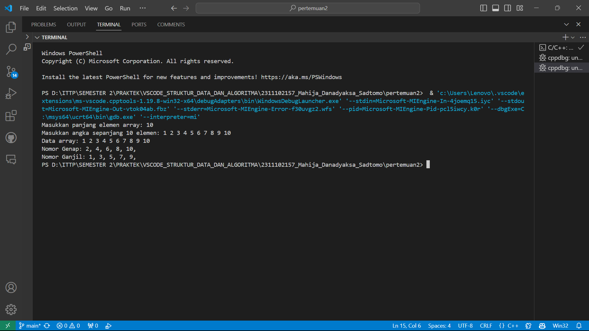
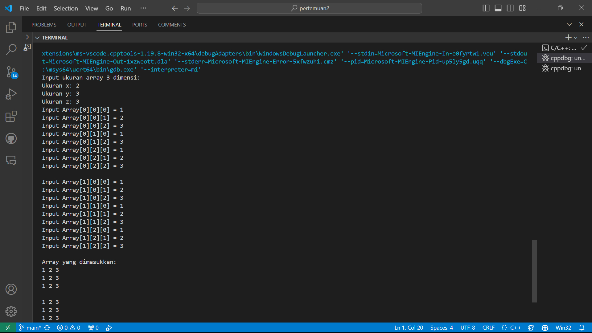

# <h1 align="center">Laporan Praktikum Modul 3 - Linked List </h1>
<p align="center">Mahija Danadyaksa Sadtomo_2311102157</p>

## Dasar Teori
<p>Linked list adalah struktur data yang berisi kumpulan elemen data dimana (node) tiap elemen saling berkaitan atau dihubungkan dengan elemen lain melalui suatu pointer. Pointer adalah alamat elemen data yang tersimpan di mermori.</p> <br/>
<p>Ada dua jenis pointer yaitu head dan tail. Head adalah simpul pertama yang digunakan sebagai awal akses ke seluruh data dalam linked list. Tail adalah simpul terakhir yang digunakan sebagai penanda akhir urutan simpul. Apabila linked list berisi elemen kosong, maka pointer dari head akan menunjuk ke NULL, begitu juga untuk pointer berikutnya dari tail.</p> <br/>
<p> Berbeda dengan array, linked list memiliki ukuran elemen yang dapat berubah secara dinamis dan mudah dalam menyisipkan dan menghapus elemen. Selain itu, pada linked list penyimpanan memorinya tidak harus berurutan dan berdekatan. </p> <br/>

Tedapat beberapa jenis linked list, yaitu:
1. Single linked list
2. Double linked list
3. Single Circular linked list
4. Double Circular linked list

### Single Linked List
Single linked list adalah jenis linked list yang hanya memiliki 1 pointer saja. Pointer digunakan untuk menunjuk node selanjutnya (next), kecuali pada node tail atau node terakhir yang pointernya menunjuk ke NULL.


### Double Linked List
Double Linked List adalah jenis linked list yang memiliki 2 pointer. 1 pointer menunjuk ke node selanjutnya (next) dan 1 lagi menunjuk ke node sebelumnya (prev). Pada node head, pointer prev akan bernilai NULL karena node Head adalah node pertama. Pada node Tail, pointer next akan menunjuk ke NULL.


### Single Circluar Linked List
Single Circular Linked List adalah linked list yang pointer next-nya menunjuk ke dirinya sendiri, jadi node tail (node terakhir) akan menunjuk ke node head (node pertama).


### Double Circular Linked List
Double Circular Linked List adalah linked list yang pointer next dan pointer prev-nya menunjuk ke dirinya sendiri secara circular.


## Guided 

### 1. Latihan Single Linked List

```C++
// Latihan Single Linked List

#include <iostream>
using namespace std;

///PROGRAM SINGLE LINKED LIST NON-CIRCULAR
//Deklarasi Struct Node
struct Node {
    int data;
    Node* next;
};

Node* head;
Node* tail;

//Inisialisasi Node
void init() {
    head = NULL;
    tail = NULL;
}

// Pengecekan
bool isEmpty() {
    if (head == NULL)
        return true;
    else
        return false;
}

//Tambah Depan
void insertDepan(int nilai) {
    //Buat Node baru
    Node* baru = new Node;
    baru->data = nilai;
    baru->next = NULL;

    if (isEmpty() == true) {
        head = tail = baru;
        tail->next = NULL;
    }
    else {
        baru->next = head;
        head = baru;
    }
}

//Tambah Belakang
void insertBelakang(int nilai) {
    //Buat Node baru
    Node* baru = new Node;
    baru->data = nilai;
    baru->next = NULL;

    if (isEmpty() == true) {
        head = tail = baru;
        tail->next = NULL;
    }
    else {
        tail->next = baru;
        tail = baru;
    }
}

//Hitung Jumlah List
int hitungList() {
    Node* hitung;
    hitung = head;
    int jumlah = 0;

    while (hitung != NULL) {
        jumlah++;
        hitung = hitung->next;
    }

    return jumlah;
}

//Tambah Tengah
void insertTengah(int data, int posisi) {
    if (posisi < 1 || posisi > hitungList()) {
        cout << "Posisi diluar jangkauan" << endl;
    }
    else if (posisi == 1) {
        cout << "Posisi bukan posisi tengah" << endl;
    }
    else {
        Node* baru, * bantu;
        baru = new Node();
        baru->data = data;

        // tranversing
        bantu = head;
        int nomor = 1;

        while (nomor < posisi - 1) {
            bantu = bantu->next;
            nomor++;
        }

        baru->next = bantu->next;
        bantu->next = baru;
    }
}

//Hapus Depan
void hapusDepan() {
    Node* hapus;

    if (isEmpty() == false) {
        if (head->next != NULL) {
            hapus = head;
            head = head->next;
            delete hapus;
        }
        else {
            head = tail = NULL;
        }
    }
    else {
        cout << "List kosong!" << endl;
    }
}

//Hapus Belakang
void hapusBelakang() {
    Node* hapus;
    Node* bantu;

    if (isEmpty() == false) {
        if (head != tail) {
            hapus = tail;
            bantu = head;

            while (bantu->next != tail) {
                bantu = bantu->next;
            }

            tail = bantu;
            tail->next = NULL;
            delete hapus;
        }
        else {
            head = tail = NULL;
        }
    }
    else {
        cout << "List kosong!" << endl;
    }
}

//Hapus Tengah
void hapusTengah(int posisi) {
    Node* hapus, * bantu, * bantu2;

    if (posisi < 1 || posisi > hitungList()) {
        cout << "Posisi di luar jangkauan" << endl;
    }
    else if (posisi == 1) {
        cout << "Posisi bukan posisi tengah" << endl;
    }
    else {
        int nomor = 1;
        bantu = head;

        while (nomor <= posisi) {
            if (nomor == posisi - 1) {
                bantu2 = bantu;
            }

            if (nomor == posisi) {
                hapus = bantu;
            }

            bantu = bantu->next;
            nomor++;
        }

        bantu2->next = bantu;
        delete hapus;
    }
}

//Ubah Depan
void ubahDepan(int data) {
    if (isEmpty() == false) {
        head->data = data;
    }
    else {
        cout << "List masih kosong!" << endl;
    }
}

//Ubah Tengah
void ubahTengah(int data, int posisi) {
    Node* bantu;

    if (isEmpty() == false) {
        if (posisi < 1 || posisi > hitungList()) {
            cout << "Posisi di luar jangkauan" << endl;
        }
        else if (posisi == 1) {
            cout << "Posisi bukan posisi tengah" << endl;
        }
        else {
            bantu = head;
            int nomor = 1;

            while (nomor < posisi) {
                bantu = bantu->next;
                nomor++;
            }

            bantu->data = data;
        }
    }
    else {
        cout << "List masih kosong!" << endl;
    }
}

//Ubah Belakang
void ubahBelakang(int data) {
    if (isEmpty() == false) {
        tail->data = data;
    }
    else {
        cout << "List masih kosong!" << endl;
    }
}

//Hapus List
void clearList() {
    Node* bantu, * hapus;
    bantu = head;

    while (bantu != NULL) {
        hapus = bantu;
        bantu = bantu->next;
        delete hapus;
    }

    head = tail = NULL;
    cout << "List berhasil terhapus!" << endl;
}

//Tampilkan List
void tampil() {
    Node* bantu;
    bantu = head;

    if (isEmpty() == false) {
        while (bantu != NULL) {
            cout << bantu->data << ends;
            bantu = bantu->next;
        }

        cout << endl;
    }
    else {
        cout << "List masih kosong!" << endl;
    }
}

int main() {
    init();
    insertDepan(3);
    tampil();
    insertBelakang(5);
    tampil();
    insertDepan(2);
    tampil();
    insertDepan(1);
    tampil();
    hapusDepan();
    tampil();
    hapusBelakang();
    tampil();
    insertTengah(7, 2);
    tampil();
    hapusTengah(2);
    tampil();
    ubahDepan(1);
    tampil();
    ubahBelakang(8);
    tampil();
    ubahTengah(11, 2);
    tampil();

    return 0;
}
```
 Program di atas adalah program single linked list non-circular yang menggunakan bahasa C++. Pertama kita deklarasikan struct Node yang berisi data dan pointer next. Kemudian kita inisialisasi head dan tail dengan NULL. Kemudian kita membuat fungsi-fungsi untuk menambahkan data di depan, belakang, dan tengah. Kemudian kita membuat fungsi untuk menghitung jumlah list, menghapus data di depan, belakang, dan tengah, mengubah data di depan, belakang, dan tengah, menghapus semua data, dan menampilkan data. Kemudian kita panggil fungsi-fungsi tersebut di dalam fungsi main. Hasilnya adalah sebagai berikut: 3 5 2 3 5 7 3 8 11

### 2. Latihan Double Linked List
```c++
#include <iostream>
using namespace std;

class Node {
public:
    int data;
    Node* prev;
    Node* next;
};

class DoublyLinkedList {
public:
    Node* head;
    Node* tail;

    DoublyLinkedList() {
        head = nullptr;
        tail = nullptr;
    }

    void push(int data) {
        Node* newNode = new Node;
        newNode->data = data;
        newNode->prev = nullptr;
        newNode->next = head;
        if (head != nullptr) {
            head->prev = newNode;
        }
        else {
            tail = newNode;
        }
        head = newNode;
    }

    void pop() {
        if (head == nullptr) {
            return;
        }
        Node* temp = head;
        head = head->next;
        if (head != nullptr) {
            head->prev = nullptr;
        }
        else {
            tail = nullptr;
        }
        delete temp;
    }

    bool update(int oldData, int newData) {
        Node* current = head;
        while (current != nullptr) {
            if (current->data == oldData) {
                current->data = newData;
                return true;
            }
            current = current->next;
        }
        return false;
    }

    void deleteAll() {
        Node* current = head;
        while (current != nullptr) {
            Node* temp = current;
            current = current->next;
            delete temp;
        }
        head = nullptr;
        tail = nullptr;
    }

    void display() {
        Node* current = head;
        while (current != nullptr) {
            cout << current->data << " ";
            current = current->next;
        }
        cout << endl;
    }
};

int main() {
    DoublyLinkedList list;
    while (true) {
        cout << "1. Add data" << endl;
        cout << "2. Delete data" << endl;
        cout << "3. Update data" << endl;
        cout << "4. Clear data" << endl;
        cout << "5. Display data" << endl;
        cout << "6. Exit" << endl;
        int choice;
        cout << "Enter your choice: ";
        cin >> choice;
        switch (choice) {
            case 1: {
                int data;
                cout << "Enter data to add: ";
                cin >> data;
                list.push(data);
                break;
            }
            case 2: {
                list.pop();
                break;
            }
            case 3: {
                int oldData, newData;
                cout << "Enter old data: ";
                cin >> oldData;
                cout << "Enter new data: ";
                cin >> newData;
                bool updated = list.update(oldData, newData);
                if (!updated) {
                    cout << "Data not found" << endl;
                }
                break;
            }
            case 4: {
                list.deleteAll();
                break;
            }
            case 5: {
                list.display();
                break;
            }
            case 6: {
                return 0;
            }
            default: {
                cout << "Invalid choice" << endl;
                break;
            }
        }
    }
    return 0;
}
```
Program di atas adalah program yang sama dengan program Guided1.cpp, namun program di atas menggunakan konsep class dan object. Pertama kita deklarasikan class Node yang berisi data, pointer prev, dan pointer next. Kemudian kita deklarasikan class DoublyLinkedList yang berisi pointer head dan pointer tail. Kemudian kita buat constructor untuk menginisialisasi head dan tail dengan NULL. Kemudian kita buat fungsi push untuk menambahkan data di depan, fungsi pop untuk menghapus data di depan, fungsi update untuk mengubah data, fungsi deleteAll untuk menghapus semua data, dan fungsi display untuk menampilkan data. Kemudian kita panggil fungsi-fungsi tersebut di dalam fungsi main. Hasilnya adalah sebagai berikut: 3 5 2 3 5 7 3 8 11

## Unguided 

### 1. Soal mengenai Single Linked List
Buatlah program menu Single Linked List Non-Circular untuk menyimpan Nama dan Usia mahasiswa, dengan menggunakan inputan dari user. Lakukan operasi berikut:<br/>


ㅤ1. Masukkan data sesuai urutan berikut. (Gunakan insert depan, belakang atau tengah). Data pertama yang dimasukkan adalah nama dan usia anda.<br/>
ㅤ2. Hapus data Akechi<br/>
ㅤ3. Tambahkan data berikut diantara John dan Jane: "Futaba 18"<br/>
ㅤ4. Tambahkan data berikut di awal: "Igor 20"<br/>
ㅤ5. Ubah data Michael menjadi: "Reyn 18"<br/>
ㅤ6. Tampilkan seluruh data<br/>

```C++

```
#### Output:


penjelasan coding

### 2. Soal mengenai Double Linked List
Modifikasi Guided Double Linked List dilakukan dengan penambahan operasi untuk menambah data, menghapus, dan update di tengah / di urutan tertentu yang diminta. Selain itu, buatlah agar tampilannya menampilkan Nama Produk dan Harga.<br/>
Case:<br/>
ㅤ1. Tambahkan produk Azarine dengan harga 65000 diantara Somethinc dan Skintific<br/>
ㅤ2. Hapus produk Wardah<br/>
ㅤ3. Update produk Hanasui menjadi Cleora dengan harga 55000<br/>
ㅤ4. Tampilkan menu, di mana tampilan akhirnya akan menjadi seperti dibawah ini:<br/>

```C++

```
#### Output:


penjelasan coding

## Kesimpulan
Linked List adalah struktur data yang menyimpan elemen (node) secara berurutan yang dihubungkan dengan pointer yaitu head dan tail. Linked list memiliki batas data yang dinamis tidak seperti array yang statis. Tedapat bermacam-macam jenis pada linked list, yaitu Single Linked List, Double Linked List, Single Circular Linked List, dan Double Circular Linked List. Kegunaan dari linked list sendiri yaitu memudahkan dalam menyisipkan dan menghapus data secara dinamis dan memungkinkan alokasi dan dealokasi memori dengan lebih fleksibel.

## Referensi
[1] Sihombing, Johnson & Ganesha, Politeknik & Gatot, Jl & No, Soebroto & Bandung,. (2020). PENERAPAN STACK DAN QUEUE PADA ARRAY DAN LINKED LIST DALAM JAVA. <br/>
[2] Abu Sara, M. R., Klaib, M. F. J., & Hasan, M. (2021). Hybrid Array List: An Efficient Dynamic Array with Linked List Structure. Indonesia Journal on Computing (Indo-JC), 5(3), 47-62. <br/>
[3] Anita Sindar, R. M. S. (2019). Struktur Data Dan Algoritma Dengan C++ (Vol. 1). CV. AA. RIZKY.<br/>