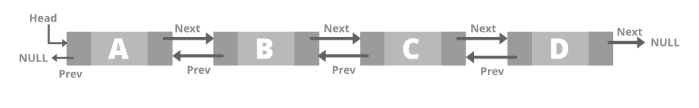

# <h1 align="center">Laporan Praktikum Modul 3 - Linked List </h1>
<p align="center">Mahija Danadyaksa Sadtomo_2311102157</p>

## Dasar Teori
<p>Linked list adalah struktur data yang berisi kumpulan elemen data dimana (node) tiap elemen saling berkaitan atau dihubungkan dengan elemen lain melalui suatu pointer. Pointer adalah alamat elemen data yang tersimpan di mermori.</p> <br/>
<p>Ada dua jenis pointer yaitu head dan tail. Head adalah simpul pertama yang digunakan sebagai awal akses ke seluruh data dalam linked list. Tail adalah simpul terakhir yang digunakan sebagai penanda akhir urutan simpul. Apabila linked list berisi elemen kosong, maka pointer dari head akan menunjuk ke NULL, begitu juga untuk pointer berikutnya dari tail.</p> <br/>
<p> Berbeda dengan array, linked list memiliki ukuran elemen yang dapat berubah secara dinamis dan mudah dalam menyisipkan dan menghapus elemen. Selain itu, pada linked list penyimpanan memorinya tidak harus berurutan dan berdekatan. </p> <br/>

Tedapat beberapa jenis linked list, yaitu:
1. Single linked list
2. Double linked list
3. Single Circular linked list
4. Double Circular linked list

### Single Linked List
Single linked list adalah jenis linked list yang hanya memiliki 1 pointer saja. Pointer digunakan untuk menunjuk node selanjutnya (next), kecuali pada node tail atau node terakhir yang pointernya menunjuk ke NULL.


### Double Linked List
Double Linked List adalah jenis linked list yang memiliki 2 pointer. 1 pointer menunjuk ke node selanjutnya (next) dan 1 lagi menunjuk ke node sebelumnya (prev). Pada node head, pointer prev akan bernilai NULL karena node Head adalah node pertama. Pada node Tail, pointer next akan menunjuk ke NULL.


### Single Circluar Linked List
Single : artinya field pointer-nya hanya satu buah saja dan satu arah.<br/>
Circular : artinya pointer next-nya akan menunjuk pada dirinya sendiri
sehingga berputar. <br/>
Jadi, Single Circular Linked List adalah linked list yang pointer next-nya menunjuk ke dirinya sendiri, jadi node tail (node terakhir) akan menunjuk ke node head (node pertama).


### Double Circular Linked List
Double Circular Linked List adalah linked list yang pointer next dan pointer prev-nya menunjuk ke dirinya sendiri secara circular.


## Guided 

### 1. Latihan Single Linked List Non Circular

```C++
#include <iostream>

using namespace std;

// PROGRAM SINGLE LINKED LIST NON-CIRCULAR

// Deklarasi struct node
struct Node
{
    int data;
    Node *next;
};

Node *head; // Deklarasi head
Node *tail; // Deklarasi tail

// Inisialisasi Node
void init()
{
    head = NULL;
    tail = NULL;
}

// Pengecekkan apakah linked list kosong
bool isEmpty()
{
    if (head == NULL)
    {
        return true;
    }
    else
    {
        return false;
    }
}
    // Tambah depan
    void insertDepan(int nilai)
    {

        // buat node baru
        Node *baru = new Node();
        baru->data = nilai;
        baru->next = NULL;
        if (isEmpty() == true)
        {
            head = tail = baru;
            head->next = NULL;
        }
        else
        {
            baru->next = head;
            head = baru;
        }
    }

    // Tambah belakang
    void insertBelakang(int nilai)
    {
        // buat node baru
        Node *baru = new Node();
        baru->data = nilai;
        baru->next = NULL;
        if (isEmpty() == true)
        {
            head = tail = baru;
            head->next = NULL;
        }
        else
        {
            tail->next = baru;
            tail = baru;
        }
    }

    // Hitung jumlah list
    int hitungList()
    {
        Node *hitung;
        hitung = head;
        int jumlah = 0;
        while (hitung != NULL)
        {
            jumlah++;
            hitung = hitung->next;
        }
        return jumlah;
    }

    // Tambah tengah
    void insertTengah(int data, int posisi)
    {
        if (posisi < 1 || posisi > hitungList())
        {
            cout << "Posisi di luar jangkauan" << endl;
        }
        else if (posisi == 1)
        {
            cout << "Posisi bukan posisi tengah" << endl;
        }
        else
        {
            Node *baru, *bantu;
            baru = new Node();
            baru->data = data;

            // tranversing
            bantu = head;
            int nomor = 1;
            while (nomor < posisi - 1)
            {
                bantu = bantu->next;
                nomor++;
            }

            baru->next = bantu->next;
            bantu->next = baru;
        }
    }

    // Hapus depan
    void hapusDepan()
    {
        Node *hapus;
        if (isEmpty() == false)
        {
            if (head->next != NULL)
            {
                hapus = head;
                head = head->next;
                delete hapus;
            }
            else
            {
                head = tail = NULL;
            }
        }
        else
        {
            cout << "Linked list masih kosong" << endl;
        }
    }

    // Hapus belakang
    void hapusBelakang()
    {
        Node *hapus;
        Node *bantu;
        if (isEmpty() == false)
        {
            if (head != tail)
            {
                hapus = tail;
                bantu = head;
                while (bantu->next != tail)
                {
                    bantu = bantu->next;
                }
                tail = bantu;
                tail->next = NULL;
                delete hapus;
            }
            else
            {
                head = tail = NULL;
            }
        }
        else
        {
            cout << "Linked list masih kosong" << endl;
        }
    }
    // Hapus tengah
    void hapusTengah(int posisi)
    {
        Node *hapus, *bantu, *sebelum;
        if (posisi < 1 || posisi > hitungList())
        {
            cout << "Posisi di luar jangkauan" << endl;
        }
        else if (posisi == 1)
        {
            cout << "Posisi bukan posisi tengah" << endl;
        }
        else
        {
            int nomor = 1;
            bantu = head;
            while (nomor <= posisi)
            {
                if (nomor == posisi - 1)
                {
                    sebelum = bantu;
                }
                if (nomor == posisi)
                {
                    hapus = bantu;
                }
                bantu = bantu->next;
                nomor++;
            }
            sebelum->next = bantu;
            delete hapus;
        }
    }

    // ubah depan
    void ubahDepan(int data)
    {
        if (isEmpty() == 0)
        {
            head->data = data;
        }
        else
        {
            cout << "Linked list masih kosong" << endl;
        }
    }

    // ubah tengah
    void ubahTengah(int data, int posisi)
    {
        Node *bantu;
        if (isEmpty() == 0)
        {
            if (posisi < 1 || posisi > hitungList())
            {
                cout << "Posisi di luar jangkauan" << endl;
            }
            else if (posisi == 1)
            {
                cout << "Posisi bukan posisi tengah" << endl;
            }
            else
            {
                int nomor = 1;
                bantu = head;
                while (nomor < posisi)
                {
                    bantu = bantu->next;
                    nomor++;
                }
                bantu->data = data;
            }
        }
        else
        {
            cout << "Linked list masih kosong" << endl;
        }
    }

    // ubah belakang
    void ubahBelakang(int data)
    {
        if (isEmpty() == 0)
        {
            tail->data = data;
        }
        else
        {
            cout << "Linked list masih kosong" << endl;
        }
    }

    // Hapus list
    void clearList()
    {
        Node *bantu, *hapus;
        bantu = head;
        while (bantu != NULL)
        {
            hapus = bantu;
            bantu = bantu->next;
            delete hapus;
        }
        head = tail = NULL;
        cout << "List berhasil terhapus!" << endl;
    }

    // Tampilkan list
    void tampilList()
    {
        Node *bantu;
        bantu = head;
        if (isEmpty() == false)
        {
            while (bantu != NULL)
            {
                cout << bantu->data << " ";
                bantu = bantu->next;
            }
            cout << endl;
        }
        else
        {
            cout << "Linked list masih kosong" << endl;
        }
    }

    int main()
    {
        init();
        insertDepan(3);
        tampilList();
        insertBelakang(5);
        tampilList();
        insertDepan(2);
        tampilList();
        insertDepan(1);
        tampilList();
        hapusDepan();
        tampilList();
        hapusBelakang();
        tampilList();
        insertTengah(7, 2);
        tampilList();
        hapusTengah(2);
        tampilList();
        ubahDepan(1);
        tampilList();
        ubahBelakang(8);
        tampilList();
        ubahTengah(11, 2);
        tampilList();

        return 0;
    }
```
Program di atas adalah program single linked list non-circular yang menggunakan bahasa C++. Pertama kita deklarasikan struct Node yang berisi data dan pointer next. Kemudian kita inisialisasi head dan tail dengan NULL. Kemudian kita membuat fungsi-fungsi untuk menambahkan data di depan, belakang, dan tengah. Kemudian kita membuat fungsi untuk menghitung jumlah list, menghapus data di depan, belakang, dan tengah, mengubah data di depan, belakang, dan tengah, menghapus semua data, dan menampilkan data. Kemudian kita panggil fungsi-fungsi tersebut di dalam fungsi main. Tampilan output program di atas adalah sebagai berikut:
3
3 5
2 3 5
1 2 3 5
2 3 5
2 3
2 7 3
2 3
1 3
1 8
1 11

### 2. Latihan Single Linked List Circular
```c++
#include <iostream>

using namespace std;

// Deklarasi Struct Node


struct Node
{
    string data;
    Node* next;
};

Node* head, * tail, * baru, * bantu, * hapus;

//Inisialisasi node head & tail
void init(){
    head = NULL;
    tail = head;
}

//Pengecekan isi list
int isEmpty(){
    if (head == NULL){
        return 1; // true
    } else {
        return 0; // false
    }
}

//Buat Node Baru
void buatNode(string data){
    baru = new Node;
    baru->data = data;
    baru->next = NULL;
}

//Hitung List
int hitungList(){
    bantu = head;
    int jumlah = 0;
    while (bantu != NULL) {
        jumlah++;
        bantu = bantu->next;
    }
    return jumlah;
}

//Tambah Depan
void insertDepan(string data){
    // Buat Node baru
    buatNode(data);

    if (isEmpty() == 1){
        head = baru;
        tail = head;
        baru->next = head;
    } else {
        while (tail->next != head){
            tail = tail->next;
        }
        baru->next = head;
        head = baru;
        tail->next = head;
    }
}

//Tambah Belakang
void insertBelakang(string data){
    // Buat Node baru
    buatNode(data);

    if (isEmpty() == 1){
        head = baru;
        tail = head;
        baru->next = head;
    } else {
        while (tail->next != head){
            tail = tail->next;
        }
        tail->next = baru;
        baru->next = head;
    }
}

//Tambah Tengah
void insertTengah(string data, int posisi){
    if (isEmpty() == 1){
        head = baru;
        tail = head;
        baru->next = head;
    } else {
        baru->data = data;
        // transversing
        int nomor = 1;
        bantu = head;
        while (nomor < posisi - 1){
            bantu = bantu->next;
            nomor++;
        }
        baru->next = bantu->next;
        bantu->next = baru;
    }
}

//Hapus Depan
void hapusDepan(){
    if (isEmpty() == 0){
        hapus = head;
        tail = head;
        if (hapus->next == head){
            head = NULL;
            tail = NULL;
            delete hapus;
        } else {
            while (tail->next != hapus){
                tail = tail->next;
            }
            head = head->next;
            tail->next = head;
            hapus->next = NULL;
            delete hapus;
        }
    } else {
        cout << "List masih kosong!" << endl;
    }
}

//Hapus Belakang
void hapusBelakang(){
    if (isEmpty() == 0){
        hapus = head;
        tail = head;
        if (hapus->next == head){
            head = NULL;
            tail = NULL;
            delete hapus;
        } else {
            while (hapus->next != head){
                hapus = hapus->next;
            }
            while (tail->next != hapus){
                tail = tail->next;
            }
            tail->next = head;
            hapus->next = NULL;
            delete hapus;
        }
    } else {
        cout << "List masih kosong!" << endl;
    }
}

// Hapus Tengah
void hapusTengah(int posisi){
    if (isEmpty() == 0){
        // transversing
        int nomor = 1;
        bantu = head;
        while (nomor < posisi - 1){
            bantu = bantu->next;
            nomor++;
        }
        hapus = bantu->next;
        bantu->next = hapus->next;
        delete hapus;
    } else {
        cout << "List masih kosong!" << endl;
    }
}

//Hapus List
void clearList(){
    if (head != NULL){
        hapus = head->next;
        while (hapus != head){
            bantu = hapus->next;
            delete hapus;
            hapus = bantu;
        }
        delete head;
        head = NULL;
    }
    cout << "List berhasil terhapus!" << endl;
}

//Tampilkan List
void tampil(){
    if (isEmpty() == 0){
        tail = head;
        do {
            cout << tail->data << ends;
            tail = tail->next;
        } while (tail != head);
        cout << endl;
    } else {
        cout << "List masih kosong!" << endl;
    }
}

int main(){
    init();
    insertDepan("Ayam");
    tampil();
    insertDepan("Bebek");
    tampil();
    insertBelakang("Cicak");
    tampil();
    insertBelakang("Domba");
    tampil();
    hapusBelakang();
    tampil();
    hapusDepan();
    tampil();
    insertTengah("Sapi", 2);
    tampil();
    hapusTengah(2);
    tampil();
    
    return 0;
}
```
Program di atas adalah program list data dengan menggunakan single linked list circular yang di dalamnya menggunakan struct Node yang berisi string data dan pointer next. Pertama kita deklarasikan struct Node yang berisi string data dan pointer next. Lalu kita deklarasikan variabel head, tail, baru, bantu, dan hapus yang bertipe pointer Node. Lalu kita membuat fungsi menambahkan data di depan, belakang, dan tengah; menghapus data di depan, belakang, dan tengah; menghitung jumlah data; menampilkan data; dan menghapus semua data. Kemudian kita panggil fungsi-fungsi tersebut di dalam fungsi main. Tampilan output program di atas adalah:
Ayam
Bebek Ayam
Bebek Ayam Cicak
Bebek Ayam Cicak Domba
Bebek Ayam Cicak
Ayam Cicak
Ayam Sapi Cicak
Ayam Cicak

## Unguided 

### 1. Soal mengenai Single Linked List non Citcular

Buatlah program menu Linked List Non Circular untuk menyimpan Nama dan NIM mahasiswa, dengan menggunakan input dari user. Setelah membuat menu tersebut, masukkan data sesuai urutan berikut, lalu tampilkan data yang telah dimasukkan. <br/>

1. Masukkan data sesuai urutan berikut. (Gunakan insert depan, belakang atau tengah). Data kedua yang dimasukkan adalah nama dan NIM anda.<br/>
<br/>
2. Tambahkan data berikut diantara Farrel dan Denis: Wati 2330004 <br/>
3. Hapus data Denis <br/>
4. Tambahkan data berikut di awal: Owi 2330000<br/>
5. Tambahkan data berikut di akhir: David 23300100<br/>
6. Ubah data Udin menjadi data berikut: Idin 23300045<br/>
7. Ubah data terkahir menjadi berikut: Lucy 23300101<br/>
8. Hapus data awal<br/>
9. Ubah data awal menjadi berikut: Bagas 2330002<br/>
10. Hapus data akhir <br/>
11. Tampilkan seluruh data <br/>

```C++
#include <iostream> // Library yang digunakan untuk fungsi input dan output
#include <iomanip>  // Library yang digunakan untuk fungsi manipulasi output

using namespace std; // Untuk mempersingkat penulisan cin, cout, dan lain-lain

// PROGRAM SINGLE LINKED LIST NON-CIRCULAR

// Deklarasi struct node
struct Node
{
    string nama23;
    long long int nim23;
    Node *next;
};

Node *head; // Deklarasi head
Node *tail; // Deklarasi tail

// Inisialisasi Node
void init()
{
    head = NULL;
    tail = NULL;
}

// Pengecekkan apakah linked list kosong
bool isEmpty()
{
    if (head == NULL)
    {
        return true;
    }
    else
    {
        return false;
    }
}
// Tambah depan
void insertDepan(string nama, long long int nim)
{

    // buat node baru
    Node *baru = new Node();
    baru->nama23 = nama;
    baru->nim23 = nim;
    baru->next = NULL;

    if (isEmpty() == true)
    {
        head = tail = baru;
        head->next = NULL;
    }
    else
    {
        baru->next = head;
        head = baru;
    }
}

// Tambah belakang
void insertBelakang(string nama, long long int nim)
{
    // buat node baru
    Node *baru = new Node();
    baru->nama23 = nama;
    baru->nim23 = nim;
    baru->next = NULL;
    if (isEmpty() == true)
    {
        head = tail = baru;
        head->next = NULL;
    }
    else
    {
        tail->next = baru;
        tail = baru;
    }
}

// Hitung jumlah list
int hitungList()
{
    Node *hitung;
    hitung = head;
    int jumlah = 0;
    while (hitung != NULL)
    {
        jumlah++;
        hitung = hitung->next;
    }
    return jumlah;
}

// Tambah tengah
void insertTengah(string nama, long long int nim, int posisi)
{
    if (posisi < 1 || posisi > hitungList())
    {
        cout << "Posisi di luar jangkauan" << endl;
    }
    else if (posisi == 1)
    {
        cout << "Posisi bukan posisi tengah" << endl;
    }
    else
    {
        Node *baru, *bantu;
        baru = new Node();
        baru->nama23 = nama;
        baru->nim23 = nim;

        // tranversing
        bantu = head;
        int nomor = 1;
        while (nomor < posisi - 1)
        {
            bantu = bantu->next;
            nomor++;
        }

        baru->next = bantu->next;
        bantu->next = baru;
    }
}

// Hapus depan
void hapusDepan()
{
    Node *hapus;
    if (isEmpty() == false)
    {
        if (head->next != NULL)
        {
            hapus = head;
            head = head->next;
            delete hapus;
        }
        else
        {
            head = tail = NULL;
        }
    }
    else
    {
        cout << "Linked list masih kosong" << endl;
    }
}

// Hapus belakang
void hapusBelakang()
{
    Node *hapus;
    Node *bantu;
    if (isEmpty() == false)
    {
        if (head != tail)
        {
            hapus = tail;
            bantu = head;
            while (bantu->next != tail)
            {
                bantu = bantu->next;
            }
            tail = bantu;
            tail->next = NULL;
            delete hapus;
        }
        else
        {
            head = tail = NULL;
        }
    }
    else
    {
        cout << "Linked list masih kosong" << endl;
    }
}

// Hapus tengah
void hapusTengah(int posisi)
{
    Node *hapus, *bantu, *sebelum;
    if (posisi < 1 || posisi > hitungList())
    {
        cout << "Posisi di luar jangkauan" << endl;
    }
    else if (posisi == 1)
    {
        cout << "Posisi bukan posisi tengah" << endl;
    }
    else
    {
        int nomor = 1;
        bantu = head;
        while (nomor <= posisi)
        {
            if (nomor == posisi - 1)
            {
                sebelum = bantu;
            }
            if (nomor == posisi)
            {
                hapus = bantu;
            }
            bantu = bantu->next;
            nomor++;
        }
        sebelum->next = bantu;
        delete hapus;
    }
}

// ubah depan
void ubahDepan(string nama, long long int nim)
{
    if (isEmpty() == 0)
    {
        head->nama23 = nama;
        head->nim23 = nim;
    }
    else
    {
        cout << "Linked list masih kosong" << endl;
    }
}

// ubah tengah
void ubahTengah(string nama, long long int nim, int posisi)
{
    Node *bantu;
    if (isEmpty() == 0)
    {
        if (posisi < 1 || posisi > hitungList())
        {
            cout << "Posisi di luar jangkauan" << endl;
        }
        else if (posisi == 1)
        {
            cout << "Posisi bukan posisi tengah" << endl;
        }
        else
        {
            int nomor = 1;
            bantu = head;
            while (nomor < posisi)
            {
                bantu = bantu->next;
                nomor++;
            }
            bantu->nama23 = nama;
            bantu->nim23 = nim;
        }
    }
    else
    {
        cout << "Linked list masih kosong" << endl;
    }
}

// ubah belakang
void ubahBelakang(string nama, long long int nim)
{
    if (isEmpty() == 0)
    {
        tail->nama23 = nama;
        tail->nim23 = nim;
    }
    else
    {
        cout << "Linked list masih kosong" << endl;
    }
}

// Hapus list
void clearList()
{
    Node *bantu, *hapus;
    bantu = head;
    while (bantu != NULL)
    {
        hapus = bantu;
        bantu = bantu->next;
        delete hapus;
    }
    head = tail = NULL;
    cout << "List berhasil terhapus!" << endl;
}

// Tampilkan list
void tampilList()
{
    Node *bantu;
    bantu = head;
    if (isEmpty() == false)
    {
        cout << "============ TAMPILKAN LIST ============" << endl;
        cout << "----------------------------------------" << endl;
        cout << left << setw(20) << "| Nama"
             << "| NIM" << endl;
        cout << "----------------------------------------" << endl;
        while (bantu != NULL)
        {
            cout << left << setw(20) << "| " + bantu->nama23 << "| " << bantu->nim23 << endl; // setw digunakan untuk menentukan lebar kolom
            bantu = bantu->next;
        }
        cout << "----------------------------------------" << endl;
    }
    else
    {
        cout << "============ TAMPILKAN LIST ============" << endl;
        cout << "----------------------------------------" << endl;
        cout << left << setw(20) << "| Nama"
             << "| NIM" << endl;
        cout << "----------------------------------------" << endl;
        cout << left << setw(20) << "| (NULL)"
             << "| (NULL) " << endl;
        cout << "----------------------------------------" << endl;
    }
}

int main()
{
    string nama; // Deklarasi variabel nama
    long long int nim; // Deklarasi variabel nim
    int posisi; // Deklarasi variabel posisi
    init(); // Inisialisasi linked list

    cout << "========== PROGRAM SINGLE LINKED LIST NON-CIRCULAR ==========" << endl;
    // Looping menu
    while (true)
    {
        cout << "1.  Tambah Depan" << endl;
        cout << "2.  Tambah Belakang" << endl;
        cout << "3.  Tambah Tengah" << endl;
        cout << "4.  Ubah Depan" << endl;
        cout << "5.  Ubah Belakang" << endl;
        cout << "6.  Ubah Tengah" << endl;
        cout << "7.  Hapus Depan" << endl;
        cout << "8.  Hapus Belakang" << endl;
        cout << "9.  Hapus Tengah" << endl;
        cout << "10. Hapus List" << endl;
        cout << "11. Tampilkan" << endl;
        cout << "0. Keluar" << endl;
        int pilihan;
        cout << "Masukkan pilihan: ";
        cin >> pilihan;

        switch (pilihan)
        {
        case 1:
        {
            // Tambah depan
            cout << "========== TAMBAH DEPAN ==========" << endl;
            cout << "Masukkan Nama: ";
            cin >> nama;
            cout << "Masukkan NIM: ";
            cin >> nim;
            insertDepan(nama, nim);
            cout << "Data [" << nama << "] berhasil ditambahkan di depan! " << endl;
            break;
        }
        case 2:
        {
            // Tambah belakang
            cout << "========== TAMBAH BELAKANG ==========" << endl;
            cout << "Masukkan Nama: ";
            cin >> nama;
            cout << "Masukkan NIM: ";
            cin >> nim;
            insertBelakang(nama, nim);
            cout << "Data [" << nama << "] berhasil ditambahkan di belakang! " << endl;
            break;
        }
        case 3:
        {
            // Tambah tengah
            cout << "========== TAMBAH TENGAH ==========" << endl;
            cout << "Masukkan posisi: ";
            cin >> posisi;
            cout << "Masukkan nama: ";
            cin >> nama;
            cout << "Masukkan NIM: ";
            cin >> nim;

            insertTengah(nama, nim, posisi);
            cout << "Data [" << nama << "] berhasil ditambahkan di posisi ke-" << posisi << "!" << endl;
            break;
        }
        case 4:
        {
            // Ubah depan
            cout << "========== UBAH DEPAN ==========" << endl;
            cout << "Masukkan nama: ";
            cin >> nama;
            cout << "Masukkan NIM: ";
            cin >> nim;
            string oldNama = head->nama23; // menyiapkan nama lama untuk ditampilkan di output
            ubahDepan(nama, nim);
            cout << "Data depan yaitu [" << oldNama << "] berhasil diubah menjadi [" << nama << "] dengan NIM menjadi [" << nim << "]!" << endl;
            break;
        }
        case 5:
        {
            // Ubah belakang
            cout << "========== UBAH BELAKANG ==========" << endl;
            cout << "Masukkan nama: ";
            cin >> nama;
            cout << "Masukkan NIM: ";
            cin >> nim;
            string oldNama = tail->nama23; // menyiapkan nama lama untuk ditampilkan di output
            ubahBelakang(nama, nim);
            cout << "Data belakang yaitu [" << oldNama << "] berhasil diubah menjadi [" << nama << "] dengan NIM menjadi [" << nim << "]!" << endl;
            break;
        }
        case 6:
        {
            // Ubah tengah
            cout << "========== UBAH TENGAH ==========" << endl;
            cout << "Masukkan posisi: ";
            cin >> posisi;
            cout << "Masukkan nama: ";
            cin >> nama;
            cout << "Masukkan NIM: ";
            cin >> nim;
            Node *bantu = head;
            for (int i = 1; i < posisi; i++)
            {
                bantu = bantu->next;
            }
            string oldNama = bantu->nama23; // menyiapkan nama lama untuk ditampilkan di output
            ubahTengah(nama, nim, posisi);
            cout << "Data [" << oldNama << "] berhasil diubah menjadi [" << nama << "] dengan NIM menjadi [" << nim << "] di posisi ke-" << posisi << "!" << endl;
            break;
        }
        case 7:
        {
            // Hapus depan
            string oldName = head->nama23;  // menyiapkan nama lama untuk ditampilkan di output
            hapusDepan();
            cout << "Data depan yaitu [" << oldName << "] berhasil dihapus!" << endl; // Use the stored name in the output message
            break;
        }
        case 8:
        {
            // Hapus belakang
            string oldName = tail->nama23; // menyiapkan nama lama untuk ditampilkan di output
            hapusBelakang();
            cout << "Data belakang yaitu [" << oldName << "] berhasil dihapus!" << endl;
            break;
        }
        case 9:
        {
            // Hapus tengah
            cout << "========== HAPUS TENGAH ==========" << endl;
            cout << "Masukkan posisi: ";
            cin >> posisi;
            if (posisi == 1)
            {
                cout << "Data head tidak bisa dihapus!" << endl;
                break;
            }
            Node *bantu = head;
            for (int i = 1; i < posisi; i++)
            {
                bantu = bantu->next;
            }
            string oldNama = bantu->nama23; // menyiapkan nama lama untuk ditampilkan di output
            hapusTengah(posisi);
            cout << "Data [" << oldNama << "] berhasil dihapus di posisi ke-" << posisi << "!" << endl;
            break;
        }
        case 10:
        {
            // Hapus list
            clearList();
            cout << "Data berhasil dihapus semua!" << endl;
            break;
        }
        case 11:
        {
            // Tampilkan list
            tampilList();
            break;
        }
        case 0:
        {
            // Keluar
            cout << "Program selesai!" << endl;
            return 0;
        }
        default:
            // Selain pilihan di atas
            cout << "Pilihan tidak tersedia!" << endl;
            break;
        }
    }
    return 0;
}
```
#### Output:
1. Insert Data awal
.png)
.png)
.png)
.png)
.png)
.png)
.png)

2. Modifikasi Data
.png)
.png)
.png)
.png)
.png)
.png)


program di atas merupakan program list nama dan nim Mahasiswa yang menggunakan single linked list non-circular dengan menggunakan struct Node yang berisi string nama23,  long long int nim, dan Node *next. Alasan saya menggunakan long long int untuk nim adalah karena nim memiliki 10 digit angka dimana long memiliki ukuran 4 byte dan int memiliki ukuran 2 byte. Program ini memiliki beberapa fungsi yaitu:
1. insertDepan(string nama, long long int nim) : Menambahkan data di depan linked list
2. insertBelakang(string nama, long long int nim) : Menambahkan data di belakang linked list
3. insertTengah(string nama, long long int nim, int posisi) : Menambahkan data di tengah linked list
4. hapusDepan() : Menghapus data di depan linked list
5. hapusBelakang() : Menghapus data di belakang linked list
6. hapusTengah(int posisi) : Menghapus data di tengah linked list
7. ubahDepan(string nama, long long int nim) : Mengubah data di depan linked list
8. ubahBelakang(string nama, long long int nim) : Mengubah data di belakang linked list
9. ubahTengah(string nama, long long int nim, int posisi) : Mengubah data di tengah linked list
10. clearList() : Menghapus semua data di linked list
11. tampilList() : Menampilkan data di linked list<br/>

Di dalam main program terdapat beberapa pilihan menu yang bisa dipilih oleh user, yaitu:
1. Tambah Depan
2. Tambah Belakang
3. Tambah Tengah
4. Ubah Depan
5. Ubah Belakang
6. Ubah Tengah
7. Hapus Depan
8. Hapus Belakang
9. Hapus Tengah
10. Hapus List
11. Tampilkan
0. Keluar<br/>

User dapat memilih menu yang diinginkan dengan memasukkan angka yang sesuai dengan menu yang diinginkan. Program akan berjalan sesuai dengan pilihan yang dipilih oleh user. Program akan berhenti jika user memilih menu keluar (0).

## Kesimpulan
Linked List adalah struktur data yang menyimpan elemen (node) secara berurutan yang dihubungkan dengan pointer yaitu head dan tail. Linked list memiliki batas data yang dinamis tidak seperti array yang statis. Tedapat bermacam-macam jenis pada linked list, yaitu Single Linked List, Double Linked List, Single Circular Linked List, dan Double Circular Linked List. <br/>
Circular Single Linked List adalah Single Linked List yang pointernya menunjuk pada dirinya sendiri. Jika Single Linked List tersebut terdiri dari beberapa node, maka pointer next pada node terakhir akan menunjuk ke node terdepannya. Pengertiannya sendiri terdiri dari 2 kata yakni single yang artinya field pointer nya hanya satu buah saja dan satu arah dan circular yang artinya pointer next nya akan menunjuk pada dirinya sendiri sehingga berputar. <br/>
Perbedaan antara Circular Single Linked List dengan Single Linked List yakni, Circular Single Linked List merupakan suatu linked leist dimana tail menunjuk ke head. Jadi, tidak ada pointer yang menunjuk NULL. Sedangkan pada Single Linked List merupakan suatu linked list yang hanya memiliki satu variabel pointer saja. Dimana pointer tersebut menunjuk ke node selanjutnya, biasanya field pada tail menunjuk ke NULL.

## Referensi
[1] Sihombing, Johnson & Ganesha, Politeknik & Gatot, Jl & No, Soebroto & Bandung,. (2020). PENERAPAN STACK DAN QUEUE PADA ARRAY DAN LINKED LIST DALAM JAVA. <br/>
[2] Abu Sara, M. R., Klaib, M. F. J., & Hasan, M. (2021). Hybrid Array List: An Efficient Dynamic Array with Linked List Structure. Indonesia Journal on Computing (Indo-JC), 5(3), 47-62. <br/>
[3] Anita Sindar, R. M. S. (2019). Struktur Data Dan Algoritma Dengan C++ (Vol. 1). CV. AA. RIZKY.<br/>