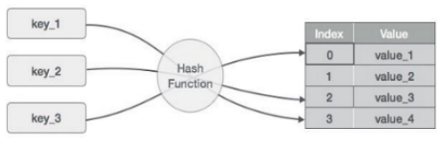

# <h1 align="center">Laporan Praktikum Modul 5 - Hash Table </h1>
<p align="center">Mahija Danadyaksa Sadtomo_2311102157</p>

## Dasar Teori
### Hashing
<p>Hashing diambil dari kata hash. Hash adalah kode yang digunakan untuk membuat pesan kata, maupun data. Sementara itu, hashing adalah sebuah proses yang bertujuan untuk mengubah data dengan ukuran besar (Big Data) ke dalam nilai yang lebih kecil serta unik. Hashing merupakan metode untuk menyimpan sebuah data dalam sebuah array agar penyimpanan data, pencarian data, penambahan data, dan penghapusan data dapat dilakukan dengan cepat.
</p> <br/>

### Hash Table

<p>Hash Table adalah struktur data yang digunakan untuk menyimpan dan mengelola kumpulan data, di mana setiap elemen dalam kumpulan data memiliki kunci (key) yang unik dan nilainya (value) terkait. Konsep utama di balik Hash Table adalah penggunaan fungsi Hash untuk mengonversi kunci menjadi alamat atau indeks di dalam tabel, sehingga memungkinkan pencarian dan pengambilan data dengan efisien.
</p> <br/>

<p>Sistem hash table bekerja dengan cara mengambil input kunci dan
memetakkannya ke nilai indeks array menggunakan fungsi hash. Kemudian, data
disimpan pada posisi indeks array yang dihasilkan oleh fungsi hash. Ketika data
perlu dicari, input kunci dijadikan sebagai parameter untuk fungsi hash, dan
posisi indeks array yang dihasilkan digunakan untuk mencari data. Dalam kasus
hash collision, di mana dua atau lebih data memiliki nilai hash yang sama, hash
table menyimpan data tersebut dalam slot yang sama dengan Teknik yang disebut
chaining. Fungsi utama dari Hash Table adalah untuk menyediakan struktur data yang memungkinkan pencarian, penyisipan, dan penghapusan data dengan efisien.
</p><br/>

<p>
Kelebihan penggunaan Hash Table yaitu dapat mengakses data dengan cepat, kapasitas tidak terbatas, dan relatif mudah digunakan. Sedangkan, kekurangannya yaitu jika memiliki nilai kunci yang sama (kolisi) maka waktu pencarian dapat menjadi 0(n), boros ruang, tidak dapat langsung mengakses data dengan indeks sebelumnya karena Hash Table tidak mendukung reverse traversal.
</p> <br/>

<p>
Dalam praktiknya, ada dua teknik yang umum digunakan untuk mengatasi kolisi pada saat menggunakan hash table:

1. Open Hashing (Chaining)
Metode chaining mengatasi collision dengan menyimpan semua item data yang memiliki nilai indeks yang sama dalam sebuah linked list. Ketika terjadi pencarian atau penambahan data, operasi dilakukan pada linked list yang sesuai dengan indeks yang dihasilkan dari fungsi hash. Meskipun pencarian atau penambahan bisa lambat ketika linked list memiliki banyak node, chaining efektif mengatasi jumlah besar data dengan menghindari keterbatasan array.

2. Closed Hashing
- Linear Probing: Pada collision, pencarian dilakukan ke posisi berikutnya dalam tabel hash hingga menemukan posisi yang kosong. Jika tidak ada yang kosong, tabel dianggap penuh.
- Quadratic Probing: Mirip dengan linear probing, tetapi langkahnya bukan satu-satu, melainkan dengan penambahan kuadrat (1^2, 2^2, 3^2, dst.).
- Double Hashing: Pada collision, digunakan fungsi hash kedua untuk menentukan posisi alternatif. 
</p> <br/>

<P>
Macam-macam operasi pada Hash Table:

1. Pencarian (Search): Digunakan untuk mencari elemen/data dalam Hash Table berdasarkan kunci atau indeksnya. Pencarian dilakukan dengan menggunakan fungsi hash untuk menghasilkan indeks elemen yang dicari.
2. Penyisipan (Insertion): Operasi ini digunakan untuk menyisipkan elemen/data baru ke dalam Hash Table. Elemen baru akan ditempatkan pada indeks yang dihasilkan oleh fungsi hash.
3. Penghapusan (Deletion): Digunakan untuk menghapus elemen/data dari Hash Table berdasarkan kunci atau indeksnya. Elemen yang dihapus akan dihapus dari indeks yang dihasilkan oleh fungsi hash.
4. Update: Operasi ini digunakan untuk mengubah nilai elemen/data yang sudah ada dalam Hash Table. Nilai elemen dapat diubah berdasarkan kunci atau indeksnya.
5. Collision Handling: Collision terjadi ketika dua atau lebih elemen memiliki indeks yang sama setelah melalui fungsi hash. Operasi ini digunakan untuk menangani collision dan memastikan bahwa elemen-elemen dengan indeks yang sama dapat disimpan dan diakses dengan benar.
6. Resize: Operasi ini digunakan untuk mengubah ukuran Hash Table jika jumlah elemen/data yang disimpan melebihi kapasitas yang ditentukan. Resize dilakukan untuk menjaga efisiensi dan kinerja Hash Table.
7. Iterasi: Operasi yang digunakan untuk mengakses dan memproses semua elemen/data yang ada dalam Hash Table secara berurutan.
</p> <br/>

<p>Langkah-langkah membuat Hash Table:

1. Tentukan Ukuran Tabel<br/>
Pertama, tentukan ukuran tabel hash yang sesuai untuk kebutuhan Anda. Ukuran tabel haruslah bilangan prima agar membantu mengurangi jumlah tabrakan hash dan mendistribusikan data dengan lebih merata.

2. Buat Struktur Data<br/>
Buat struktur data untuk menyimpan pasangan kunci-nilai (key-value) dalam tabel hash. Dalam beberapa bahasa pemrograman, Anda dapat menggunakan array, linked list, atau struktur data lainnya untuk mewakili tabel hash.

3. Definisikan Fungsi Hash<br/>
Buatlah fungsi hash yang akan mengubah kunci (key) menjadi indeks dalam tabel hash. Fungsi hash harus menghasilkan nilai yang unik dan merata untuk setiap kunci untuk mencegah terjadinya tabrakan hash sebisa mungkin.

4. Penanganan Tabrakan<br/>
Tentukan dan terapkan metode penanganan tabrakan hash. Jika dua kunci berbeda menghasilkan indeks yang sama, Anda perlu memutuskan cara untuk menangani tabrakan tersebut. Metode umum untuk menangani tabrakan adalah dengan teknik chaining, yaitu menyimpan beberapa nilai dalam satu slot tabel hash menggunakan struktur data seperti linked list atau array.

5. Operasi Pencarian, Penyisipan, dan Penghapusan<br/>
Implementasikan fungsi-fungsi untuk melakukan operasi pencarian (search), penyisipan (insertion), dan penghapusan (deletion) data dalam tabel hash. Pastikan operasi ini bekerja dengan benar dan efisien, memanfaatkan fungsi hash dan metode penanganan tabrakan yang telah ditentukan sebelumnya.

6. Uji Coba dan Optimalisasi<br/>
Setelah selesai membuat Hash Table, lakukan uji coba untuk memastikan bahwa implementasi berfungsi dengan baik dan memberikan hasil yang diharapkan. Jika diperlukan, lakukan optimasi untuk meningkatkan kinerja Hash Table, termasuk pemilihan ukuran tabel yang lebih optimal atau perbaikan pada fungsi hash.
</p> <br/>

## Guided 

### 1. Latihan Hash Table

```C++
#include <iostream>

using namespace std;

const int MAX_SIZE = 10;

// Fungsi Hash Sederhana
int hash_func(int key)
{
    return key % MAX_SIZE;
}

// Struktur Data Untuk Setiap Node
struct Node
{
    int key;
    int value;
    Node *next;
    Node(int key, int value) : key(key), value(value), next(nullptr) {}
};

// Class Hash Table
class HashTable
{
private:
    Node **table;

public:
    HashTable()
    {
        table = new Node *[MAX_SIZE]();
    }
    ~HashTable()
    {
        for (int i = 0; i < MAX_SIZE; i++)
        {
            Node *current = table[i];
            while (current != nullptr)
            {
                Node *temp = current;
                current = current->next;
                delete temp;
            }
        }
        delete[] table;
    }

    // Insertion
    void insert(int key, int value)
    {
        int index = hash_func(key);
        Node *current = table[index];
        while (current != nullptr)
        {
            if (current->key == key)
            {
                current->value = value;
                return;
            }
            current = current->next;
        }
        Node *node = new Node(key, value);
        node->next = table[index];
        table[index] = node;
    }

    // Searching
    int get(int key)
    {
        int index = hash_func(key);
        Node *current = table[index];
        while (current != nullptr)
        {
            if (current->key == key)
            {
                return current->value;
            }
            current = current->next;
        }
        return -1;
    }

    // Deletion
    void remove(int key)
    {
        int index = hash_func(key);
        Node *current = table[index];
        Node *prev = nullptr;
        while (current != nullptr)
        {
            if (current->key == key)
            {
                if (prev == nullptr)
                {
                    table[index] = current->next;
                }
                else
                {
                    prev->next = current->next;
                }
                delete current;
                return;
            }
            prev = current;
            current = current->next;
        }
    }

    // Traversal
    void traverse()
    {
        for (int i = 0; i < MAX_SIZE; i++)
        {
            Node *current = table[i];
            while (current != nullptr)
            {
                cout << current->key << " : " << current->value << endl;
                current = current->next;
            }
        }
    }
};

int main()
{
    HashTable ht;
    // Insertion
    ht.insert(1, 10);
    ht.insert(2, 20);
    ht.insert(3, 30);

    // Searching
    cout << "Get key 1: " << ht.get(1) << endl;
    cout << "Get key 4: " << ht.get(4) << endl;

    // Deletion
    ht.remove(4);

    // Traversal
    ht.traverse();

    return 0;
}
```
program di atas adalah program insert dan remove dengan menggunakan hash table yang menggunakan bahasa C++. Pertama kita membuat ukuran tabel hash yang akan kita gunakan, dalam kasus ini kita menggunakan ukuran tabel 10. Kemudian kita membuat fungsi hash_func yang akan mengembalikan nilai key % MAX_SIZE. Fungsi hashFunc digunakan untuk menghitung index dari key yang akan kita masukkan. Selanjutnya kita membuat struktur data Node yang berisi key,value, dan pointer next. Node ini digunakan untuk menyimpan data yang akan kita masukkan ke dalam tabel hash. Setelah itu kita membuat class HashTable yang berisi fungsi-fungsi yang akan kita gunakan untuk mengelola tabel hash. <br/>
Pada class HashTable kita membuat fungsi-fungsi berikut:
1. Fungsi insert yang akan memasukkan data ke dalam tabel hash.
2. Fungsi get yang akan mencari data berdasarkan key yang diinputkan.
3. Fungsi remove yang akan menghapus data berdasarkan key yang diinputkan. <br/>

Hasil output dari program di atas adalah:<br/>
Get key 1: 10<br/>
Get key 4: -1<br/>
3 : 30<br/>
2 : 20<br/>
1 : 10<br/>
Pada output di atas, kita berhasil mendapatkan value dari key 1 yaitu 10, sedangkan key 4 tidak ditemukan sehingga mengembalikan nilai -1. Kemudian kita berhasil menghapus key 4 dari tabel hash dan menampilkan data yang tersisa di dalam tabel hash.

### 2. Latihan Hash Table dengan Node
```c++
#include <iostream>
#include <string>
#include <vector>

using namespace std;

// ukuran tabel hash
const int TABLE_SIZE = 11;

string name; //deklarasi variabel string name
string phone_number; //deklarasi variabel string phone_number

// Struktur Data Untuk Setiap Node
class HashNode
{
//deklarasi variabel name dan phone_number
public:
    string name;
    string phone_number;

    HashNode(string name, string phone_number)
    {
        this->name = name;
        this->phone_number = phone_number;
    }
};

// Class HashMap
class HashMap
{
private:
    vector<HashNode*> table[TABLE_SIZE];

public:
    // Fungsi Hash Sederhana
    int hashFunc(string key)
    {
        int hash_val = 0;
        for (char c : key)
        {
            hash_val += c;
        }
        return hash_val % TABLE_SIZE;
    }

    // Tambah data
    void insert(string name, string phone_number)
    {
        int hash_val = hashFunc(name);
        for (auto node : table[hash_val])
        {
            if (node->name == name)
            {
                node->phone_number = phone_number;
                return;
            }
        }
        table[hash_val].push_back(new HashNode(name, phone_number));
    }

    // Hapus data
    void remove(string name)
    {
        int hash_val = hashFunc(name);
        for (auto it = table[hash_val].begin(); it != table[hash_val].end(); it++)
        {
            if ((*it)->name == name)
            {
                table[hash_val].erase(it);
                return;
            }
        }
    }

    // Cari data berdasarkan nama
    string searchByName(string name)
    {
        int hash_val = hashFunc(name);
        for (auto node : table[hash_val])
        {
            if (node->name == name)
            {
                return node->phone_number;
            }
        }
        return "";
    }

    // Cetak data
    void print()
    {
        for (int i = 0; i < TABLE_SIZE; i++)
        {
            cout << i << ": ";
            for (auto pair : table[i])
            {
                if (pair != nullptr)
                {
                    cout << "[" << pair->name << ", " << pair->phone_number << "]";
                }
            }
        }
    }
};

int main()
{
    HashMap employee_map;
    employee_map.insert("Mistah", "1234");
    employee_map.insert("Pastah", "5678");
    employee_map.insert("Ghana", "91011");
    cout << "Nomer Hp Mistah : " << employee_map.searchByName("Mistah") << endl;
    cout << "Phone Hp Pastah : " << employee_map.searchByName("Pastah") << endl;
    employee_map.remove("Mistah");
    cout << "Nomer Hp Mistah setelah dihapus : " << employee_map.searchByName("Mistah") << endl << endl;
    cout << "Hash Table : " << endl;
    employee_map.print();

    return 0;
}
```
Program di atas adalah program yang mengimplementasikan hash table dengan node yang berisi nama dan nomor telepon Program di atas memiliki 3 fungsi utama yaitu insert, remove, dan searchByName. Pertama membuat ukuran tabel hash dengan TABLE_SIZE = 11. Kemudian membuat struktur data HashNode yang berisi nama dan nomor telepon. Lalu membuat class HashMap yang berisi vector dari HashNode* table[TABLE_SIZE]. Selanjutnya membuat fungsi hashFunc yang berfungsi untuk menghitung nilai hash dari nama. Kemudian membuat fungsi insert, remove, searchByName, dan print. <br/>
Di dalam fungsi main, membuat objek employee_map dari class HashMap untuk menyimpan data nama dan nomor telepon. Kemudian memasukkan data ke dalam hash table menggunakan fungsi insert yaitu data "Mistah", "Pastah", dan "Ghana". Kemudian mencari nomor telepon berdasarkan nama menggunakan fungsi searchByName. Kemudian menghapus data menggunakan fungsi remove. Terakhir mencetak hash table menggunakan fungsi print. <br/>
Hasi dari program di atas adalah sebagai berikut:<br/>
Nomer Hp Mistah : 1234 <br/>
Phone Hp Pastah : 5678 <br/>
Nomer Hp Mistah setelah dihapus : <br/>
Hash Table : <br/>
0: 1: 2: 3: 4: 5: 6: 7: 8: 9: [Ghana, 91011]10: [Pastah, 5678] <br/>
Dari hasil di atas, dapat dilihat bahwa program berhasil memasukkan data ke dalam hash table, mencari data berdasarkan nama, menghapus data, dan mencetak hash table.

## Unguided 

### 1. Soal Hash Table

Implementasikan hash table untuk menyimpan data mahasiswa. Setiap mahasiswa memiliki NIM dan nilai. Implementasikan fungsi untuk menambahkan data baru, menghapus data, mencari data berdasarkan NIM, dan mencari data berdasarkan nilai. Dengan ketentuan :
1. Setiap mahasiswa memiliki NIM dan nilai.
2. Program memiliki tampilan pilihan menu berisi poin C.
3. Implementasikan fungsi untuk menambahkan data baru, menghapus data,
mencari data berdasarkan NIM, dan mencari data berdasarkan rentang nilai
(80 – 90).

```C++
#include <iostream> //deklarasi library iostream
#include <string>   //deklarasi library string
#include <vector>   //deklarasi library vector
#include <iomanip>  //deklarasi library iomanip

using namespace std; // menggunakan namespace std

const int TABLE_SIZE = 100; // deklarasi variabel TABLE_SIZE dengan nilai 100

// Struktur data mahasiswa
struct Mahasiswa
{
    string nama;
    string nim;
    int nilai;
};

// Struktur data untuk setiap node
class HashNode
{
    // deklarasi variabel name, nim, dan nilai
public:
    string name;
    string nim;
    int nilai;

    HashNode(string name, string nim, int nilai)
    {
        this->name = name;
        this->nim = nim;
        this->nilai = nilai;
    }
};

// Class HashMap
class HashMap
{
private:
    // deklarasi vector table dengan ukuran TABLE_SIZE
    vector<HashNode *> table[TABLE_SIZE];

public:
    // Fungsi Hash Sederhana
    int hashFunc(string key)
    {
        int hash_val = 0;
        for (char c : key)
        {
            hash_val += c;
        }
        return hash_val % TABLE_SIZE;
    }

    // Tambah data
    void insert(string name, string nim, int nilai)
    {
        int hash_val = hashFunc(name);
        for (auto node : table[hash_val])
        {
            if (node->name == name)
            {
                node->nim = nim;
                node->nilai = nilai;
                cout << "Data Mahasiswa dengan Nama " << name << " berhasil ditambahkan." << endl;
                return;
            }
        }
        table[hash_val].push_back(new HashNode(name, nim, nilai));
    }

    // Hapus data
    void remove(string name)
    {
        int hash_val = hashFunc(name);
        for (auto it = table[hash_val].begin(); it != table[hash_val].end(); ++it)
        {
            if ((*it)->name == name)
            {
                delete *it;
                table[hash_val].erase(it);
                cout << "Data Mahasiswa dengan nama " << name << " berhasil dihapus." << endl;
                return;
            }
        }
    }

    // Cari data berdasarkan NIM
    void searchByNIM(string nim)
    {
        bool found = false;
        for (int i = 0; i < TABLE_SIZE; ++i)
        {
            for (auto node : table[i])
            {
                if (node->nim == nim)
                {
                    // Menampilkan data mahasiswa pakai setw agar rapi
                    cout << "\n ============ CARI DATA MAHASISWA (NIM) ============" << endl;
                    cout << " ---------------------------------------------------" << endl;
                    cout << left << "| " << setw(15) << "Nama"
                         << "| " << setw(20) << "NIM"
                         << "| " << setw(10) << "Nilai"
                         << " |" << endl;
                    cout << " ---------------------------------------------------" << endl;
                    cout << "| " << left << setw(15) << node->name
                         << "| " << left << setw(20) << node->nim
                         << "| " << left << setw(10) << node->nilai << " |" << endl;
                    cout << " ---------------------------------------------------" << endl;
                    found = true;
                    return;
                }
            }
        }
        if (!found)
        {
            cout << "Mahasiswa dengan NIM " << nim << " tidak ditemukan." << endl;
        }
    }

    // Cari data berdasarkan rentang nilai
    void CariRentangNilai(int NilaiMin, int NilaiMax)
    {
        bool found = false;

        // Menampilkan data mahasiswa pakai setw agar rapi
        cout << "\n ======= CARI DATA MAHASISWA (RENTANG NILAI) =======" << endl;
        cout << " ---------------------------------------------------" << endl;
        cout << left << "| " << setw(15) << "Nama"
             << "| " << setw(20) << "NIM"
             << "| " << setw(10) << "Nilai"
             << " |" << endl;
        cout << " ---------------------------------------------------" << endl;
        for (int i = 0; i < TABLE_SIZE; ++i)
        {
            for (auto node : table[i])
            {
                if (node->nilai >= NilaiMin && node->nilai <= NilaiMax)
                {
                    cout << "| " << left << setw(15) << node->name
                         << "| " << left << setw(20) << node->nim
                         << "| " << left << setw(10) << node->nilai << " |" << endl;
                    found = true;
                }
            }
        }
        if (!found)
        {
            cout << "Tidak ada data Mahasiswa dengan nilai antara " << NilaiMin << " dan " << NilaiMax << "." << endl;
        }
        cout << " ---------------------------------------------------" << endl;
    }

    // Tampilkan data
    void print()
    {
        // Menampilkan data mahasiswa pakai setw agar rapi
        cout << "\n ================== DATA MAHASISWA =================" << endl;
        cout << " ---------------------------------------------------" << endl;
        cout << left << "| " << setw(15) << "Nama"
             << "| " << setw(20) << "NIM"
             << "| " << setw(10) << "Nilai"
             << " |" << endl;
        cout << " ---------------------------------------------------" << endl;
        for (int i = 0; i < TABLE_SIZE; ++i)
        {
            for (auto pair : table[i])
            {
                cout << "| " << left << setw(15) << pair->name
                     << "| " << left << setw(20) << pair->nim
                     << "| " << left << setw(10) << pair->nilai << " |" << endl;
            }
        }
        cout << " ---------------------------------------------------" << endl;
    }
};

int main()
{
    HashMap map;
    int choice;
    string name;
    string nim;
    int nilai;
    int search1, search2;
    do
    {
        // Menampilkan menu
        cout << "\n ============ MENU LIST NILAI MAHASISWA ============" << endl;
        cout << "1. Tambah data Mahasiswa" << endl;
        cout << "2. Hapus data Mahasiswa" << endl;
        cout << "3. Cari data Mahasiswa (NIM)" << endl;
        cout << "4. Cari data Mahasiswa (Rentang Nilai)" << endl;
        cout << "5. Tampilkan" << endl;
        cout << "6. Keluar" << endl;
        cout << "Masukkan pilihan: ";
        cin >> choice;
        switch (choice)
        {

        // Pilihan 1: Tambah data Mahasiswa
        case 1:
            cout << "\n ============== TAMBAH DATA MAHASISWA ==============" << endl;
            cout << "Masukkan nama: ";
            cin >> name;
            cout << "Masukkan NIM: ";
            cin >> nim;
            cout << "Masukkan nilai: ";
            cin >> nilai;
            map.insert(name, nim, nilai);
            break;

        // Pilihan 2: Hapus data Mahasiswa
        case 2:
            cout << "\n =========== HAPUS DATA MAHASISWA (nama) ===========" << endl;
            cout << "Masukkan nama: ";
            cin >> name;
            map.remove(name);
            break;

        // Pilihan 3: Cari data Mahasiswa (NIM)
        case 3:
            cout << "\n ============ CARI DATA MAHASISWA (NIM) ============" << endl;
            cout << "Masukkan NIM: ";
            cin >> nim;
            map.searchByNIM(nim);
            break;

        // Pilihan 4: Cari data Mahasiswa (Rentang Nilai)
        case 4:
            cout << "\n ======= CARI DATA MAHASISWA (RENTANG NILAI) =======" << endl;
            cout << "Masukkan nilai minimum: ";
            cin >> search1;
            cout << "Masukkan nilai maksimum: ";
            cin >> search2;
            map.CariRentangNilai(search1, search2);
            break;

        // Pilihan 5: Tampilkan data
        case 5:
            map.print();
            break;

        // Pilihan 6: Keluar
        case 6:
            break;

        // Pilihan tidak tersedia
        default:
            cout << "Pilihan tidak tersedia!" << endl;
        }
    } while (choice != 6);

    return 0;
}
```
#### Output:
##### 1. Insert Data awal
.png)
.png)
.png)
.png)
.png)

Program di atas adalah program list data mahasiswa dengan menggunakan hash table untuk menyimpan data mahasiswa. Hash table pada program ini memiliki ukuran 100 yang artinya bisa menampung 100 data Mahasiswa. Program ini menggunakan struktur data mahasiswa yang terdiri dari nama, NIM, dan nilai. Program ini memiliki beberapa fitur, yaitu:

1. Tambah data Mahasiswa
2. Hapus data Mahasiswa
3. Cari data Mahasiswa berdasarkan NIM
4. Cari data Mahasiswa berdasarkan rentang nilai
5. Tampilkan data
6. Keluar <br/>

Program ini menggunakan class HashMap yang memiliki beberapa method, yaitu:

1. hashFunc(string key): Fungsi hash sederhana untuk menghasilkan nilai hash dari key.
2. insert(string name, string nim, int nilai): Menambahkan data mahasiswa ke hash table.
3. remove(string name): Menghapus data mahasiswa dari hash table berdasarkan nama.
4. searchByNIM(string nim): Mencari data mahasiswa berdasarkan NIM.
5. CariRentangNilai(int NilaiMin, int NilaiMax): Mencari data mahasiswa berdasarkan rentang nilai
6. print(): Menampilkan data mahasiswa yang ada di hash table.<br/>

user dapat memilih menu yang tersedia dan melakukan operasi sesuai dengan pilihan yang dipilih. Program akan terus berjalan hingga user memilih untuk keluar (pilihan 6).

## Kesimpulan

Hashing adalah proses untuk mengubah data dengan ukuran besar menjadi nilai yang lebih kecil dan unik. Hash Table merupakan struktur data yang menyimpan dan mengelola kumpulan data dengan menggunakan kunci (key) unik untuk setiap elemen dan nilai (value) terkait. Konsep utama Hash Table adalah menggunakan fungsi hash untuk mengonversi kunci menjadi indeks di dalam tabel, memungkinkan pencarian dan pengambilan data secara efisien. Ada dua teknik umum untuk mengatasi kolisi pada Hash Table: Open Hashing (Chaining) dan Closed Hashing (termasuk Linear Probing, Quadratic Probing, dan Double Hashing).<br/>

Operasi pada Hash Table meliputi pencarian, penyisipan, penghapusan, update, penanganan collision, resize, dan iterasi. Langkah-langkah dalam membuat Hash Table melibatkan penentuan ukuran tabel, pembuatan struktur data, definisi fungsi hash, penanganan collision, implementasi operasi pencarian, penyisipan, dan penghapusan, serta uji coba dan optimalisasi.<br/>

Kelebihan penggunaan Hash Table termasuk akses data yang cepat, kapasitas tidak terbatas, dan kemudahan penggunaan, sementara kekurangannya meliputi waktu pencarian yang menjadi 0(n) jika nilai kunci sama (kolisi) yang dapat di atasi dengan beberapa teknik yang sudah dibahas di atas, penggunaan ruang yang boros, dan tidak mendukung reverse traversal.<br/>

## Referensi
[1] Shamseen, A., Zanjireh, M. M., Bahaghighat, M., & Xin, Q. (2021). Developing a parallel classifier for mining in big data sets. IIUM Engineering Journal, 22(2), 119-134.<br/>
[2] Rahardja, U., Hidayanto, A. N., Lutfiani, N., Febiani, D. A., & Aini, Q. (2021). Immutability of Distributed Hash Model on Blockchain Node Storage. Sci. J. Informatics, 8(1), 137-143.<br/>
[3] Mailund, T. (2019). The joys of hashing: hash table programming with C. Apress.<br/>