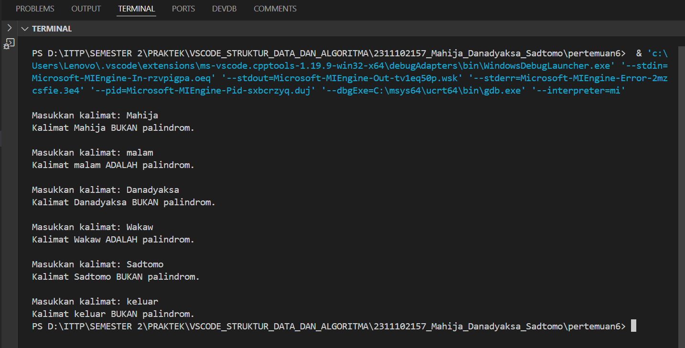
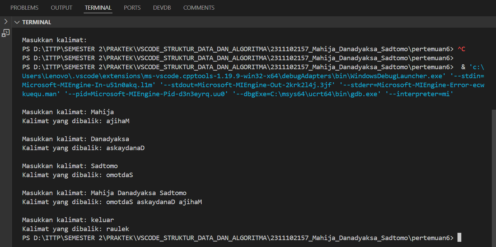

# <h1 align="center">Laporan Praktikum Modul 6 - Stack</h1>
<p align="center">Mahija Danadyaksa Sadtomo_2311102157</p>

## Dasar Teori
Stack merupakan struktur data LIFO (Last In First Out) yang tersusun dari kumpulan data, di mana elemen terbaru akan berada di atas dan menjadi elemen pertama yang dikeluarkan saat operasi "pop" dilakukan. Elemen baru ditambahkan ke stack melalui operasi "push". Pada Stack, terdapat juga konsep dan operasi-operasi penting yang perlu diketahui, yaitu:
- Kelas stack : Kelas container ini mengelola kumpulan elemen dan menyediakan operasi penting untuk fungsionalitas stack.
- push(elemen): Menambahkan elemen baru ke bagian atas stack.
- pop()       : Menghapus dan mengembalikan elemen di bagian atas stack. Melempar exception jika stack kosong.
- top()       : Mengembalikan referensi ke elemen di bagian atas stack tanpa menghapusnya. Melempar exception jika stack kosong.
- empty()     : Mengembalikan true jika stack kosong, false sebaliknya.
- size()      : Mengembalikan jumlah elemen yang saat ini ada di stack.
- peek()      : Melihat nilai atau elemen pada posisi tertentu.
- search()    : Mencari elemen tertentu.

## Guided 

### 1. Stack

```C++
#include <iostream>
using namespace std;

string arrayBuku[5];
int maksimal = 5, top = 0;

bool isFull()
{
    return (top == maksimal);
}

bool isEmpty()
{
    return (top == 0);
}

void pushArrayBuku(string data)
{
    if (isFull())
    {
        cout << "Data telah penuh" << endl;
    }
    else
    {
        arrayBuku[top] = data;
        top++;
    }
}

void popArrayBuku()
{
    if (isEmpty())
    {
        cout << "Tidak ada data yang dihapus" << endl;
    }
    else
    {
        arrayBuku[top - 1] = "";
        top--;
    }
}

void peekArrayBuku(int posisi)
{
    if (isEmpty())
    {
        cout << "Tidak ada data yang bisa dilihat" << endl;
    }
    else
    {
        int index = top;
        for (int i = 1; i <= posisi; i++)
        {
            index--;
        }
        cout << "Posisi ke " << posisi << " adalah " << arrayBuku[index] << endl;
    }
}

int countStack()
{
    return top;
}

void changeArrayBuku(int posisi, string data)
{
    if (posisi > top)
    {
        cout << "Posisi melebihi data yang ada" << endl;
    }
    else
    {
        int index = top;
        for (int i = 1; i <= posisi; i++)
        {
            index--;
        }
        arrayBuku[index] = data;
    }
}

void destroyArraybuku()
{
    for (int i = top; i >= 0; i--)
    {
        arrayBuku[i] = "";
    }
    top = 0;
}

void cetakArrayBuku()
{
    if (isEmpty())
    {
        cout << "Tidak ada data yang dicetak" << endl;
    }
    else
    {
        for (int i = top - 1; i >= 0; i--)
        {
            cout << arrayBuku[i] << endl;
        }
    }
}

int main()
{
    pushArrayBuku("Kalkulus");
    pushArrayBuku("Struktur Data");
    pushArrayBuku("Matematika Diskrit");
    pushArrayBuku("Dasar Multimedia");
    pushArrayBuku("Inggris");

    cetakArrayBuku();
    cout << "\n";

    cout << "Apakah data stack penuh? " << isFull() << endl;
    cout << "Apakah data stack kosong? " << isEmpty() << endl;

    peekArrayBuku(2);
    popArrayBuku();

    cout << "Banyaknya data = " << countStack() << endl;

    changeArrayBuku(2, "Bahasa Jerman");
    cetakArrayBuku();
    cout << "\n";

    destroyArraybuku();
    cout << "Jumlah data setelah dihapus: " << top << endl;
    cetakArrayBuku();

    return 0;
}
```
<p>Kode di atas mengimplementasi struktur data stack menggunakan array. Fungsi "string arrayBuku[5]; dan "int maksimal = 5, top = 0;" mendefinisikan arrayBuku yang berisi string dan variabel maksimal yang menentukan batas maksimal elemen yang dapat disimpan dalam array. Variabel top menyimpan indeks dari elemen teratas stack. Ada juga fungsi-fungsi lain, yaitu:</p>

- bool isFull()</br>
    Untuk memeriksa apakah stack penuh atau tidak
- bool isEmpty()</br>
    Untuk memeriksa apakah stack kosong atau tidak
- void pushArrayBuku(string data)</br>
    Untuk menambahkan data ke dalam stack
- void popArrayBuku(int posisi)</br>
    Untuk menghapus data dari stack
- void peekArrayBuku(int posisi)</br>
    Untuk melihat data pada posisi tertentu dalam stack tanpa menghapusnya
- int countStack()</br>
    Untuk mengembalikan jumlah elemen dalam stack
- void changeArrayBuku(int posisi, string data)</br>
    Untuk mengubah data pada posisi tertentu dalam stack
- void destroyArraybuku()</br>
    Untuk menghapus semua data dalam stack
- void cetakArrayBuku()</br>
    Untuk mencetak semua data dalam stack</br>
<p>Pada fungsi int main(), beberapa operasi dilakukan seperti menambahkan data ke dalam stack, mencetak stack, memeriksa apakah stack penuh atau kosong, melihat data pada posisi tertentu, menghapus data dari stack, menghitung jumlah elemen dalam stack, dll.</p>

## Unguided 

### 1. Buatlah program untuk menentukan apakah kalimat tersebut yang diinputkan dalam program stack adalah palindrom/tidak. Palindrom kalimat yang dibaca dari depan dan belakang sama. Jelaskan bagaimana cara kerja programnya.

```C++
#include <iostream> // Library untuk fungsi input dan output
#include <stack> // Library untuk menggunakan stack

using namespace std;

bool Palindrom(string kalimat)
{
  for (int i = 0; i < kalimat.length(); i++)
  { // Ubah semua karakter kalimat menjadi huruf kecil
    kalimat[i] = tolower(kalimat[i]);
  }

  stack<char> s; // Stack untuk menyimpan karakter kalimat

  for (int i = 0; i < kalimat.length(); i++)
  { // Masukkan karakter kalimat ke stack
    s.push(kalimat[i]);
  }

  for (int i = 0; i < kalimat.length() / 2; i++)
  { // Periksa apakah kalimat palindrom atau bukan
    if (kalimat[i] != s.top())
    {
      return false;
    }
    s.pop();
  }

  return true;
}

int main()
{
  string kalimat;

  do
  {
    cout << "\nMasukkan kalimat: "; // Input kalimat dari user
    getline(cin, kalimat);

    if (Palindrom(kalimat))
    { // Periksa apakah kalimat palindrom atau bukan
      cout << "Kalimat " << kalimat << " ADALAH palindrom." << endl;
    }
    else
    {
      cout << "Kalimat " << kalimat << " BUKAN palindrom." << endl;
    }

  } while (kalimat != "keluar");
  return 0;
}
```
#### Output:

<p align="justify">Kode di atas menjalankan sebuah program stack yang dapat menentukan kalimat yang diinput user itu palindrom atau tidak. Fungsi bool Palindrom(string kalimat) dapat memeriksa apakah sebuah kalimat merupakan palindrom atau tidak. Fungsi ini menerima satu string yang merupakan kalimat yang akan diperiksa. Pada fungsi Palindrom:</p>

- Kalimat dikonversi menjadi huruf kecil menggunakan tolower agar perbandingan karakter tidak sensitif terhadap huruf besar dan kecil.
- Stack s dibuat untuk menyimpan semua karakter dari kalimat.
- Setiap karakter dari kalimat dimasukkan ke dalam stack.
- Dilakukan perbandingan karakter dari depan dan belakang kalimat dengan mengambil karakter dari stack. Jika terdapat perbedaan, fungsi akan mengembalikan false.
- Jika semua karakter cocok, fungsi akan mengembalikan true.</br>
<p align="justify">Dalam int main(), user dapat menginput string ke dalam terminal untuk mengecek apakah inputan user tersebut palindrom atau tidak. Dengan bantuan if else, output akan muncul tergantung inputan tersebut memenuhi Palindrom atau tidak. Program ini akan mengulang sampai user mengetik kata 'keluar'.</p>

### 2. Buatlah program untuk melakukan pembalikan terhadap kalimat menggunakan stack dengan minimal 3 kata. Jelaskan output program dan source codenya beserta operasi/fungsi yang dibuat!

```C++
#include <iostream> // Library untuk fungsi input dan output
#include <stack> // Library untuk menggunakan stack

using namespace std;

string SebelumBalik(string kalimat) {
  stack<char> s; // Stack untuk menyimpan karakter kalimat

  for (int i = 0; i < kalimat.length(); i++) { // For untuk memasukkan karakter kalimat ke stack
    s.push(kalimat[i]);
  }

  string SetelahBalik; // String untuk menyimpan kalimat yang sudah dibalik
  while (!s.empty()) {
    SetelahBalik += s.top();
    s.pop();
  }

  return SetelahBalik;
}

int main() {
  string kalimat;

  do {
  cout << "\nMasukkan kalimat: ";  // Input kalimat dari user
  getline(cin, kalimat);

  string SetelahBalik = SebelumBalik(kalimat);  // Membalik kalimat

  cout << "Kalimat yang dibalik: " << SetelahBalik << endl; // Menampilkan kalimat yang dibalik

  } while (kalimat != "keluar");
  return 0;
}
```
#### Output:

<p align="justify">Kode di menjalankan sebuah program stack yang melakukan pembalikan terhadap kalimat yang diinput oleh user. Dengan adanya fungsi SebelumBalik(string kalimat), program dapat membalikkan sebuah kalimat yang diterima sebagai parameter. Fungsi ini menggunakan stack untuk menyimpan karakter-karakter dari kalimat secara terbalik. Stack s dibuat untuk menyimpan karakter-karakter dari kalimat lalu setiap karakter dari kalimat dimasukkan ke dalam stack. Kemudian, karakter-karakter tersebut diambil dari stack satu per satu, dan digabungkan menjadi string SetelahBalik. Hal ini menyebabkan urutan karakter pada kalimat dibalik.</p>
<p align="justify">Pada int main(), user dapat menginput sebuah kalimat yang ingin dibalikkan. Inputan itu akan melalui proses SebelumBalik menjadi SetelahBalik. Jika sudah dilalui, program akan menampilkan output kalimat yang telah dibalikkan. Program ini akan mengulang sampai user mengetik kata 'keluar'.</p>

## Kesimpulan

Stack (tumpukan) dalam C++ adalah struktur data LIFO (Last In, First Out) yang dapat diimplementasikan dengan array atau linked list. Operasinya meliputi push (tambah elemen), pop (hapus elemen teratas), top (akses elemen teratas), dan empty (periksa kekosongan). Stack berguna untuk undo/redo, ekspresi matematika, parsing, dan algoritma pencarian. Memahaminya penting untuk menyelesaikan masalah pemrograman secara efisien.

## Referensi
[1] Quinn, R., Advanced C++ Programming Cookbook. United Kingdoms: Packt Publishing Ltd., 2020.<br/>
[2] Muhammad Nugraha, Dasar Pemrograman Dengan C++, Materi Paling Dasar untuk Menjadi Programmer Berbagai Platform. Yogyakarta: Deepublish, 2021.<br/>
[3] Stroustrup, B., A Tour of C++ Third Edition. United States: Pearson Education, Inc., 2023.

