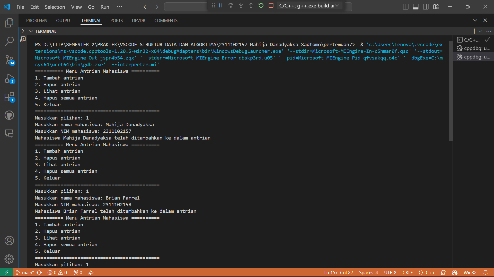

# <h1 align="center">Laporan Praktikum Modul 7 - Queue</h1>
<p align="center">Mahija Danadyaksa Sadtomo_2311102157</p>

## Dasar Teori
### Pengertian Queue
Queue merupakan struktur data FIFO (First In First Out) yang tersusun dari kumpulan data, di mana elemen data yang pertama dimasukkan ke dalam antrean akan menjadi yang pertama pula untuk dikeluarkan. 

### Cara Kerja
Cara kerja queue yaitu seperti antrean pada supermarket, di mana orang pertama yang menuju kasir adalah yang pertama dilayani. Pada queue, urutan pertama disebut front atau head dan urutan terakhir dosebut Back, Rear, atau Tail. Proses penambahan data pada queue disebut Enqueue dan proses penghapusan pada queue disebut dequeue.<br/>
[Screenshot Cara Kerja Queue](Image/Asset-1-4-1536x864.png)<br/>

### Operasi Pada Queue
Operasi-operasi Dasar pada Queue, yaitu:
1. enqueue() : menambahkan data ke dalam queue.
2. dequeue() : mengeluarkan data dari queue.
3. peek() : mengambil data dari queue tanpa menghapusnya.
4. isEmpty() : mengecek apakah queue kosong atau tidak.
5. isFull() : mengecek apakah queue penuh atau tidak.
6. size() : menghitung jumlah elemen dalam queue.

### Jenis-Jenis Queue
Secara umum ada 4 jenis struktur data queue, yaitu:

#### Berdasarkan Implementasinya:
1. Simple Queue
Simple queue adalah struktur data queue paling dasar di mana penyisipan item dilakukan di simpul belakang (rear atau tail) dan penghapusan terjadi di simpul depan (front atau head). <br/>
[Screenshot Jenis Queue](Image/2022_06_image-87.jpg)<br/>

2. Circular Queue
Pada circular queue, simpul terakhir terhubung ke simpul pertama. Queue jenis ini juga dikenal sebagai Ring Buffer karena semua ujungnya terhubung ke ujung yang lain. Penyisipan terjadi di akhir antrian dan penghapusan di depan antrian. <br/>
[Screenshot Jenis Queue](Image/2022_06_image-86.jpg)<br/>

#### Berdasarkan Penggunaan:
3. Priority Queue
Priority Queue adalah strruktur data queue dimana simpul akan memiliki beberapa prioritas yang telah ditentukan. Simpul dengan prioritas terbesar akan menjadi yang pertama dihapus dari antrian. Sedangkan penyisipan item terjadi sesuai urutan kedatangannya. <br/>
[Screenshot Jenis Queue](Image/2022_06_image-84.jpg)<br/>

4. Double-Ended Queue (Dequeue)
Dalam double-ended queue (dequeue), operasi penyisipan dan penghapusan dapat terjadi di ujung depan dan belakang dari queue. <br/>
[Screenshot Jenis Queue](Image/Screenshot%202024-05-13%20174457.png)<br/>

### Fungsi Queue Dan Kegunaan Queue
Fungsi queue yang paling umum dalam struktur data, yaitu:
1. Queue banyak digunakan untuk menangani lalu lintas (traffic) situs web.
2. Membantu untuk mempertahankan playlist yang ada pada aplikasi media player
3. Queue digunakan dalam sistem operasi untuk menangani interupsi.
4. Membantu dalam melayani permintaan pada satu sumber daya bersama, seperti printer, penjadwalan tugas CPU, dll.
5. Digunakan dalam transfer data asinkronus misal pipeline, IO file, dan socket.


## Guided 

### 1. Stack

```C++
#include <iostream>
using namespace std;

const int maksimalQueue = 5; // Maksimal antrian
int front = 0; // Penanda antrian
int back = 0; // Penanda
string queueTeller[5]; // Fungsi pengecekan

bool isFull() { // Pengecekan antrian penuh atau tidak
    if (back == maksimalQueue) {
        return true; // =1
    } else {
        return false;
    }
}

bool isEmpty() { // Antriannya kosong atau tidak
    if (back == 0) {
        return true;
    } else {
        return false;
    }
}

void enqueueAntrian(string data) { // Fungsi menambahkan antrian
    if (isFull()) {
        cout << "Antrian penuh" << endl;
    } else {
        if (isEmpty()) { // Kondisi ketika queue kosong
            queueTeller[0] = data;
            front++;
            back++;
        } else { // Antrianya ada isi
            queueTeller[back] = data;
            back++;
        }
    }
}

void dequeueAntrian() { // Fungsi mengurangi antrian
    if (isEmpty()) {
        cout << "Antrian kosong" << endl;
    } else {
        for (int i = 0; i < back; i++) {
            queueTeller[i] = queueTeller[i + 1];
        }
        back--;
    }
}

int countQueue() { // Fungsi menghitung banyak antrian
    return back;
}

void clearQueue() { // Fungsi menghapus semua antrian
    if (isEmpty()) {
        cout << "Antrian kosong" << endl;
    } else {
        for (int i = 0; i < back; i++) {
            queueTeller[i] = "";
        }
        back = 0;
        front = 0;
    }
}

void viewQueue() { // Fungsi melihat antrian
    cout << "Data antrian teller:" << endl;
    for (int i = 0; i < maksimalQueue; i++) {
        if (queueTeller[i] != "") {
            cout << i + 1 << ". " << queueTeller[i] << endl;
        } else {
            cout << i + 1 << ". (kosong)" << endl;
        }
    }
}

int main() {
    enqueueAntrian("Andi");
    enqueueAntrian("Maya");
    viewQueue();
    cout << "Jumlah antrian = " << countQueue() << endl;
    dequeueAntrian();
    viewQueue();
    cout << "Jumlah antrian = " << countQueue() << endl;
    clearQueue();
    viewQueue();
    cout << "Jumlah antrian = " << countQueue() << endl;
    return 0;
}
```
program di atas adalah program antrian dengan menggunakan struktur data queue. Program ini memiliki beberapa fungsi yaitu:
1. isFull(), digunakan untuk mengecek apakah antrian penuh atau tidak. 
2. isEmpty(), digunakan untuk mengecek apakah antrian kosong atau tidak.
3. enqueueAntrian(), digunakan untuk menambahkan antrian.
4. dequeueAntrian(), digunakan untuk mengurangi antrian.
5. countQueue(), digunakan untuk menghitung banyak antrian.
6. clearQueue(), digunakan untuk menghapus semua antrian.
7. viewQueue(), digunakan untuk melihat antrian.

Pada fungsi main, terdapat contoh penggunaan fungsi-fungsi tersebut. Pertama, menambahkan antrian dengan nama Andi dan Maya. Kemudian, menampilkan antrian dan jumlah antrian. Selanjutnya, mengurangi antrian dan menampilkan antrian serta jumlah antrian.Terakhir, menghapus semua antrian dan menampilkan antrian serta jumlah antrian.

## Unguided 

### 1. Ubahlah penerapan konsep queue pada bagian guided dari array menjadi linked list

```C++
// Coding milik Mahija Danadyaksa Sadtomo

#include <iostream> // Library standar yang digunakan untuk input dan output
using namespace std; // Untuk mempersingkat penulisan kode program

struct Node // Membuat struct Node
{
    string data;  
    Node *next; 
};

class Queue // Membuat class Queue
{
private:
    Node *front; 
    Node *back;

public:
    Queue() // Membuat Queue untuk menginisialisasi front dan back
    {
        front = nullptr;
        back = nullptr;
    }

    bool isEmpty() // Membuat fungsi isEmpty untuk mengecek apakah antrian kosong atau tidak
    {
        return front == nullptr;
    }

    void enqueueAntrian(string data) // Membuat fungsi enqueueAntrian untuk menambahkan data ke dalam antrian
    {
        Node *newNode = new Node;
        newNode->data = data;
        newNode->next = nullptr;

        if (isEmpty())
        {
            front = newNode;
            back = newNode;
        }
        else
        {
            back->next = newNode;
            back = newNode;
        }
    }

    void dequeueAntrian() // Membuat fungsi dequeueAntrian untuk menghapus data dari antrian
    {
        if (isEmpty())
        {
            cout << "Antrian kosong" << endl;
        }
        else
        {
            Node *temp = front;
            front = front->next;
            delete temp;
        }
    }

    int count() // Membuat fungsi count untuk menghitung jumlah data dalam antrian
    {
        int count = 0;
        Node *current = front;
        while (current != nullptr)
        {
            count++;
            current = current->next;
        }
        return count;
    }

    void clear() // Membuat fungsi clear untuk menghapus semua data dalam antrian
    {
        while (!isEmpty())
        {
            dequeueAntrian();
        }
    }

    void view() // Membuat fungsi view untuk menampilkan data dalam antrian
    {
        cout << "Data antrian teller:" << endl;
        Node *current = front;
        int position = 1;
        while (current != nullptr)
        {
            cout << position << ". " << current->data << endl;
            current = current->next;
            position++;
        }
    }
};

int main()
{
    Queue queue;
    queue.enqueueAntrian("Andi");
    queue.enqueueAntrian("Maya");
    queue.view();
    cout << "Jumlah antrian = " << queue.count() << endl;
    queue.dequeueAntrian();
    queue.view();
    cout << "Jumlah antrian = " << queue.count() << endl;
    queue.clear();
    queue.view();
    cout << "Jumlah antrian = " << queue.count() << endl;
    return 0;
}
```
#### Output:

Program di atas adalah program queue dengan menggunakan linked list. Program ini memiliki fungsi-fungsi yang sama dengan program sebelumnya, yaitu:
1. enqueueAntrian: Menambahkan data ke dalam antrian
2. dequeueAntrian: Menghapus data dari antrian
3. count: Menghitung jumlah data dalam antrian
4. clear: Menghapus semua data dalam antrian
5. view: Menampilkan data dalam antrian
pertama, kita membuat struct Node yang berisi data dan pointer next. Kemudian, kita membuat class Queue yang memiliki atribut front dan back yang bertipe Node pointer. Di dalam class Queue, kita membuat fungsi-fungsi enqueueAntrian, dequeueAntrian, count, clear, dan view. Di dalam fungsi main, kita membuat objek queue dari class Queue dan melakukan operasi-operasi enqueue, dequeue, count, clear, dan view, seperti yang ada di dalam program yaitu menambahkan data "Andi" dan "Maya" dengan enqueueAntrian(), menghapus data "Andi" dan "Maya" dengan dequeueAntrian(), menghitung jumlah data dalam antrian dengan count(), dan menampilkan data dalam antrian dengan view().

### 2. Dari nomor 1 buatlah konsep antri dengan atribut Nama mahasiswa dan NIM Mahasiswa

```C++
// Coding milik Mahija Danadyaksa Sadtomo

#include <iostream> // Library standar yang digunakan untuk input dan output
#include <string>   // Library standar yang digunakan untuk tipe data string

using namespace std; // Untuk mempersingkat penulisan kode program

struct Node // Membuat struct Node Mahasiswa
{
    string nama;
    long long nim;
    Node *next;
};

class Queue // Membuat class Queue
{
private:
    Node *front;
    Node *back;

public:
    Queue() // Membuat Queue untuk menginisialisasi front dan back
    {
        front = nullptr;
        back = nullptr;
    }

    bool isEmpty() // Membuat fungsi isEmpty untuk mengecek apakah antrian kosong atau tidak
    {
        return front == nullptr;
    }

    void enqueueAntrian(string nama, long long nim) // Membuat fungsi enqueueAntrian untuk menambahkan data ke dalam antrian
    {
        Node *newNode = new Node;
        newNode->nama = nama;
        newNode->nim = nim;
        newNode->next = nullptr;

        if (isEmpty())
        {
            front = newNode;
            back = newNode;
        }
        else
        {
            back->next = newNode;
            back = newNode;
        }
    }

    void dequeueAntrian() // Membuat fungsi dequeueAntrian untuk menghapus data dari antrian
    {
        if (isEmpty())
        {
            cout << "Antrian kosong" << endl;
        }
        else
        {
            cout << "Pengunjung dengan nama " << front->nama << " telah selesai dilayani" << endl;
            Node *temp = front;
            front = front->next;
            delete temp;

            if (front == nullptr)
            {
                back = nullptr;
            }
        }
    }

    int count() // Membuat fungsi count untuk menghitung jumlah data dalam antrian
    {
        int count = 0;
        Node *current = front;
        while (current != nullptr)
        {
            count++;
            current = current->next;
        }
        return count;
    }

    void clear() // Membuat fungsi clear untuk menghapus semua data dalam antrian
    {
        while (!isEmpty())
        {
            dequeueAntrian();
        }
    }

    void view() // Membuat fungsi view untuk menampilkan data dalam antrian
    {
        if (isEmpty())
        {
            cout << "Antrian kosong" << endl;
            return;
        }
        else
        {
            cout << "Data antrian mahasiswa:" << endl;
            Node *current = front;
            int position = 1;
            while (current != nullptr)
            {
                cout << position << ". " << current->nama << " (" << current->nim << ")" << endl;
                current = current->next;
                position++;
            }
        }
    }
};

int main()
{
    Queue queue;
    int pilihan;
    while (true)
    {
        cout << "========== Menu Antrian Mahasiswa ==========" << endl;
        cout << "1. Tambah antrian" << endl;
        cout << "2. Hapus antrian" << endl;
        cout << "3. Lihat antrian" << endl;
        cout << "4. Hapus semua antrian" << endl;
        cout << "5. Keluar" << endl;
        cout << "============================================" << endl;
        cout << "Masukkan pilihan: ";
        cin >> pilihan;
        switch (pilihan)
        {
        case 1:
        {
            string nama;
            long long nim;
            cout << "Masukkan nama mahasiswa: ";
            cin.ignore();
            getline(cin, nama);
            cout << "Masukkan NIM mahasiswa: ";
            cin >> nim;
            queue.enqueueAntrian(nama, nim);
            cout << "Mahasiswa " << nama << " telah ditambahkan ke dalam antrian" << endl;
            break;
        }
        case 2:
        {
            queue.dequeueAntrian();
            break;
        }
        case 3:
        {
            queue.view();
            cout << "Jumlah antrian = " << queue.count() << endl;
            break;
        }
        case 4:
        {
            queue.clear();
            cout << "Semua antrian telah dilayani" << endl;
            break;
        }
        case 5:
        {
            cout << "Terima kasih telah menggunakan program ini" << endl;
            return 0;
        }
        default:
        {
            cout << "Pilihan tidak valid" << endl;
            break;
        }
        }
    }
}
```
#### Output:

.png)


Program di atas adalah program queue dengan menggunakan linked list. Program ini digunakan untuk mengelola antrian mahasiswa. Program ini memiliki beberapa fitur, yaitu:
1. Tambah antrian, enqueueAntrian(): Menambahkan data mahasiswa ke dalam antrian
2. Hapus antrian, deqeueueAntrian(): Menghapus data mahasiswa dari antrian
3. Lihat antrian, view(): Menampilkan data mahasiswa yang ada dalam antrian
4. Hapus semua antrian, clear(): Menghapus semua data mahasiswa dalam antrian
5. Keluar: Keluar dari program
Pada main menu, user dapat memilih fitur yang ingin digunakan dengan memasukkan nomor pilihan. Program akan menampilkan pesan kesalahan jika user memasukkan nomor pilihan yang tidak valid. Program akan terus berjalan hingga user memilih untuk keluar dari program. Pertama, programmer menambahkan 3 data nama dan nim. Setelah itu, programmer menghapus data pertama. Kemudian, menghapus semua antrian dan mengecek jumlah antrian yang sudah kosong.

## Kesimpulan
Queue hampir sama seprti linked list tetapi pada queue menggunakan struktur data FIFO (First In First Out) di mana elemen data yang pertama dimasukkan ke dalam antrean akan menjadi yang pertama pula untuk dikeluarkan. Struktur data ini memiliki konsep seperti antrean pada supermarket. 
Terdapat beberapa operasi di queue yaitu enqueue(), dequeue(), peek(), isEmpty(), isFull(), dan size(). Jenis-jenis queue yaitu Simple queue, Circular queue, Priority queue, Double-Ended queue. Queue memiliki fungsi utama yaitu untuk mengatur dan mengelola antrean tugas atau operasi secara efisien. Dalam sistem komputasi, ia digunakan untuk menangani tugas-tugas seperti penjadwalan proses, antrean pesan, dan manajemen sumber daya. 

## Referensi
[1] Quinn, R., Advanced C++ Programming Cookbook. United Kingdoms: Packt Publishing Ltd., 2020.<br/>
[2] Muhammad Nugraha, Dasar Pemrograman Dengan C++, Materi Paling Dasar untuk Menjadi Programmer Berbagai Platform. Yogyakarta: Deepublish, 2021.<br/>
[3] Anita Sindar, R. M. S. (2019). Struktur Data Dan Algoritma Dengan C++ (Vol. 1). CV. AA. RIZKY.

