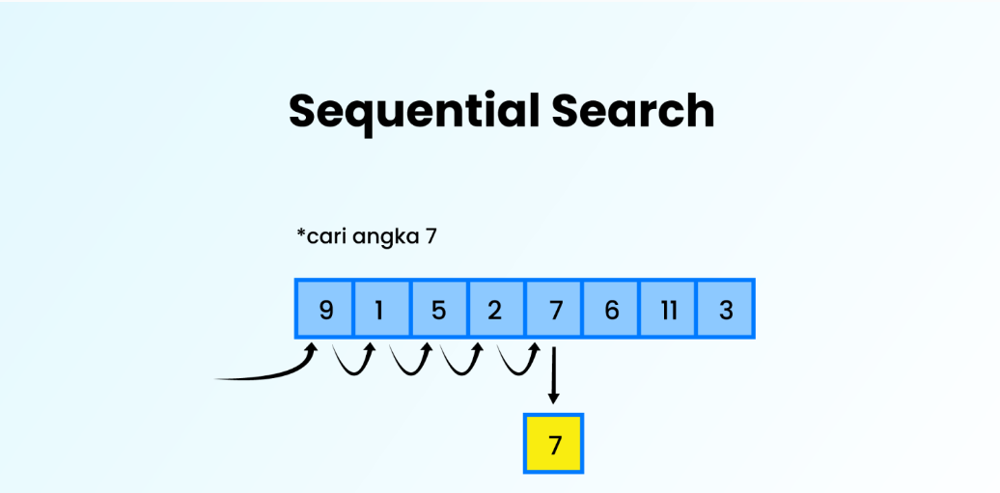
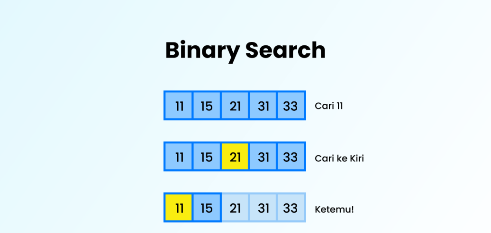
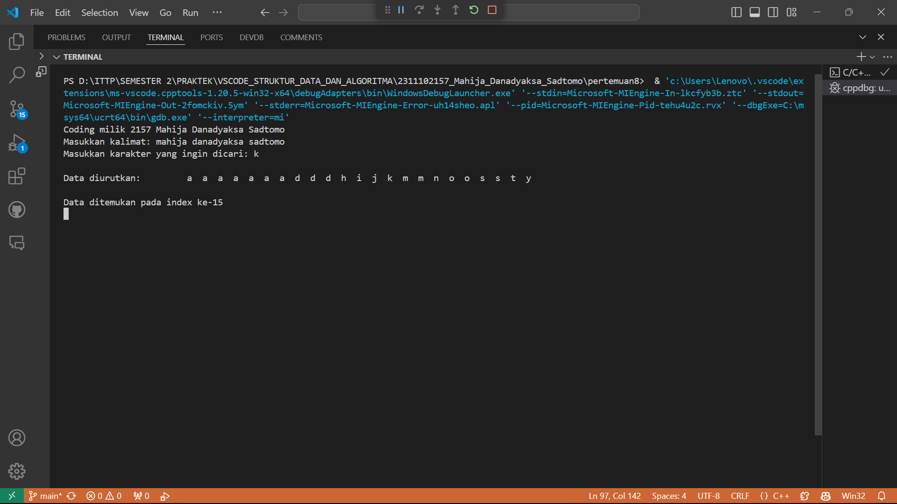
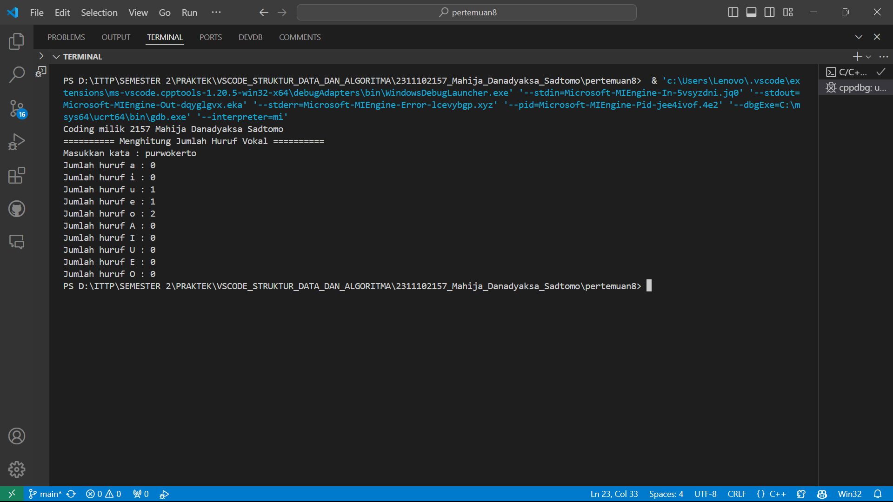
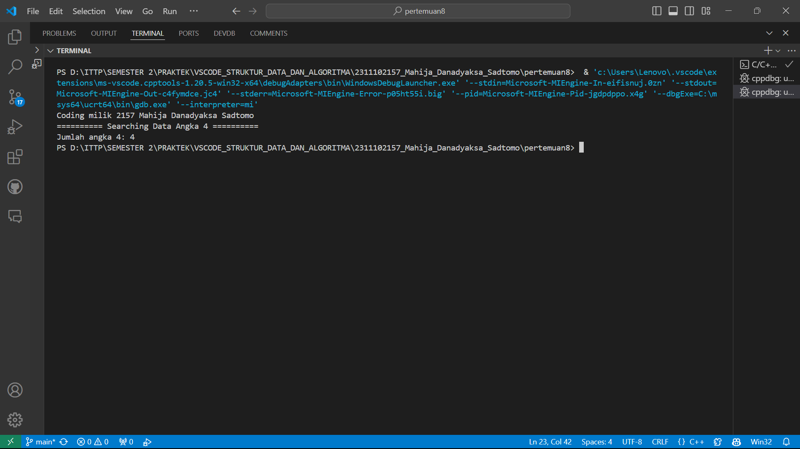

# <h1 align="center">Laporan Praktikum Modul 8 - Searching</h1>
<p align="center">Mahija Danadyaksa Sadtomo_2311102157</p>

## Dasar Teori
### Searching
Searching adalah sebuah metode pencarian guna menemukan data/informasi yang sedang dicari di dalam sebuah kumpulan data yang memiliki tipe data sama. Pencarian diperlukan untuk mendapatkan informasi/data dari kumpulan data yang belum diketahui. Pencarian yang dilakukan terhadap data yang berada dalam komputer di kenal dengan pencarian internal sedangkan pencarian yang dilakukan pada media penyimpanan eksternal disebut pencarian ekternal. Terdapat 2 pencarian pada internal yaitu Pencarian Sekuensial (Sequential Search) dan Pencarian Biner (Binary Search). 


### 1. Sequential Search
Sequential Search Adalah metode pencarian sebuah data dari suatu kumpulan data dimana data dicari dari depan ke belakang atau dari awal sampai akhir data tanpa harus data tersebut terurut. Konsepnya yaitu dengan melakukan perbandingan data satu-persatu secara berurutan sampai data tersebut ditemukan ataupun tidak di temukan.

#### Algoritma Sequential Search 
1. Data melakukan perbandingan satu per satu secara berurutan dalam kumpulan data dengan data yang  dicari sampai data tersebut ditemukan atau tidak ditemukan.  
2. Pada dasarnya, pencarian ini hanya melakukan pengulangan data dari 1 sampai dengan jumlah data (n).  
3. Setiap pengulangan, dibandingkan data ke-i dengan data yang sedang dicari. 
4. Apabila data sama dengan yang dicari, berarti data telah berhasil ditemukan.Sebaliknya apabila sampai akhir melakukan pengulangan tidak ada data yang sama dengan yang dicari, berarti data tidak ada yang ditemukan.

#### Kelebihan dan Kekurangan Sequential Search
Kelebihan:
- Relatif lebih cepat dan efisien untuk data yang memiliki jumlah terbatas .
- Algoritma perogrammannya lebih sederhana <br/>

Kekurangan:
- Kurang cepat untuk melakukan pencarian data dalam jumlah yang besar 
- Beban komputasinya lebih besar

<br/>

### 1. Binary Search
Binary Search Adalah metode pencarian sebuah data dari suatu kumpulan data, dimana kumpulan data tersebut harus berurutan dengan benar agar proses pencarian data bisa di lakukan. Dalam proses pencarian data pada metode ini data akan di bagi menjadi dua bagian untuk setiap tahap pencariannya. 
<br/>

#### Algoritma Binary Search:
1. Pertama pengambilan data dimulai  dari posisi 1 sampai  dengan posisi akhir (n)
2. Selanjutnya mencari posisi data yang tengah dengan menggunakan rumus: (posisi awal + posisi akhir) / 2. 
3. Setelah itu data yang akan dicari dibandingkan dengan data yang berada di tengah, apakah data tersebut sama atau lebih kecil, atau lebih besar? 
4. Seandainya data tersebut  lebih besar, maka proses pencarian yang dicari dengan posisi awal adalah posisi tengah + 1 
5. Apabila data lebih kecil, maka proses pencarian yang dicari dengan posisi akhir adalah posisi tengah – 1 
6. Jika data sama dengan data yang di cari, berarti  data tersebut telah ketemu.

#### Kelebihan dan Kekurangan Binary Search
Kelebihan:
- Untuk Pencarian data dalam jumlah yang besar, waktu searching/pencarian lebih cepat karena data telah terurut 
- Beban komputasinya cenderung lebih kecil <br/>

Kekurangan:
- Data harus sudah di-sorting lebih dulu ( dalam keadaan terurut ) agar lebih mudah dalam pencarian data yang diinginkan. 
- Algoritma pemrogramannya lebih rumit dari sequential search, tidak baik untuk data berangkai 


<br/>

## Guided 

### 1. Sequential Search
```C++
#include <iostream>

using namespace std;

int main()
{
    int n = 10;
    int data[n] = {9, 4, 1, 7, 5, 12, 4, 13, 4, 10};
    int cari = 10;
    bool ketemu = false;
    int i;

    for (i = 0; i < n; i++)
    {
        if (data[i] == cari)
        {
            ketemu = true;
            break;
        }
    }

    cout << "Program Sequential Search" << endl;
    cout << "data : {9,4,1,7,5,12,4,13,4,10}" << endl;

    if (ketemu)
    {
        cout << "\nAngka " << cari << " ditemukan pada indeks ke-" << i << endl;
    }
    else
    {
        cout << "data tidak ditemukan" << endl;
    }

    return 0;
}
```
program di atas adalah program pencarian data dengan metode sequential search. Pada program di atas terdapat array data yang berisi 10 data, kemudian program akan mencari data yang dicari pada array data tersebut. Jika data yang dicari ditemukan, maka program akan menampilkan pesan "Angka ditemukan pada indeks ke-". Jika data tidak ditemukan, maka program akan menampilkan pesan "data tidak ditemukan". <br/>

Pada program di atas, data yang dicari adalah 10. Output dari program di atas adalah "Angka 10 ditemukan pada indeks ke-9" karena data 10 ditemukan pada indeks ke-9. Jika data yang dicari adalah 11 maka output dari program di atas adalah "data tidak ditemukan" karena data 11 tidak ada pada array data. <br/>

### 2. Binary Search
```C++
#include<iostream>
#include<conio.h>
#include<iomanip>

using namespace std;

int dataArray[7] = {1, 8, 2, 5, 4, 9, 7};
int cari;

void Selection_Sort(){
    int temp, min, i, j;
    for(i = 0; i < 7; i++){
        min = i;
        for(j = i + 1; j < 7; j++){
            if(dataArray[j] < dataArray[min]){
                min = j;
            }
        }
        temp = dataArray[i];
        dataArray[i] = dataArray[min];
        dataArray[min] = temp;
    }
}

void BinarySearch(){
    int awal, akhir, tengah;
    bool b_flag = false;
    awal = 0;
    akhir = 6;
    while(!b_flag && awal <= akhir){
        tengah = (awal + akhir)/2;
        if(dataArray[tengah] == cari){
            b_flag = true;
        } else if(dataArray[tengah] < cari){
            awal = tengah + 1;
        } else {
            akhir = tengah - 1;
        }
    }
    if(b_flag){
        cout << "\nData ditemukan pada index ke-" << tengah << endl;
    } else {
        cout << "\nData tidak ditemukan" << endl;
    }
}

int main(){
    cout << "BINARY SEARCH" << endl;
    cout << "\nData : ";
    for(int x = 0; x < 7; x++){
        cout << setw(3) << dataArray[x];
    }
    cout << endl;

    cout << "Masukkan data yang ingin dicari : ";
    cin >> cari;
    
    cout << "\nData diurutkan : ";
    Selection_Sort();

    for(int x = 0; x < 7; x++){
        cout << setw(3) << dataArray[x];
    }
    cout << endl;
    BinarySearch();
    _getche();
    return 0;
}
```
Program di atas adalah program pencarian data dengan metode binary search. Pada program di atas terdapat array data yang berisi 7 data. Pada program di atas, data diurutkan terlebih dahulu menggunakan metode selection sort sebelum dilakukan pencarian data menggunakan metode binary search. Kemudian program akan mencari data yang dicari pada array data tersebut. Jika data yang dicari ditemukan maka program akan menampilkan pesan "Data ditemukan pada index ke-". <br/>

Jika data tidak ditemukan, maka program akan menampilkan pesan "Data tidak ditemukan". Pada program di atas, data yang dicari adalah 5. Output dari program di atas adalah "Data ditemukan pada index ke-3" karena data 5 ditemukan pada index ke-3. Jika data yang dicari adalah 6 maka output dari program di atas adalah "Data tidak ditemukan" karena data 6 tidak ada pada array data. <br/>

## Unguided 

### 1. Buatlah sebuah program untuk mencari sebuah huruf pada sebuah kalimat yang sudah di input dengan menggunakan Binary Search!

```C++
// Coding milik 2157 Mahija Danadyaksa Sadtomo

#include <iostream> // Library standar yang digunakan untuk input dan output
#include <conio.h> // Library standar yang digunakan untuk _getche()
#include <cstring> // Library standar yang digunakan untuk strlen()
#include <iomanip> // Library standar yang digunakan untuk setw()

using namespace std; // Untuk mempersingkat penulisan kode program

char dataArray[100]; // Data yang akan diurutkan
char cari; // Data yang dicari

void Selection_Sort(char arr[], int n) // Fungsi untuk mengurutkan data menggunakan Selection Sort
{
    int temp, min, i, j;
    for (i = 0; i < n - 1; i++)
    {
        min = i;
        for (j = i + 1; j < n; j++)
        {
            if (arr[j] < arr[min])
            {
                min = j;
            }
        }
        temp = arr[i];
        arr[i] = arr[min];
        arr[min] = temp;
    }
}
void BinarySearch(char arr[], int n) // Fungsi untuk mencari data menggunakan Binary Search
{
    int awal, akhir, tengah;
    bool b_flag = false;
    awal = 0;
    akhir = n - 1;
    while (!b_flag && awal <= akhir)
    {
        tengah = (awal + akhir) / 2;
        if (arr[tengah] == cari)
        {
            b_flag = true;
        }
        else if (arr[tengah] < cari)
        {
            awal = tengah + 1;
        }
        else
        {
            akhir = tengah - 1;
        }
    }
    if (b_flag)
    {
        cout << "\nData ditemukan pada index ke-" << tengah << endl;
    }
    else
    {
        cout << "\nData tidak ditemukan" << endl;
    }
}

int main() // Fungsi utama
{
    cout << "Coding milik 2157 Mahija Danadyaksa Sadtomo" << endl;
    cout << "========== Searching Huruf ==========" << endl;

    cout << "Masukkan kalimat: ";
    cin.getline(dataArray, 100); // Memasukkan data yang akan diurutkan, getline() digunakan untuk membaca inputan yang mengandung spasi

    int n = strlen(dataArray);

    cout << "Masukkan karakter yang ingin dicari: ";
    cin >> cari;

    cout << "\nData diurutkan: ";
    Selection_Sort(dataArray, n); // Memanggil fungsi Selection_Sort

    for (int x = 0; x < n; x++)
    {
        cout << setw(3) << dataArray[x];
    }
    cout << endl;

    BinarySearch(dataArray, n);  // Memanggil fungsi BinarySearch

    _getche(); // Menunggu inputan dari user
    return 0;
}
```
#### Output:


<p>Program diatas adalah program yang digunakan untuk mencari data yang dicari menggunakan Binary Search pada data yang sudah diurutkan menggunakan Selection Sort.</p> <br/>

<p>Pada selection sort terdapat variabel temp, min, i, dan j yang digunakan untuk menyimpan data sementara. Di dalam fungsi selection sort, pertama-tama akan dicari data terkecil dari data yang ada, lalu data terkecil tersebut akan dipindahkan ke index pertama.</p> <br/>

<p>Pada binary search terdapat variabel awal, akhir, dan tengah yang digunakan untuk menyimpan index awal, index akhir, dan index tengah. Di dalam fungsi binary search, pertama-tama akan dicek apakah data yang dicari sama dengan data pada index tengah, jika tidak maka akan dibagi menjadi dua bagian.</p> <br/>

<p>Pada main program, pertama-tama user diminta untuk memasukkan kalimat yang akan diurutkan, lalu user diminta untuk memasukkan karakter yang ingin dicari pada kalimat tersebut. Jika data ditemukan, maka akan menampilkan index dari data tersebut, jika tidak maka akan menampilkan pesan bahwa data tidak ditemukan. </p> <br/>

### 2. Buatlah sebuah program yang dapat menghitung banyaknya huruf vocal dalam sebuah kalimat!

```C++
#include <iostream> // Library standar yang digunakan untuk input dan output
#include <string>   // Library standar yang digunakan untuk string

using namespace std; // Untuk mempersingkat penulisan kode program

int carivokal(string kata, char huruf) // fungsi untuk mencari jumlah huruf vokal (sequential search)
{
    int jumlah = 0;
    for (int i = 0; i < kata.length(); i++) // Sequential search dilakukan dengan iterasi melalui setiap karakter dalam string
    {
        if (kata[i] == huruf) // Memeriksa apakah karakter pada indeks saat ini sama dengan huruf yang dicari
        {
            jumlah++; // Jika ditemukan huruf yang sesuai, jumlahnya ditambah
        }
    }
    return jumlah; // Mengembalikan jumlah huruf yang ditemukan
}

void hitungvokal(string kata) // fungsi untuk menampilkan jumlah huruf vokal
{
    int jumlah;
    char vokal[10] = {'a', 'i', 'u', 'e', 'o', 'A', 'I', 'U', 'E', 'O'};
    for (int i = 0; i < 10; i++)
    {
        jumlah = carivokal(kata, vokal[i]);
        cout << "Jumlah huruf " << vokal[i] << " : " << jumlah << endl;
    }
}

int main() // fungsi utama
{
    cout << "Coding milik 2157 Mahija Danadyaksa Sadtomo" << endl;
    cout << "========== Menghitung Jumlah Huruf Vokal ==========" << endl;
    string kata;
    cout << "Masukkan kata : ";
    cin >> kata;
    hitungvokal(kata);
    return 0;
}
```
#### Output:


Program di atas adalah program yang digunakan untuk menghitung jumlah huruf vokal dalam suatu kata dengan menggunakan sequential search. <br/>

terdapat beberapa fungsi pada program tersebut, yaitu:

1. fungsi carivokal(string kata, char huruf) : fungsi ini digunakan untuk mencari jumlah huruf vokal dalam suatu kata.
   - Input : string kata, char huruf 
   - Output : int jumlah <br/>

2. fungsi hitungvokal(string kata) : fungsi ini digunakan untuk menampilkan jumlah huruf vokal dalam suatu kata.
   - Input : string kata
   - Output : void <br/>

3. fungsi main() : fungsi utama yang digunakan untuk memanggil fungsi hitungvokal(string kata) dan menampilkan hasilnya.
   - Input : void
   - Output : int <br/>

Pada fungsi carivokal(string kata, char huruf), terdapat variabel jumlah yang digunakan untuk menyimpan jumlah huruf vokal yang ditemukan. Kemudian, dilakukan iterasi melalui setiap karakter dalam string kata. Jika karakter pada indeks saat ini sama dengan huruf yang dicari, maka jumlah akan ditambah. <br/>

Pada fungsi hitungvokal(string kata), terdapat variabel jumlah dan array vokal yang berisi huruf vokal. Kemudian, dilakukan iterasi melalui array vokal. Pada setiap iterasi, fungsi carivokal(kata, vokal[i]) akan dipanggil untuk menghitung jumlah huruf vokal vokal[i] dalam kata. <br/>

Pada fungsi main(), terdapat variabel kata yang digunakan untuk menyimpan kata yang dimasukkan oleh pengguna. Pengguna diminta untuk memasukkan kata, kemudian fungsi hitungvokal(kata) akan dipanggil untuk menghitung dan menampilkan jumlah huruf vokal dalam kata tersebut. Jumlah huruf vokal akan ditampilkan pada layar sesuai dengan huruf vokal yang ada. Jika tidak ada huruf vokal tertentu dalam kata, maka jumlah huruf vokal tersebut akan ditampilkan sebagai 0.


### 3. Diketahui data = 9, 4, 1, 4, 7, 10, 5, 4, 12, 4. Hitunglah berapa banyak angka 4 dengan menggunakan algoritma Sequential Search!

```C++
#include <iostream> // Library standar yang digunakan untuk input dan output

using namespace std; // Untuk mempersingkat penulisan kode program

int sequentialSearch(int arr[], int n, int key) // Fungsi untuk mencari jumlah kemunculan suatu angka dalam array
{
    int count = 0;
    for (int i = 0; i < n; ++i)
    {
        if (arr[i] == key)
        {
            count++;
        }
    }
    return count;
}

int main() // fungsi utama
{
    cout << "Coding milik 2157 Mahija Danadyaksa Sadtomo" << endl;
    cout << "========== Searching Data Angka 4 ==========" << endl;
    int data[] = {9, 4, 1, 4, 7, 10, 5, 4, 12, 4}; // Data yang akan dicari
    int size = sizeof(data) / sizeof(data[0]); // Menghitung jumlah elemen dalam array
    int key = 4; // Angka yang dicari
    int result = sequentialSearch(data, size, key); // Memanggil fungsi sequentialSearch
    cout << "Jumlah angka 4: " << result << endl; 
    return 0;
}
```
#### Output:


<p> Program di atas adalah program yang digunakan untuk mencari jumlah kemunculan suatu angka dalam array. Terdapat fungsi sequential search yang digunakan untuk mencari jumlah kemunculan angka 4 dalam array. int arr[] adalah array yang akan dicari, int n adalah jumlah elemen dalam array, dan int key adalah angka yang dicari. terdapat int count yang digunakan untuk menghitung jumlah kemunculan angka 4 dalam array dan perulangan for untuk mencari angka 4 dalam array.  </p> <br/>

<p> Pada fungsi main, terdapat array data yang akan dicari, size untuk menghitung jumlah elemen dalam array, key adalah angka yang dicari, dan result adalah hasil dari fungsi sequentialSearch. Hasil dari program di atas adalah jumlah kemunculan angka 4 dalam array data. Output dari program di atas adalah "Jumlah angka 4: 4" karena angka 4 muncul sebanyak 4 kali dalam array data. </p> <br/>

## Kesimpulan
<p> Searching adalah sebuah metode pencarian guna menemukan data/informasi yang sedang dicari di dalam sebuah kumpulan data yang memiliki tipe data sama. Terdapat 2 metode searching yaitu Sequential Search dan Binary Search.<p> <br/>
<p> Sequential Search adalah algoritma pencarian yang bekerja dengan mengecek setiap elemen pada array secara berurutan mulai dari elemen pertama hingga akhir. Algoritma pencarian ini dapat digunakan untuk data yang masih berpola acak. <p> <br/>
<p> Binary Search adalah algoritma pencarian data yang digunakan untuk mencari suatu nilai pada data yang sudah terurut. Cara kerja dari algoritma ini yaitu membagi jumlah data menjadi 2 bagian secara berulang kali untuk memperkecil lokasi pencarian suatu data hingga pada akhirnya dapat ditemukan. Berbeda dengan Sequential Search yang mencari dengan cara mengecek setiap elemen pada array satu persatu.<p> <br/>

## Referensi
[1] Quinn, R., Advanced C++ Programming Cookbook. United Kingdoms: Packt Publishing Ltd., 2020.<br/>
[2] Muhammad Nugraha, Dasar Pemrograman Dengan C++, Materi Paling Dasar untuk Menjadi Programmer Berbagai Platform. Yogyakarta: Deepublish, 2021.<br/>
[3] Wahyuni, W. S., Andryana, S., & Rahman, B. (2022). Penggunaan algoritma sequential searching pada aplikasi perpustakaan berbasis web. JIPI (Jurnal Ilmiah Penelitian dan Pembelajaran Informatika), 7(2), 294-302.

