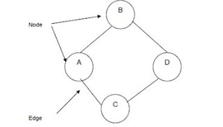
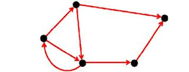
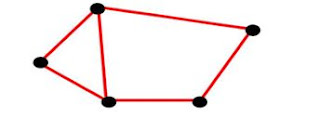
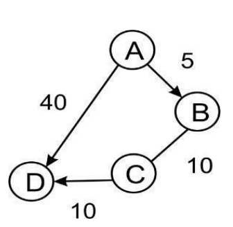
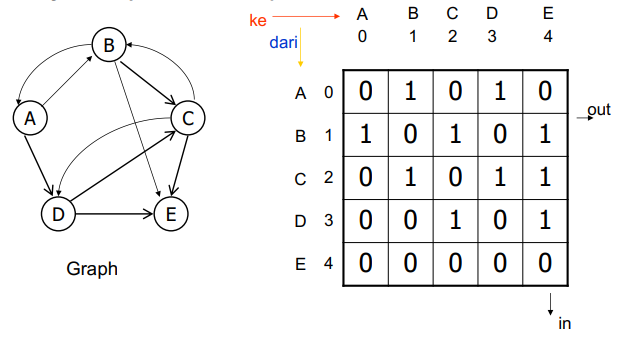
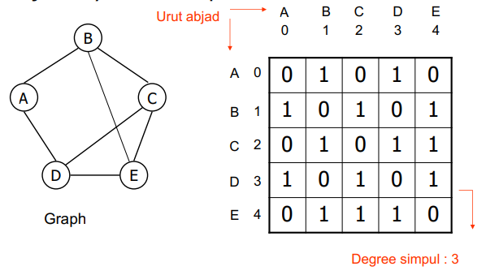
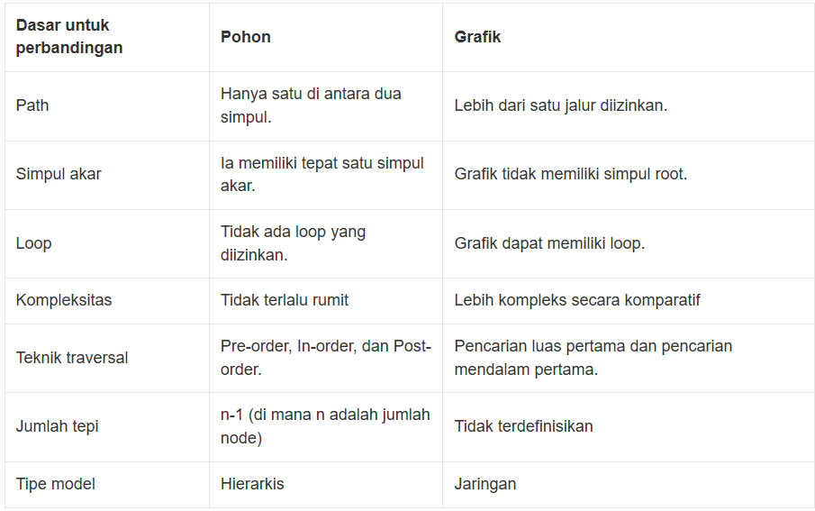
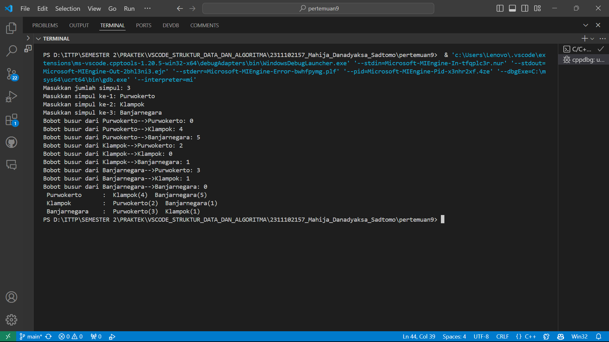

# <h1 align="center">Laporan Praktikum Modul 8 - Searching</h1>
<p align="center">Mahija Danadyaksa Sadtomo_2311102157</p>

## Dasar Teori

### 1. Graph
<br/>

#### A. Penjelasan Graph
Graph adalah jenis struktur data umum yang susunan datanya tidak berdekatan satu sama lain (non-linier). Graph terdiri dari beberapa kumpulan titik (node) dan garis (edge). Graph dapat digunakan untuk merepresentasikan objek-objek diskrit dan hubungan antara objek-objek tersebut. Representasi visual dari graph adalah dengan menyatakan objek sebagai node, bulatan atau titik (vertex), sedangkan hubungan antara objek dinyatakan dengan garis (edge).<br/>


Istilah-istilah pada Graph:
1. Node, adalah struktur yang berisi sebuah nilai atau suatu kondisi atau menggambarkan sebuah struktur data terpisah atau sebuah bagian pohon itu sendiri.<br/>

2. Vertex, adalah himpunan node / titik pada sebuah graph. <br/>

3. Edge, adalah penghubung antara satu node dengan node yang lain. Sebuah garis harus diawali dan diakhiri titik. <br/>

4. Path, adalah jalur dari satu titik ke titik lain. Sebuah path yang diawali dan diakhiri dengan titik yang sama disebut juga dengan simpul tertutup. <br/>

5. Adjacent, adalah dua buah titik dikatakan berdekatan (adjacent) jika dua buah titik tersebut terhubung dengan sebuah sisi. <br/>

#### B. Jenis Graph
1. Berdasarkan orientasi arah sisi nya, graph dapat dibedakan menjadi 2 yaitu : <br/>
- Graf berarah (Directed graph) adalah graph yang setiap sisi nya memiliki orientasi arah. <br/>
<br/>

- Graf tak berarah (Undirected graph) adalah graph yang sisi nya tidak memiliki orientasi arah. <br/>
<br/>

2. berdasarkan ada tidaknya label bobot pada koneksinya, yaitu: <br/>
- Graf berbobot (Weight Graph) adalah graph dimana setiap cabang diberi bobot numerik
<br/>

- Graph tanpa bobot (Unweighted Graph) adalah graph yang tidak memiliki properti bobot pada koneksinya. Graph ini hanya mempertimbangkan apakah dua node saling terhubung atau tidak. <br/>

#### C. Representasi Graph
1. Representasi graph dalam bentuk matrix
- Adjacency Matrix Graph berarah
<br/>

- Adjacency Matrix Graph tak berarah
<br/>

2. Representasi graph dalam bentuk linked list
- Adjacency Linkedlist Graph tak berarah
<br/>

### 2. Tree
<br/>

#### A. Penjelasan Tree
Tree adalah struktur data non linier berbentuk hierarki yang terdiri dari sekumpulan node yang berbeda. Hierarki pada struktur tree dapat diibaratkan seperti sebuah pohon keluarga di mana terdapat hubungan antara orang tua dan anak. Titik yang lebih atas disebut simpul induk sedangkan simpul di bawahnya adalah simpul anak.

Istilah-istilah pada tree:
1. Node
Node atau simpul adalah entitas pada struktur data tree yang mengandung sebuah nilai dan pointer yang menunjuk simpul di bawahnya (child node).

2. Child node
Child node atau simpul anak adalah simpul turunan dari simpul di atasnya.

3. Leaf Node
Leaf node atau simpul daun adalah simpul yang tidak memiliki child node dan merupakan node yang paling bawah dalam struktur data tree. Simpul ini biasa disebut juga sebagai external node

3. Root
Root atau akar adalah simpul teratas dari sebuah tree.

4. Internal node
Internal node adalah istilah untuk menyebut simpul yang memiliki minimal satu child node.

5. Edge
Edge merujuk pada garis yang menghubungkan antara dua buah simpul dalam tree. Jika sebuah tree memiliki N node maka tree tersebut akan memiliki (N-1) edge. Hanya ada satu jalur dari setiap simpul ke simpul lainnya.

6. Height of node
Height of node adalah jumlah edge dari sebuah node ke leaf node yang paling dalam.

7. Depth of node
Depth of node adalah banyaknya edge dari root ke sebuah node.

8. Height of tree
Height of tree dapat diartikan sebagai panjang jalur terpanjang dari simpul akar ke simpul daun dari seuah tree.

9. Degree of node
Jumlah cabang yang melekat pada simpul disebut Degree of node atau derajat simpul. Derajat simpul pada sebuah leaf node adalah 0. 

Selain Degree of node, terdapat juga Degree of tree yaitu derajat maksimum simpul di antara semua simpul pada tree.

10. Subtree
Subtree adalah setiap simpul dari tree beserta turunannya.

#### B. Karakteristik Tree

Karakteristik dari struktur data tree, yaitu:
1. Penjelahan data (traversing) pada tree dilakukan oleh algoritma Depth First Search dan Breadth First Search
2. Tidak ada loop dan circuit
3. Tidak memiliki self-loop
4. Disusun dalam model hierarki

#### C. Jenis Tree

Struktur data tree dapat diklasifikasikan ke dalam 4 jenis, yaitu:

1. General tree
Struktur data tree yang tidak memiliki batasan jumlah node pada hierarki tree disebut General tree. Setiap simpul atau node bebas memiliki berapapun child node. Tree jenis adalah superset dari semua jenis tree.

2. Binary tree  
Binary tree adalah jenis tree yang simpulnya hanya dapat memiliki paling banyak 2 simpul anak (child node). Kedua simpul tersebut biasa disebut simpul kiri (left node) dan simpul kanan (right node). Tree tipe ini lebih populer daripada jenis lainnya.

3. Balanced tree
Apabila tinggi dari subtree sebelah kiri dan subtree sebelah kanan sama atau kalaupun berbeda hanya berbeda 1, maka disebut sebagai balanced tree. 

4. Binary search tree
Sesuai dengan namanya, Binary search tree digunakan untuk berbagai algoritma pencarian dan pengurutan. Contohnya seperti AVL tree dan Red-black tree. Struktur data tree jenis ini memiliki nilai pada simpul sebelah kiri lebih kecil daripada induknya. Sedangkan nilai simpul sebelah kanan lebih besar dari induknya.


### 3. Perbedaan Graph dan Tree
<br/>

## Guided 

### 1. Graph 
```C++
#include <iostream> // Library standar yang digunakan untuk input dan output
#include <iomanip>  // Library standar yang digunakan untuk manipulasi input dan output

using namespace std; // Untuk mempersingkat penulisan kode program

string simpul[7] =
    {
        "Ciamis", "Bandung", "Bekasi", "Tasikmalaya", "Cianjur", "Purwokerto", "Yogyakarta"}; // Array yang berisi nama-nama simpul

int busur[7][7] =
    {
        {0, 7, 8, 0, 0, 0, 0},
        {0, 0, 5, 0, 0, 15, 0},
        {0, 6, 0, 0, 5, 0, 0},
        {0, 5, 0, 0, 2, 4, 0},
        {23, 0, 0, 10, 0, 0, 8},
        {0, 0, 0, 0, 7, 0, 3},
        {0, 0, 0, 0, 9, 4, 0}}; // Array yang berisi bobot dari busur

void tampilGraph() // Fungsi untuk menampilkan graph
{
    for (int baris = 0; baris < 7; baris++)
    {
        cout << " " << setiosflags(ios::left) << setw(15) << simpul[baris] << " : ";
        for (int kolom = 0; kolom < 7; kolom++)
        {
            if (busur[baris][kolom] != 0)
            {
                cout << " " << simpul[kolom] << "(" << busur[baris][kolom] << ") ";
            }
        }
        cout << endl;
    }
}

int main() // Fungsi utama program
{
    tampilGraph();
    return 0;
}
```
program di atas adalah program menampilkan jarak dari suatu kota ke kota lainnya dengan mengimplementasikan graph. Graph di atas dipresentasikan dengan menggunakan array 2 dimensi. Terdapat beberapa fungsi pada program tersebut yaitu:
1. busur[7][7] yang array dua dimensi untuk menyimpan jarak dari suatu kota ke kota lainnya.
2. simpul[7] yang array satu dimensi untuk menyimpan nama kota.
3. tampilGraph() yang digunakan untuk menampilkan jarak dari suatu kota ke kota lainnya.
4. main() yang digunakan untuk memanggil fungsi tampilGraph().

### 2. Tree
```C++
#include <iostream>
#include <iomanip>
using namespace std;
struct Pohon
{
    char data;
    Pohon *left, *right, *parent;
};
Pohon *root, *baru;
void init()
{
    root = NULL;
}
bool isEmpty()
{
    return root == NULL;
}
void buatNode(char data)
{
    if (isEmpty())
    {
        root = new Pohon();
        root->data = data;
        root->left = NULL;
        root->right = NULL;
        root->parent = NULL;
        cout << "\n Node " << data << " berhasil dibuat sebagai root."
             << endl;
    }
    else
    {
        cout << "\n Tree sudah ada!" << endl;
    }
}
Pohon *insertLeft(char data, Pohon *node)
{
    if (isEmpty())
    {
        cout << "\n Buat tree terlebih dahulu!" << endl;
        return NULL;
    }
    else
    {
        if (node->left != NULL)
        {
            cout << "\n Node " << node->data << " sudah ada child kiri !" << endl;
            return NULL;
        }
        else
        {
            Pohon *baru = new Pohon();
            baru->data = data;
            baru->left = NULL;
            baru->right = NULL;
            baru->parent = node;
            node->left = baru;
            cout << "\n Node " << data << " berhasil ditambahkan kechild kiri " << baru->parent->data << endl;
            return baru;
        }
    }
}
Pohon *insertRight(char data, Pohon *node)
{
    if (isEmpty())
    {
        cout << "\n Buat tree terlebih dahulu!" << endl;
        return NULL;
    }
    else
    {
        if (node->right != NULL)
        {
            cout << "\n Node " << node->data << " sudah ada child kanan !" << endl;
            return NULL;
        }
        else
        {
            Pohon *baru = new Pohon();
            baru->data = data;
            baru->left = NULL;
            baru->right = NULL;
            baru->parent = node;
            node->right = baru;
            cout << "\n Node " << data << " berhasil ditambahkan ke child kanan " << baru->parent->data << endl;
            return baru;
        }
    }
}
void update(char data, Pohon *node)
{
    if (isEmpty())
    {
        cout << "\n Buat tree terlebih dahulu!" << endl;
    }
    else
    {
        if (!node)
        {
            cout << "\n Node yang ingin diganti tidak ada!!" << endl;
        }
        else
        {
            char temp = node->data;
            node->data = data;
            cout << "\n Node " << temp << " berhasil diubah menjadi "
                 << data << endl;
        }
    }
}
void retrieve(Pohon *node)
{
    if (isEmpty())
    {
        cout << "\n Buat tree terlebih dahulu!" << endl;
    }
    else
    {
        if (!node)
        {
            cout << "\n Node yang ditunjuk tidak ada!" << endl;
        }
        else
        {
            cout << "\n Data node : " << node->data << endl;
        }
    }
}
void find(Pohon *node)
{
    if (isEmpty())
    {
        cout << "\n Buat tree terlebih dahulu!" << endl;
    }
    else
    {
        if (!node)
        {
            cout << "\n Node yang ditunjuk tidak ada!" << endl;
        }
        else
        {
            cout << "\n Data Node : " << node->data << endl;
            cout << " Root : " << root->data << endl;
            if (!node->parent)
                cout << " Parent : (tidak punya parent)" << endl;
            else
                cout << " Parent : " << node->parent->data << endl;
            if (node->parent != NULL && node->parent->left != node &&
                node->parent->right == node)
                cout << " Sibling : " << node->parent->left->data << endl;
            else if (node->parent != NULL && node->parent->right != node && node->parent->left == node)
                cout << " Sibling : " << node->parent->right->data << endl;
            else
                cout << " Sibling : (tidak punya sibling)" << endl;
            if (!node->left)
                cout << " Child Kiri : (tidak punya Child kiri)" << endl;
            else
                cout << " Child Kiri : " << node->left->data << endl;
            if (!node->right)
                cout << " Child Kanan : (tidak punya Child kanan)" << endl;
            else
                cout << " Child Kanan : " << node->right->data << endl;
        }
    }
}
// Penelusuran (Traversal)
// preOrder
void preOrder(Pohon *node = root)
{
    if (isEmpty())
    {
        cout << "\n Buat tree terlebih dahulu!" << endl;
    }
    else
    {
        if (node != NULL)
        {
            cout << " " << node->data << ", ";
            preOrder(node->left);
            preOrder(node->right);
        }
    }
}
// inOrder
void inOrder(Pohon *node = root)
{
    if (isEmpty())
    {
        cout << "\n Buat tree terlebih dahulu!" << endl;
    }
    else
    {
        if (node != NULL)
        {
            inOrder(node->left);
            cout << " " << node->data << ", ";
            inOrder(node->right);
        }
    }
}
// postOrder
void postOrder(Pohon *node = root)
{
    if (isEmpty())
    {
        cout << "\n Buat tree terlebih dahulu!" << endl;
    }
    else
    {
        if (node != NULL)
        {
            postOrder(node->left);
            postOrder(node->right);
            cout << " " << node->data << ", ";
        }
    }
}
// Hapus Node Tree
void deleteTree(Pohon *node)
{
    if (isEmpty())
    {
        cout << "\n Buat tree terlebih dahulu!" << endl;
    }
    else
    {
        if (node != NULL)
        {
            if (node != root)
            {
                node->parent->left = NULL;
                node->parent->right = NULL;
            }
            deleteTree(node->left);
            deleteTree(node->right);
            if (node == root)
            {
                delete root;
                root = NULL;
            }
            else
            {
                delete node;
            }
        }
    }
}
// Hapus SubTree
void deleteSub(Pohon *node)
{
    if (isEmpty())
    {
        cout << "\n Buat tree terlebih dahulu!" << endl;
    }
    else
    {
        deleteTree(node->left);
        deleteTree(node->right);
        cout << "\n Node subtree " << node->data << " berhasil dihapus." << endl;
    }
}
void clear()
{
    if (isEmpty())
    {
        cout << "\n Buat tree terlebih dahulu!!" << endl;
    }
    else
    {
        deleteTree(root);
        cout << "\n Pohon berhasil dihapus." << endl;
    }
}

// Cek Size Tree
int size(Pohon *node = root)
{
    if (isEmpty())
    {
        cout << "\n Buat tree terlebih dahulu!!" << endl;
        return 0;
    }
    else
    {
        if (!node)
        {
            return 0;
        }
        else
        {
            return 1 + size(node->left) + size(node->right);
        }
    }
}
// Cek Height Level Tree
int height(Pohon *node = root)
{
    if (isEmpty())
    {
        cout << "\n Buat tree terlebih dahulu!" << endl;
        return 0;
    }
    else
    {
        if (!node)
        {
            return 0;
        }
        else
        {
            int heightKiri = height(node->left);
            int heightKanan = height(node->right);
            if (heightKiri >= heightKanan)
            {
                return heightKiri + 1;
            }
            else
            {
                return heightKanan + 1;
            }
        }
    }
}
// Karakteristik Tree
void characteristic()
{
    cout << "\n Size Tree : " << size() << endl;
    cout << " Height Tree : " << height() << endl;
    cout << " Average Node of Tree : " << size() / height() << endl;
}

int main()
{
    buatNode('A');
    Pohon *nodeB, *nodeC, *nodeD, *nodeE, *nodeF,
        *nodeG, *nodeH,
        *nodeI, *nodeJ;
    nodeB = insertLeft('B', root);
    nodeC = insertRight('C', root);
    nodeD = insertLeft('D', nodeB);
    nodeE = insertRight('E', nodeB);
    nodeF = insertLeft('F', nodeC);
    nodeG = insertLeft('G', nodeE);
    nodeH = insertRight('H', nodeE);
    nodeI = insertLeft('I', nodeG);
    nodeJ = insertRight('J', nodeG);
    update('Z', nodeC);
    update('C', nodeC);
    retrieve(nodeC);
    find(nodeC);
    cout << "\n PreOrder :" << endl;
    preOrder(root);
    cout << "\n"
         << endl;
    cout << " InOrder :" << endl;
    inOrder(root);
    cout << "\n"
         << endl;
    cout << " PostOrder :" << endl;
    postOrder(root);
    cout << "\n"
         << endl;
    characteristic();
    deleteSub(nodeE);
    cout << "\n PreOrder :" << endl;
    preOrder();
    cout << "\n"
         << endl;
    characteristic();
}
```
Program di atas adalah program yang digunakan untuk membuat binary tree. Program ini menggunakan struct Pohon yang berisi data, left, right, dan parent. Di dalam program ini terdapat beberapa fungsi yaitu:

1. init() : untuk menginisialisasi root
2. isEmpty() : untuk mengecek apakah tree kosong atau tidak
3. buatNode(char data) : untuk membuat node baru
4. insertLeft(char data, Pohon *node) : untuk menambahkan node di sebelah kiri
5. insertRight(char data, Pohon *node) : untuk menambahkan node di sebelah kanan
6. update(char data, Pohon *node) : untuk mengupdate data node
7. retrieve(Pohon *node) : untuk menampilkan data node
8. find (Pohon *node) : untuk menampilkan karakteristik node
9. preOrder(Pohon *node = root) : untuk menampilkan data node secara preOrder
10. inOrder(Pohon *node = root) : untuk menampilkan data node secara inOrder
11. postOrder(Pohon *node = root) : untuk menampilkan data node secara postOrder
12. deleteTree(Pohon *node) : untuk menghapus tree
13. deleteSub(Pohon *node) : untuk menghapus subtree
14. clear() : untuk menghapus tree
15. size(Pohon *node = root) : untuk mengecek size tree
16. height(Pohon *node = root) : untuk mengecek height tree
17. characteristic() : untuk menampilkan karakteristik tree
18. main() : untuk menjalankan program <br/>

Pada main program, terdapat beberapa fungsi yang dijalankan yaitu:
1. buatNode('A') : membuat node A sebagai root
2. insertLeft('B', root) : membuat node B sebagai child kiri dari root
3. insertRight('C', root) : membuat node C sebagai child kanan dari root
4. insertLeft('D', nodeB) : membuat node D sebagai child kiri dari node B
5. insertRight('E', nodeB) : membuat node E sebagai child kanan dari node B
6. insertLeft('F', nodeC) : membuat node F sebagai child kiri dari node C
7. insertLeft('G', nodeE) : membuat node G sebagai child kiri dari node E
8. insertRight('H', nodeE) : membuat node H sebagai child kanan dari node E
9. insertLeft('I', nodeG) : membuat node I sebagai child kiri dari node G
10. insertRight('J', nodeG) : membuat node J sebagai child kanan dari node G
11. update('Z', nodeC) : mengupdate data node C menjadi Z
12. retrieve(nodeC) : menampilkan data node C
13. find(nodeC) : menampilkan karakteristik node C
14. preOrder(root) : menampilkan data node secara preOrder
15. inOrder(root) : menampilkan data node secara inOrder
16. postOrder(root) : menampilkan data node secara postOrder
17. characteristic() : menampilkan karakteristik tree
18. deleteSub(nodeE) : menghapus subtree node E
19. preOrder() : menampilkan data node secara preOrder
20. characteristic() : menampilkan karakteristik tree


## Unguided 

### 1. Buatlah program graph dengan menggunakan inputan user untuk menghitung jarak dari sebuah kota ke kota lainnya.

```C++
#include <iostream> // Library standar yang digunakan untuk input dan output
#include <iomanip>  // Library standar yang digunakan untuk manipulasi input dan output

using namespace std; // Untuk mempersingkat penulisan kode program

string simpulKota[100]; // Deklarasi array simpulArray dengan tipe data string dan berjumlah 100
int busur[100][100];    // Deklarasi array busur dengan tipe data integer dan berjumlah 100

int jumlahSimpul = 0; // Deklarasi variabel jumlahSimpul dengan tipe data integer dan diinisialisasi dengan nilai 0

void mahijaDanadyaksaSadtomo_2311102157() // Fungsi untuk menampilkan graph
{
    for (int baris = 0; baris < jumlahSimpul; baris++) // Perulangan untuk menampilkan graph
    {
        cout << " " << setiosflags(ios::left) << setw(15) << simpulKota[baris] << " : "; // Menampilkan simpulArray ke-i
        for (int kolom = 0; kolom < jumlahSimpul; kolom++) // Perulangan untuk menampilkan graph
        {
            if (busur[baris][kolom] != 0) // Kondisi jika busurArray ke-i dan ke-j tidak sama dengan 0
            {
                cout << " " << simpulKota[kolom] << "(" << busur[baris][kolom] << ") "; // Menampilkan simpulArray ke-j dan bobot busurArray ke-i dan ke-j
            }
        }
        cout << endl; // Pindah baris
    }
}

int main() // Fungsi utama program
{
    cout<<"Masukkan jumlah simpul: "; // Menampilkan pesan untuk memasukkan jumlah simpul
    cin>>jumlahSimpul; // Memasukkan jumlah simpul
    for (int i = 0; i < jumlahSimpul; i++) // Perulangan untuk memasukkan simpulArray
    {
        cout<<"Masukkan simpul ke-"<<i+1<<": "; // Menampilkan pesan untuk memasukkan simpul ke-i
        cin>>simpulKota[i]; // Memasukkan simpul ke-i
    }
    for (int i = 0; i < jumlahSimpul; i++) // Perulangan untuk memasukkan busurArray
    {
        for (int j = 0; j < jumlahSimpul; j++) // Perulangan untuk memasukkan busurArray
        {
            cout<<"Bobot busur dari "<<simpulKota[i]<<"-->"<<simpulKota[j]<<": "; // Menampilkan pesan untuk memasukkan bobot busurArray dari simpulArray ke-i ke simpulArray ke-j
            cin>>busur[i][j]; // Memasukkan bobot busurArray dari simpulArray ke-i ke simpulArray ke-j
        }
    } 
    mahijaDanadyaksaSadtomo_2311102157(); // Memanggil fungsi tampilGraph
    return 0; // Mengakhiri program
}
```
#### Output:


Program di atas adalah program untuk menampilkan bobot/jarak antar simpul kota. Program ini menggunakan array dua dimensi untuk menyimpan bobot antar simpul kota. Program ini juga menggunakan fungsi beberapa fungsi yaitu:
1. mahijaDanadyaksaSadtomo_2311102157() untuk menampilkan graph.
2. main() sebagai fungsi utama program.
Pertama import library iostream dan iomanip untuk kebutuhan input dan output. Setelah itu deklarasi variabel simpulKota bertipe string dan berjumlah 100, dan variabel busur bertipe integer dan berjumlah 100.Kemudian deklarasi variabel jumlahSimpul bertipe integer dan diinisialisasi dengan nilai 0 untuk menyimpan jumlah simpul kota mulai dari 0. Lalu buat fungsi mahijaDanadyaksaSadtomo_2311102157() untuk menampilkan graph. Di dalam fungsi ini terdapat perulangan for untuk menampilkan graph. Lalu pada fungsi main terdapat input jumlah simpul kota, dan nama simpul kota. Programmer diminta untuk memasukkan jumlah simpul kota dan nama simpul kota yang nantinya dari inputan tersebut ditampilkan graph antar kota dengan bobotnya.

### 2. Modifikasi guided tree diatas dengan program menu menggunakan input data tree dari user dan berikan fungsi tambahan untuk menampilkan node child dan descendant dari node yang diinput kan!


```C++
#include <iostream> // Library standar yang digunakan untuk input dan output
#include <queue>   // Library standar yang digunakan untuk queue
using namespace std; // Untuk mempersingkat penulisan kode program 

struct Pohon // Struct yang berisi data node tree
{
    char data;
    Pohon *left, *right, *parent;
};

Pohon *root; // Pointer root tree

void init() // Fungsi untuk inisialisasi tree
{
    root = NULL;
}

bool isEmpty() // Fungsi untuk mengecek apakah tree kosong
{
    return root == NULL;
}

void buatNode(char data) // Fungsi untuk membuat node tree
{
    if (isEmpty())
    {
        root = new Pohon();
        root->data = data;
        root->left = NULL;
        root->right = NULL;
        root->parent = NULL;
        cout << "\nNode " << data << " berhasil dibuat sebagai root." << endl;
    }
    else
    {
        cout << "\nTree sudah ada!" << endl;
    }
}

Pohon *insertLeft(char data, Pohon *node) // Fungsi untuk menambahkan node ke child kiri
{
    if (node->left != NULL)
    {
        cout << "\nNode " << node->data << " sudah ada child kiri!" << endl;
        return NULL;
    }
    else
    {
        Pohon *baru = new Pohon();
        baru->data = data;
        baru->left = NULL;
        baru->right = NULL;
        baru->parent = node;
        node->left = baru;
        cout << "\nNode " << data << " berhasil ditambahkan ke child kiri " << baru->parent->data << endl;
        return baru;
    }
}

Pohon *insertRight(char data, Pohon *node) // Fungsi untuk menambahkan node ke child kanan
{
    if (node->right != NULL)
    {
        cout << "\nNode " << node->data << " sudah ada child kanan!" << endl;
        return NULL;
    }
    else
    {
        Pohon *baru = new Pohon();
        baru->data = data;
        baru->left = NULL;
        baru->right = NULL;
        baru->parent = node;
        node->right = baru;
        cout << "\nNode " << data << " berhasil ditambahkan ke child kanan " << baru->parent->data << endl;
        return baru;
    }
}

void update(char data, Pohon *node) // Fungsi untuk mengubah data node
{
    if (!node)
    {
        cout << "\nNode yang ingin diganti tidak ada!!" << endl;
    }
    else
    {
        char temp = node->data;
        node->data = data;
        cout << "\nNode " << temp << " berhasil diubah menjadi " << data << endl;
    }
}

void retrieve(Pohon *node) // Fungsi untuk menampilkan data node 
{
    if (!node)
    {
        cout << "\nNode yang ditunjuk tidak ada!" << endl;
    }
    else
    {
        cout << "\nData node: " << node->data << endl;
    }
}

void find(Pohon *node) // Fungsi untuk mencari node
{
    if (!node)
    {
        cout << "\nNode yang ditunjuk tidak ada!" << endl;
    }
    else
    {
        cout << "\nData Node: " << node->data << endl;
        cout << "Root: " << root->data << endl;
        if (!node->parent)
            cout << "Parent: (tidak punya parent)" << endl;
        else
            cout << "Parent: " << node->parent->data << endl;
        if (node->parent != NULL && node->parent->left != node && node->parent->right == node)
            cout << "Sibling: " << node->parent->left->data << endl;
        else if (node->parent != NULL && node->parent->right != node && node->parent->left == node)
            cout << "Sibling: " << node->parent->right->data << endl;
        else
            cout << "Sibling: (tidak punya sibling)" << endl;
        if (!node->left)
            cout << "Child Kiri: (tidak punya Child kiri)" << endl;
        else
            cout << "Child Kiri: " << node->left->data << endl;
        if (!node->right)
            cout << "Child Kanan: (tidak punya Child kanan)" << endl;
        else
            cout << "Child Kanan: " << node->right->data << endl;
    }
}
void preOrder(Pohon *node) // Fungsi untuk melakukan preOrder traversal
{
    if (node != NULL)
    {
        cout << " " << node->data << ", ";
        preOrder(node->left);
        preOrder(node->right);
    }
}

void inOrder(Pohon *node) // Fungsi untuk melakukan inOrder traversal
{
    if (node != NULL)
    {
        inOrder(node->left);
        cout << " " << node->data << ", ";
        inOrder(node->right);
    }
}

void postOrder(Pohon *node) // Fungsi untuk melakukan postOrder traversal
{
    if (node != NULL)
    {
        postOrder(node->left);
        postOrder(node->right);
        cout << " " << node->data << ", ";
    }
}

void deleteTree(Pohon *node) // Fungsi untuk menghapus tree
{
    if (node != NULL)
    {
        if (node != root)
        {
            if (node->parent->left == node)
                node->parent->left = NULL;
            if (node->parent->right == node)
                node->parent->right = NULL;
        }
        deleteTree(node->left);
        deleteTree(node->right);
        if (node == root)
        {
            delete root;
            root = NULL;
        }
        else
        {
            delete node;
        }
    }
}

void deleteSub(Pohon *node) // Fungsi untuk menghapus subtree
{
    if (!isEmpty())
    {
        deleteTree(node->left);
        deleteTree(node->right);
        cout << "\nNode subtree " << node->data << " berhasil dihapus." << endl;
    }
}

void clear() // Fungsi untuk menghapus tree
{
    if (!isEmpty())
    {
        deleteTree(root);
        cout << "\nPohon berhasil dihapus." << endl;
    }
}

int size(Pohon *node = root) // Fungsi untuk menghitung jumlah node tree
{
    if (!node)
    {
        return 0;
    }
    else
    {
        return 1 + size(node->left) + size(node->right);
    }
}

int height(Pohon *node = root) // Fungsi untuk menghitung tinggi tree
{
    if (!node)
    {
        return 0;
    }
    else
    {
        int heightKiri = height(node->left);
        int heightKanan = height(node->right);
        return max(heightKiri, heightKanan) + 1;
    }
}

void characteristic() // Fungsi untuk menampilkan karakteristik tree    
{
    cout << "\nSize Tree: " << size() << endl;
    cout << "Height Tree: " << height() << endl;
    if (height() != 0)
    {
        cout << "Average Node of Tree: " << (double)size() / height() << endl;
    }
}

void mahijaDanadyaksaSadtomo_2311102157() // Fungsi untuk menampilkan menu
{
    char choice;
    do
    {
        cout << "\nMenu:\n";
        cout << "1. Buat Node\n";
        cout << "2. Update Node\n";
        cout << "3. Retrieve Node\n";
        cout << "4. Find Node\n";
        cout << "5. Travers Data\n";
        cout << "6. Hapus Subtree\n";
        cout << "7. Clear Tree\n";
        cout << "8. Karakteristik Tree\n";
        cout << "9. Exit\n";
        cout << "Pilih opsi: ";
        cin >> choice;
        char data, parentData;
        Pohon *parentNode = nullptr;
        switch (choice)
        {
        case '1': // Buat Node
            if (isEmpty())
            {
                cout << "Masukkan data root: ";
                cin >> data;
                buatNode(data);
            }
            else // Insert Left atau Insert Right
            {
                cout << "Masukkan data node baru: ";
                cin >> data;
                cout << "Masukkan data parent node: ";
                cin >> parentData;
                cout << "Pilih 1 untuk Insert Left, 2 untuk Insert Right: ";
                char insertChoice;
                cin >> insertChoice;
                parentNode = nullptr;
                queue<Pohon *> q;
                q.push(root);
                while (!q.empty()) 
                {
                    Pohon *node = q.front();
                    q.pop();
                    if (node->data == parentData)
                    {
                        parentNode = node;
                        break;
                    }
                    if (node->left)
                        q.push(node->left);
                    if (node->right)
                        q.push(node->right);
                }
                if (parentNode)
                {
                    if (insertChoice == '1')
                    {
                        insertLeft(data, parentNode);
                    }
                    else if (insertChoice == '2')
                    {
                        insertRight(data, parentNode);
                    }
                    else
                    {
                        cout << "Opsi tidak valid!" << endl;
                    }
                }
                else
                {
                    cout << "Parent node tidak ditemukan!" << endl;
                }
            }
            break;
        case '2': // Update Node
            if (!isEmpty()) 
            {
                cout << "Masukkan data node baru: ";
                cin >> data;
                cout << "Masukkan data node yang ingin diupdate: ";
                cin >> parentData;
                parentNode = nullptr;
                // Cari node yang ingin diupdate menggunakan BFS
                queue<Pohon *> q;
                q.push(root);
                while (!q.empty())
                {
                    Pohon *node = q.front();
                    q.pop();
                    if (node->data == parentData)
                    {
                        parentNode = node;
                        break;
                    }
                    if (node->left)
                        q.push(node->left);
                    if (node->right)
                        q.push(node->right);
                }
                if (parentNode)
                {
                    update(data, parentNode);
                }
                else
                {
                    cout << "Node yang ingin diupdate tidak ditemukan!" << endl;
                }
            }
            else
            {
                cout << "Buat tree terlebih dahulu!" << endl;
            }
            break;
        case '3': // Retrieve Node
            if (!isEmpty())
            {
                cout << "Masukkan data node yang ingin diretrieve: ";
                cin >> data;
                parentNode = nullptr;
                // Cari node yang ingin diretrieve menggunakan BFS
                queue<Pohon *> q;
                q.push(root);
                while (!q.empty())
                {
                    Pohon *node = q.front();
                    q.pop();
                    if (node->data == data)
                    {
                        parentNode = node;
                        break;
                    }
                    if (node->left)
                        q.push(node->left);
                    if (node->right)
                        q.push(node->right);
                }
                if (parentNode)
                {
                    retrieve(parentNode);
                }
                else
                {
                    cout << "Node yang ingin diretrieve tidak ditemukan!" << endl;
                }
            }
            else
            {
                cout << "Buat tree terlebih dahulu!" << endl;
            }
            break;
        case '4': // Find Node
            if (!isEmpty())
            {
                cout << "Masukkan data node yang ingin dicari: ";
                cin >> data;
                parentNode = nullptr;
                // Cari node yang ingin dicari menggunakan BFS
                queue<Pohon *> q;
                q.push(root);
                while (!q.empty())
                {
                    Pohon *node = q.front();
                    q.pop();
                    if (node->data == data)
                    {
                        parentNode = node;
                        break;
                    }
                    if (node->left)
                        q.push(node->left);
                    if (node->right)
                        q.push(node->right);
                }
                if (parentNode)
                {
                    find(parentNode);
                }
                else
                {
                    cout << "Node yang ingin dicari tidak ditemukan!" << endl;
                }
            }
            else
            {
                cout << "Buat tree terlebih dahulu!" << endl;
            }
            break;
        case '5': // Travers Data
            if (!isEmpty())
            {
                cout << "\nPreOrder Traversal:" << endl;
                preOrder(root);
                cout << "\n";
                cout << "\nInOrder Traversal:" << endl;
                inOrder(root);
                cout << "\n";
                cout << "\nPostOrder Traversal:" << endl;
                postOrder(root);
                cout << "\n";
            }
            else
            {
                cout << "Buat tree terlebih dahulu!" << endl;
            }
            break;
        case '6': // Hapus Subtree
            if (!isEmpty())
            {
                cout << "Masukkan data node subtree yang ingin dihapus: ";
                cin >> data;
                parentNode = nullptr;
                // Cari node subtree yang ingin dihapus menggunakan BFS
                queue<Pohon *> q;
                q.push(root);
                while (!q.empty())
                {
                    Pohon *node = q.front();
                    q.pop();
                    if (node->data == data)
                    {
                        parentNode = node;
                        break;
                    }
                    if (node->left)
                        q.push(node->left);
                    if (node->right)
                        q.push(node->right);
                }
                if (parentNode)
                {
                    deleteSub(parentNode);
                }
                else
                {
                    cout << "Node subtree yang ingin dihapus tidak ditemukan!" << endl;
                }
            }
            else
            {
                cout << "Buat tree terlebih dahulu!" << endl;
            }
            break;
        case '7': // Clear Tree
            clear();
            break;
        case '8': // Karakteristik Tree
            characteristic();
            break;
        case '9': // Exit
            cout << "Keluar dari program." << endl;
            break;
        default: // Opsi tidak valid
            cout << "Opsi tidak valid!" << endl;
            break;
        }
    } while (choice != '9');
}

int main() // Fungsi utama program
{
    init(); 
    mahijaDanadyaksaSadtomo_2311102157();
    return 0;
}
```
#### Output:
.png)
.png)
.png)
.png)
.png)
.png)
.png)
.png)
.png)
.png)
.png)
.png)
.png)
.png)
.png)
.png)

Program di atas adalah program modifikasi dari guided 2 yang menggunakan tree untuk menyimpan data node. Perbedaannya dari guided 2 adalah inputan dari program ini diambil dari pengguna.
Program ini memiliki beberapa fungsi, yaitu:
1. Buat Node: Fungsi untuk membuat node baru. Jika tree masih kosong, node yang dibuat akan menjadi root. Jika tree sudah ada, pengguna dapat memilih apakah node baru akan menjadi child kiri atau child kanan dari node tertentu.
2. Update Node: Fungsi untuk mengubah data node yang sudah ada.
3. Retrieve Node: Fungsi untuk menampilkan data node yang sudah ada.
4. Find Node: Fungsi untuk menampilkan karakteristik node yang sudah ada, seperti parent, sibling, child kiri, dan child kanan.
5. Travers Data: Fungsi untuk melakukan preOrder, inOrder, dan postOrder traversal.
6. Hapus Subtree: Fungsi untuk menghapus subtree dari node tertentu.
7. Clear Tree: Fungsi untuk menghapus seluruh tree.
8. Karakteristik Tree: Fungsi untuk menampilkan karakteristik tree, seperti size, height, dan rata-rata node.
9. Exit: Fungsi untuk keluar dari program.
10. Mahija Danadyaksa Sadtomo_2311102157: Fungsi untuk menampilkan menu.
11. init: Fungsi untuk inisialisasi tree.
Pertama, program akan menampilkan menu. Pengguna dapat memilih opsi yang diinginkan dengan memasukkan angka yang sesuai. Program akan mengeksekusi fungsi sesuai dengan opsi yang dipilih pengguna. Program akan berjalan terus menerus hingga pengguna memilih opsi 9 untuk keluar dari program.

## Kesimpulan
<p> Graph adalah jenis struktur data umum yang susunan datanya tidak berdekatan satu sama lain (non-linier). Graph terdiri dari kumpulan simpul berhingga untuk menyimpan data dan antara dua buah simpul terdapat hubungan saling keterkaitan. Graph dapat dibedakan berdasarkan arah jelajahnya dan ada tidaknya label bobot pada relasinya. Berdasarkan arah jelajahnya graph dibagi menjadi Undirected graph dan Directed graph. Selain arah jelajahnya, graph dapat dibagi menjadi 2 berdasarkan ada tidaknya label bobot pada koneksinya, yaitu weighted graph dan unweighted graph. <p> <br/>

<p> Tree adalah tipe struktur data yang sifatnya non-linier dan berbentuk hierarki. Struktur data tree dapat diklasifikasikan ke dalam 4 jenis, yaitu General tree, Binary tree, Balanced tree, dan Binary search tree. <p> <br/>

<p> Grafik dan pohon adalah struktur data non-linear yang digunakan untuk menyelesaikan berbagai masalah kompleks. Grafik adalah sekelompok simpul dan tepi di mana tepi menghubungkan sepasang simpul sedangkan pohon dianggap sebagai grafik yang terhubung minimal yang harus dihubungkan dan bebas dari loop.<p> <br/>

## Referensi
[1] Quinn, R., Advanced C++ Programming Cookbook. United Kingdoms: Packt Publishing Ltd., 2020.<br/>
[2] Muhammad Nugraha, Dasar Pemrograman Dengan C++, Materi Paling Dasar untuk Menjadi Programmer Berbagai Platform. Yogyakarta: Deepublish, 2021.<br/>
[3] Marcus, D. A. (2020). Graph theory (Vol. 53). American Mathematical Soc.. <br/>
[4] Daniel, F., & Taneo, P. N. (2019). Teori Graf. Deepublish. <br/>
[5] Nasrullah, A. H. (2021). Implementasi algoritma Decision Tree untuk klasifikasi produk laris. Jurnal Ilmiah Ilmu Komputer Fakultas Ilmu Komputer Universitas Al Asyariah Mandar, 7(2), 45-51.<br/>

